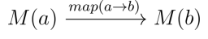
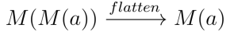
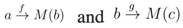
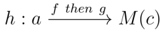

# Monad

Functor와 마찬가지로 타입 A에서 타입 B로 매핑할 수 있는 메서드를 가진 interface인데, 일반 map이 아닌 flatMap을 사용한다는 차이점이 있습니다.

## flatMap

아래 두 연산들을 순서대로 합쳐서 구현한 매핑연산입니다.

### map

[functor context](./functor_category.md) 상에서 특정 monad를 다른 monad로 매핑합니다.



### flatten

functor 매핑으로 추가된 가장 외부의 monad context 하나를 제거합니다.



:::info context

Functor, Monad의 mapping 중 수행되는 연산들을 추상화하는(= 독립된 단위라서 사용자로부터 내부 구현을 은닉해도 되는) wrapper입니다.

Array에 대해 `map`을 수행하면 iteration 일어나고, Promise에 대해 `then`을 수행하면 resolve될 때까지 대기하는 등의 내부연산들이 context로서 수행됩니다.

:::

monad의 매핑연산은 다음과 같이 수식(?)으로 표현할 수 있습니다.

```js
M(a).flatMap(a => M(b))
= M(a).map(a => M(b)).flatten()
= M(M(b)).flatten()
= M(b)

// flatMap에 들어가는 arrow는 functor(a ⇒ b)와는 다르게
// type lifting 함수(a ⇒ M(b))가 들어갑니다.
```

:::info type lifting 함수

특정 입력타입이 들어오면 context로 wrapping된 출력타입을 반환하는 함수입니다.
:::

## Composition

Monad는 flatMap을 연속으로 적용하여 단일 합성함수에 의한 flatMap을 구현하거나, 단일 arrow에 의한 flatMap을 다수 arrow들의 연속된 flatMap으로 구현할 수 있습니다.





```jsx
f = a => M(b)
g = b => M(c)
// f, g는 type lifting 함수로, arrow로 사용됩니다.

M(a).flatMap(h)
= M(a).flatMap(f).flatMap(g)
= M(b).flatMap(g)
= M(c)
```

Monad를 JS로 구현하면 다음과 같습니다.

```js
const Monad = (value) => ({
  map: (f) => f(value),
  flatMap(fn) {
    return this.map((a) => Monad.of(fn(a)));
  },
});
Monad.of = (x) => Monad(x); // type lifting
```

```js
Monad(21)
  .flatMap((x) => x * 2) // Monad(42)
  .flatMap((x) => console.log(x)); // 42
```

## Promise

Promise는 Monad의 대표적인 예시입니다.

1. flatMap 대신 `then` 메서드를 사용하고,
2. 이전 promise의 resolved value가 unwrap(= flatten)되어 전달되기 전까지 다음 `then`의 arrow는 실행되지 않고,
3. resolved value가 중첩된 Promise여도(= `P(P(P(…)))`) 모두 unwrap 되어 다음 `then`의 arrow로 구체적인 값만 전달됩니다.

Promise 기반의 Monad 매핑은 아래와 같은 함수로 구현할 수 있습니다.

```js
const composeMonads =
  (flatMap) =>
  (...arrows) => {
    return arrows.reduce((f, g) => (x) => f(x)[flatMap](g));
  };
```

```js
const composePromises = composeMonads('then');
// arrow들은 모두 하나같이 a => Promise(a) 형태로 가지므로,
// flatMap 부분에서는 flatten 연산(Promise(x) => x)이 필요합니다.

const getUserById = id => id === 3
	? Promise.resolve({ name: 'Kurt', role: 'Author' });
	: undefined;

const hasPermission = ({ role }) => {
	return Promise.resolve(role === 'Author');
}

const authUser = composePromises(getUserBuyId, hasPermission);
// x => getUserBuyId(x).then(hasPermission)

authUser(3); // Promise({ name: 'Kurt', role: 'Author' })
```

:::tip
composePromises와 같이 일련의 type lifting 함수들을 합성한 함수를 "Kleisli Composition Function"이라고 부릅니다.
:::
