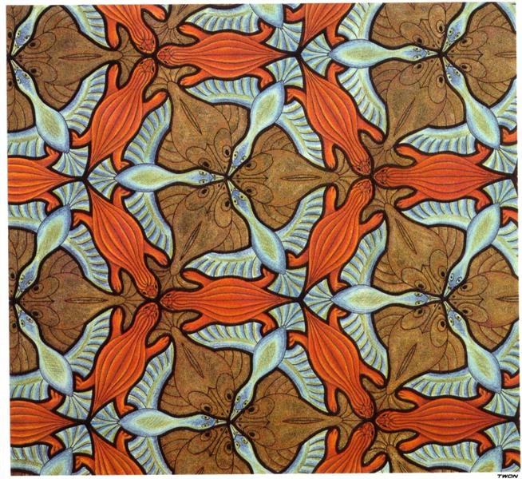

# The Forgotten History Of OOP

OOP(Object Oriented Programming)이라는 용어는 미국의 컴퓨터 과학자 Alan Kay의 1966/67년에 작성한 대학원 논문에서 처음 등장했습니다.

전체 시스템을 “encapsulate된 mini-computer(object)들 사이의 data sharing이 아닌 message passing에 기반한 통신”으로 구성하려는 시도에서 비롯되었습니다.

## OOP의 조건

### Encapsulated State

외부에서 object를 사용할 때 내부가 어떻게 구현되는지 알 수 없도록 내부 state의 구조와 구현체는 은닉하여 추상화합니다.

state 관련 read/write 연산은 메서드나 일반함수를 사용하여 message를 전송(dispatch)하는 방법으로만 제한합니다.

### Decoupling Objects

object들은 개별적으로 분리되어 서로의 state에 영향을 주지 않습니다.

### Runtime Adaptability

런타임 중 object hot-swapping이 가능합니다.

## Algebraic Data Structure

OOP에서 설명하는 object는 composite data structure로, 연관된 데이터들을 하나로 묶는 대수학적인 구조이자 단위로도 볼 수 있습니다.

대수학에서 정의한 데이터 구조는 아래와 같은 특징을 가집니다.

- unit test에 의해서 강제되는 특정 rule들을 방정식(함수) 형태로 같이 가지므로 객체의 동작방식을 예측하기 쉽고 관련 테스트를 작성할 수 있다.
- object의 메서드들은 type generic 성격을 가져서 재사용이 용이하다.
