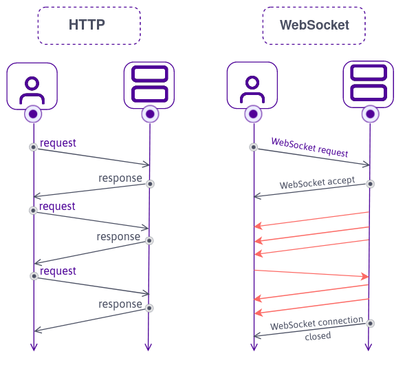

# 웹 소켓 이해하기



웹 소켓은 HTML5에 새로 추가된 스펙으로 **실시간 양방향 데이터 전송**을 위한 기술이며, HTTP와 다르게 WS라는 프로토콜을 사용합니다.

최신 브라우저는 대부분 웹 소켓을 지원하고, node.js에서는 ws나 Socket.IO 같은 패키지를 통해 웹 소켓을 사용할 수 있습니다.

## Polling

웹 소켓이 나오기 이전에는 HTTP 기술을 사용한 폴링(polling) 방식으로 실시간 데이터 전송을 구현했습니다.

HTTP가 클라이언트에서 서버로 향하는 단방향 통신이므로 주기적으로 서버에 새로운 업데이트가 있는지 확인하는 요청을 보내고, 있다면 새로운 내용을 가져오는 단순하고 무식한 방법이었습니다.

## WebSocket

웹 브라우저와 웹 서버가 지속적으로 연결된 라인을 통해 실시간으로 데이터를 주고받을 수 있는 웹 소켓이 등장했습니다.

업데이트할 내용이 생겼다면 서버에서 바로 클라이언트에 알릴 수 있고 HTTP 프로토콜과 포트를 공유할 수 있으므로 다른 포트에 연결할 필요도 없습니다.

Socket.IO는 웹 소켓을 편리하게 사용할 수 있도록 도와주는 라이브러리인데 웹 소켓을 지원하지 않는 IE9과 같은 브라우저에서는 알아서 웹 소켓 대신 폴링 방식을 사용해 실시간 데이터 전송을 가능하게 합니다.

```js
// socket.js
const WebSocket = require("ws");

module.exports = (server) => {
  const wss = new WebSocket({ server });

  wss.on("connection", (ws, req) => {
    const ip = req.headers["x-forwarded-for"] || req.socket.remoteAddress;
    ws.on("message", (message) => {
      // 클라이언트로부터 메시지 수신 시
    });
    ws.on("error", (error) => {
      // 에러 시
    });
    ws.on("close", () => {
      // 연결 종료 시
    });
  });
};
```

```js
// app.js
const express = require("express");
const webSocket = require("./socket");

const app = express();

// ...

const server = app.listen(app.get("port"), () => {
  // ...
});

webSocket(server);
```

```html
<!-- views/index.html  -->
<!DOCTYPE html>
<html>
  <head></head>
  <body>
    <script>
      const webSocket = new WebSocket("ws://");
      webSocket.onopen = function () {
        // ...
      };
      webSocket.onmessage = function (event) {
        // ...
      };
    </script>
  </body>
</html>
```

## SSE

서버센트 이벤트(Server Sent Event, 이하 SSE)라는 기술도 등장했습니다.

이는 EventSource라는 객체를 사용하고 처음에 한 번만 연결하면 서버에서 클라이언트로 데이터를 보내는 단방향 통신입니다.

SSE는 주로 주식 차트 업데이트나 SNS에서 새로운 게시물 가져오기 등을 구현할 때 사용할 수 있습니다.
