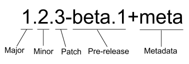

# 패키지 버전 이해하기

SemVer는 Sementic Versioning의 약어로, 버전을 구성하는 세자리가 모두 의미를 갖고 있다는 의미입니다.

각각의 패키지는 모두 버전이 다르고 패키지 간의 의존 관계도 복잡한데 이에 버전 번호를 어떻게 정하고 올려야 하는지를 명시하는 규칙인 SemVer이 등장했습니다.

## major

버전의 첫 번째 자리를 가리키며 0이라면 초기 개발 중이라는 뜻이고 1부터가 정식 버전을 의미합니다.

하위 호환이 안될 정도로 패키지의 내용이 수정되었을 때 올리고 이전 버전의 패키지로부터 업데이트한다면 에러가 발생할 가능성이 큽니다.

## minor

버전의 두 번째 자리를 가리키며 하위 호환이 되는 기능 업데이트를 할 때 올립니다.

이전 버전의 패키지로부터 업데이트해도 에러가 발생하지 않아야 합니다.

## patch

버전의 세 번째 자리를 가리키며 기존 기능에 문제가 있어 수정한 것을 내놓았을 때 올립니다.

당연히 이전 버전의 패키지로부터 업데이트해도 에러가 발생하지 않아야 합니다.

:::danger
새 버전을 배포한 뒤에 그 버전의 내용을 수정하면 안됩니다.

배포된 버전 내용이 바뀌지 않아서 패키지 간의 의존 관계에 큰 도움이 되며 동일한 버전의 패키지는 언제나 동일한 동작을 수행한다고 믿을 수 있습니다.
:::

:::info
semVer 앞에 붙는 "^", "~" 등 기호들의 의미는 다음과 같습니다.

- **^**: minor 버전까지만 설치하거나 업데이트합니다(예: ^1.1.1 === 1.x.x).
- **~**: patch 버전까지만 설치하거나 업데이트합니다(예: ~1.1.1 === 1.1.x).
- **\>, \<, \>=, \<=, =**: 초과, 미만, 이상, 이하, 동일을 의미합니다.
- **@latest**: 안정된 최신 버전의 패키지를 설치합니다.
- **@next**: 가장 최근의 배포판을 사용할 수 있는데 안정되지 않은 alpha나 beta 버전의 패키지를 설치할 수도 있습니다.

:::
