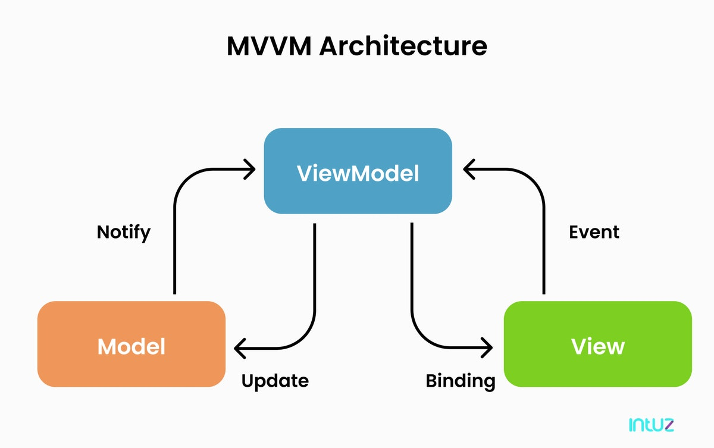

# MVVM

MVC 패턴의 Controller는 다음과 같은 반복적인 개발패턴을 가집니다.

1. 이벤트 핸들러 연결
2. API 요청
3. 데이터 수정
4. DOM 수정/삭제/추가

이러한 로직상의 중복을 극복하고자 서버에서 `.html` 파일을 생성할 때 활용하는 “템플릿 바인딩” 개념을 프론트 영역에 도입하게 됩니다.

템플릿 바인딩은 Model과 View의 기능을 통합하고 Controller의 기능들을(위 4가지) 프레임워크로 위임하여 선언적으로 페이지를 생성할 수 있도록 만듭니다.

Controller는 여전히 JS지만 이제 템플릿(View)에 바인딩할 데이터(Model)만 다루게 되어 ViewModel이라는 새로운 이름을 가졌고 여기서 MVVM 패턴이 탄생했습니다.

MVVM의 구현체로는 React, Vue, Angular, Sevelt 등이 있습니다.
