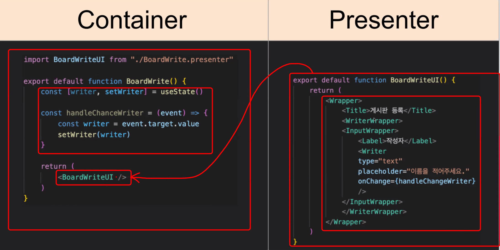

# Container-Presenter

    

MVVM 패턴의 등장 이후로, 하나의 페이지는 단일 문서가 아닌 다수의 재사용이 가능한 단위 즉, 컴포넌트들의 조합이라는 새로운 관점이 생겨났습니다.

컴포넌트는 내부적으로 MVVM 패턴을 따르고 문맥과 상관없이 재사용되려면 VM에 비즈니스 로직을 가지면 안됩니다.

이를 계기로 비즈니스 로직을 가지지 않고 특정 영역의 렌더링만 담당하는 Presenter와 비지니스 로직에 맞춰 Presenter들을 조합하여 최종 화면을 만드는 Container로 컴포넌트의 역할을 분리하는 Container-Presenter 패턴이 탄생합니다.

### Props Drilling

    

Container-Presenter 패턴을 따르는 페이지에서 컴포넌트들은 계층구조를 가지고 Container는 props를 통해 Presenter로 데이터를 전달합니다.

Container에서 깊게 중첩된(deeply nested) Presenter로 데이터를 전달하려면 중간에 거치는 컴포넌트들도 동일한 props를 가져야 하는데, 이러한 현상을 props drilling이라고 합니다.

props drilling은 다음과 같은 문제점들을 가집니다.

- 중간에 위치한 컴포넌트가 내부 상태와 관련없는 props를 강제로 가지게 되어 재사용성이 떨어질 수 있다.
- props의 이름이나 타입이 변할 때마다 일일이 찾아서 수정해야하는 번거로움이 발생한다.
