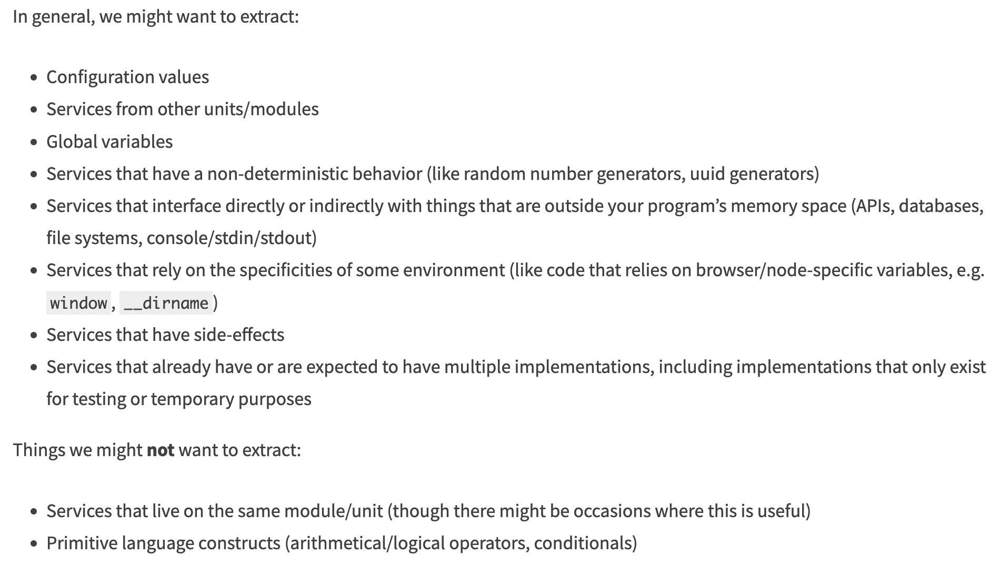

# Dependency Injection in JS/TS

## Fundamentals

임의의 함수나 클래스 T(arget)의 동작방식이 특정 값에 의해서 달라진다면 이 값을 가진 변수를 T의 dependency(이하 dep)라고 합니다.

dep는 T의 동작을 제어하므로 T의 controller라고도 볼 수 있고 물론 dep도 다른 dep가 필요한 T가 될 수 있습니다.

dep의 반환값은 예측할 수 없기 때문에 T에 대한 unit test를 진행하려면 dep의 타입을 하나로 고정할 수 있도록 dep을 T의 인자로 전달하는 로직이 필요합니다.

즉, 인자로 전달된 dep가 곧 mock 대상이 되고 dep가 inject된 T는 특정 버전의 service가 됩니다.

하지만 사용자로 하여금 직접 dep을 인자로 전달하도록 만들면 경우에 따라서 T의 내부구현 방식이 외부에 노출될 가능성이 있고 이에 사용자가 원치않은(?) 인자를 생각해야 하는 번거로움이 있습니다.

결론적으로 Dependency Injection는 2가지 개념으로 구성됩니다.

- dep(들)을 인자로 전달하여 dep에 대한 제어권을 확보하고 일반화하는 것
- 사용자 특정 dep(들)을 고정시킨 service를 만들어서 T의 내부구현을 알지 않아도 사용하는 것

Dependency Injection은 용이한 테스팅 외에도 T의 재사용성 + 독립성을 보장한다는 장점도 있습니다.

## Factory function

dep를 인자로 전달하여 특정 버전의 dep 또는 T를 만드는 고차함수를 가리킵니다.

```ts
// randomNumber.ts
type RandomGenerator = () => number;

const makeRandomNumber =
  (randomGenerator: RandomGenerator) =>
  (max: number): number => {
    return Math.floor(randomGenerator() * (max + 1));
  };

export const randomNumber = makeRandomNumber(Math.random);
```

## Strategy pattern

service를 설계할 때 특정 parameter에 따라서 다르게 구현하여 각자 return하는 것이 아닌 별도 파일에 이미 구현된 service를 정의하고 특정 parameter에 따라서 하나만 골라서 return하는 패턴을 가리킵니다.

```ts
/// BEFORE
// randomNumber.ts
import { secureRandomNumber } from "secureRandomNumber";

export const makeRandomNumber =
  (
    randomGenerator: () => number,
    secureRandomNumber: (max: number) => number
  ) =>
  (max: number) => {
    if (process.NODE_ENV !== "production") {
      return Math.floor(randomGenerator() * (max + 1));
    }

    return secureRandomNumber(max);
  };

export const randomNumber = makeRandomNumber(Math.random, secureRandomNumber);
```

```ts
// AFTER
// randomNumber.ts
import { fastRandomNumber } from "./fastRandomNumber";
import { secureRandomNumber } from "secureRandomNumber";

export const randomNumber =
  process.env.NODE_ENV !== "production" ? fastRandomNumber : secureRandomNumber;
```

## Deciding what to extract as dependency



## Composition Root(Container)

임의의 T의 dep를 구현하다보면 해당 dep이 T가 되어 다른 dep에 의존하는 로직을 종종 접합니다.

보통 dep이자 T는 하나의 파일에서 구현하여 export하면 T에서 import하는 방식으로 사용합니다.

하지만 이와 반대로 필요한 dep들을 하나의 파일에서 모두 구현하여 하는 방식도 있는데 여기서 해당 파일을 Container라고 부릅니다.

Container에서는 T이자 dep을 생성할 수 있도록 factory function들을 import하고 dependency order에 맞춰서 dep들을 구현하고 최종 service들만 named export하는 형식을 가집니다.

그럼 export된 객체는 app의 entry point에서 import되어 사용됩니다.

```ts
// container.ts

import { secureRandomNumber } from "secureRandomNumber";
import { makeFastRandomNumber } from "./fastRandomNumber";
import { makeRandomNumberList } from "./randomNumberList";

const randomGenerator = Math.random;
const fastRandomNumber = makeFastRandomNumber(randomGenerator);
const randomNumber =
  process.env.NODE_ENV === "production" ? secureRandomNumber : fastRandomNumber;
const randomNumberList = makeRandomNumberList(randomNumber);

export const container = {
  randomNumber,
  randomNumberList,
};

export type Container = typeof container;
```

```ts
// index.ts
import { container } from "./container";

const main = () => {
  // Do stuff with container
  const randomNumberList = container.randomNumberList;

  // Reads max and length from command line
  const max = Number(process.argv[2]);
  const length = Number(process.argv[3]);
  console.log(randomNumberList(max, length));

  return 0;
};

main();
```

dep들간의 관계는 dependency graph로 시각화할 수 있는데 시간 지나서 새로운 dep를 추가할 때는 전체 그래프 상에 cycle이 없어야 합니다.


## 참고자료

[Dependency Injection in JS/TS – Part 1](https://blog.codeminer42.com/dependency-injection-in-js-ts-part-1/)
