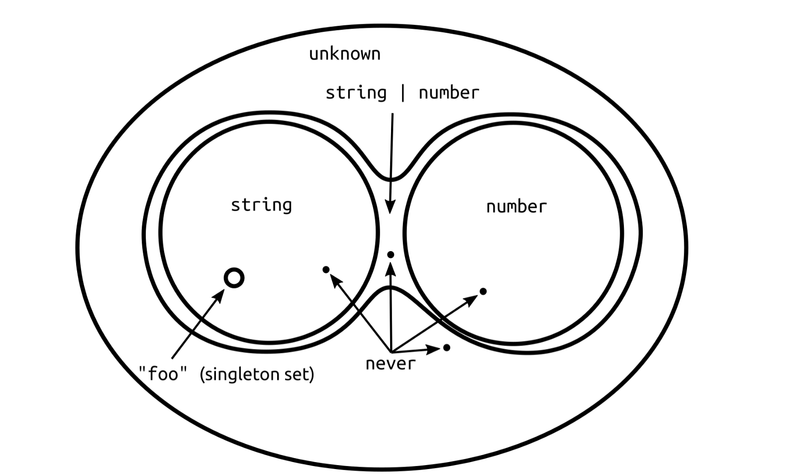

# When to use never and unknown in TypeScript

TS의 type 관련 공부를 하면서 가장 헷갈렸던 부분을 드디어 해결할 수 있었습니다😎



이거 하나만 기억하면 됩니다.

> type ⇒ 가능한 값들의 집합(Set)
>
> union type ⇒ 합집합
>
> intersection type ⇒ 교집합
>
> T extends U ? ⇒ 집합 T는 집합 U의 부분집합인가?

## unknown

가능한 모든 타입들을 포함하는 top type입니다.

중학생 때 배운 집합이론에서 전체집합 U에 대응되고 intersection type에서 항등원에 해당합니다.

```ts
type identity<T> = T & unknown; // T

type U<T> = T | unknown; // unknown
```

임의의 타입을 가지는 값은 `unknown` 타입의 변수에 대입을 할 수 있지만 역은 성립하지 않습니다.

```ts
const free: unknown = 2;

console.log(typeof free); // number
```

`unknown` 타입은 기존의 `any` 타입의 무대뽀 대입이 가능한 성질을 억제하기 위한 용도로 등장했습니다.

그러므로 좀 더 type-safe한 코드를 위해서 `any` 보다는 `unknown` 을 자주 사용하는 것을 권장합니다.

```ts
import isArray from "isarray";

function prettyPrint(x: unknown): string {
  // whoops - this `isArray` is not a type guard!
  if (isArray(x)) {
    // Error: Object is of type ‘unknown’.
    return "[" + x.mop(prettyPrint).join(", ") + "]";
  }
  /* snip */
  return "etc.";
}
```

## never

`unknown` 타입과는 반대로 모든 타입들에 포함되는 bottom type입니다.

중학생 때 배운 집합이론에서 부분집합으로서 항상 빠지지 않는 빈 집합(empty set)에 대응되고 union type에서 항등원에 해당합니다.

```ts
type identity<T> = T | never; // T

type I<T> = T & never; // never
```

`never` 타입은 임의의 타입에 assign할 수 있지만 역은 성립하지 않습니다.

단, `never` 타입 자체는 `never` 타입에 assign할 수 있습니다.

```ts
type N<T> = never extends T ? "yes" : "no";

type A = N<unknown>; // 'yes'
```

### NEVER happens!

`never` 타입은 절대로 일어나지 않을 경우에 사용됩니다.

예를 들어, `Promise<T>`에서 generic 인자는 resolved value의 타입이 들어가는데 만일 reject만 일어난다면 가능한 resolved value가 없으므로 비어있다는 의미로 `never` 타입이 들어갑니다.

```ts
function timeout(ms: number): Promise<never> {
  return new Promise((_, reject) =>
    setTimeout(() => reject(new Error("Timeout elapsed")), ms)
  );
}
```

`throw`문으로 예외가 발생하거나 무한루프에 빠진 것처럼 프로그램의 실행이 끝나지 않다가 중간에 강제로 종료되는 경우에 함수의 return type으로도 사용할 수 있습니다.

uninon type에서 더 이상 남은 type이 없는 경우에도 부여됩니다.

```ts
function fn(x: string | number) {
  if (typeof x === "string") {
    // do something
  } else if (typeof x === "number") {
    // do something else
  } else {
    x; // has type 'never'!
  }
}
```

### conditional pruning

`never` 타입은 conditional type에서 원치않는 경우에 반환할 fallback으로도 사용됩니다.

```ts
type Arguments<T> = T extends (...args: infer A) => any ? A : never;
type Return<T> = T extends (...args: any[]) => infer R ? R : never;
```

위와 같이 fallback으로 `never`를 지정하면 generic 인자에 의도한 타입이 전달되지 않을 경우, 이후 진행할 타입연산을 멈출 수 있습니다.

```ts
// Error: Type '3' is not assignable to type 'never'.
const x: Return<"not a function type"> = 3;
```

### union narrowing

`never` 타입은 union narrowing에 유용하게 사용할 수 있습니다.

```ts
type NonNullable<T> = T extends null | undefined ? never : T;
```

conditional 타입의 인자로 union 타입을 전달하면 분배법칙이 적용됩니다.

```ts
// if T = A | B
T extends U ? X : T

// (A extends U ? X : A) | (B extends U ? X : B)
```

그럼 NonNullable의 generic 인자로 아래와 같이 union type을 전달한다면 union 항등원 성질로 인해서 필터링을 수행합니다.

```ts
NonNullable<string | null>

// The conditional distributes over each branch in `string | null`.
=> (string extends null | undefined ? never : string) | (null extends null | undefined ? never : null)

// The conditional in each union branch is resolved.
=> string | never

// `never` factors out of the resulting union type.
=> string
```

## 참고자료

[When to use never and unknown in TypeScript](https://blog.logrocket.com/when-to-use-never-unknown-typescript/)
