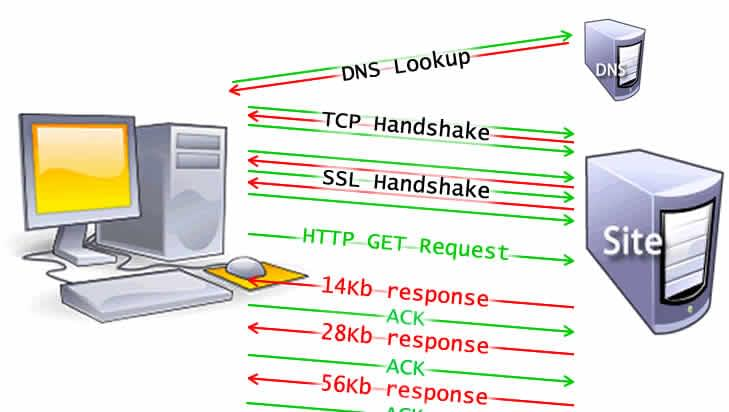

# Response

Navigation을 끝내면 브라우저는 생성된 세션을 통해서 서버로 HTTP GET 요청 메시지를 전송합니다. 서버는 요청을 받고 나서 필요한 데이터(보통 `.html`)를 준비하여 적절한 header와 body로 구성된 HTTP 응답 메시지를 브라우저로 전송합니다.

## TCP Slow Start(14KB Rule)

HTTP 응답으로 전달되는 첫 번재 데이터의 크기는 보통 14KB입니다.

이는 TCP Slow Start Algorithm의 일부로, 클라이언트와 서버 사이의 네트워크 대역폭이나 threshold에 도달할 때까지 서버에서 전송하는 데이터의 크기를 점진적으로(2배씩) 늘려갑니다.

TCP Slow Start는 클라이언트와 서버 사이의 전송과정에서 네트워크 혼잡(network congestion)이 발생하지 않도록 전송속도를 조절하기 위해서 사용됩니다.

## Congestion Control

서버로부터 TCP 패킷이 클라이언트로 도착할 때마다 클라이언트는 제대로 받았음을 알려주기 위해서 ACK 패킷을 전송합니다.

TCP connection 상에서 데이터 최대 전송량(**단위 시간 당 전송한 패킷**)은 네트워크의 구동상태와 하드웨어 사양에 의해서 결정됩니다. 만일 서버 쪽의 전송량이 threshold를 초과하면 일부 패킷들은 중간에 dropped되어 그에 맞는 ACK를 받지 못할 수도 있습니다.

그럼 서버는 제한된 시간 안에 ACK를 받지 못했을 때 Congestion Control Algorithm을 이용하여 전송률을 조정합니다.
