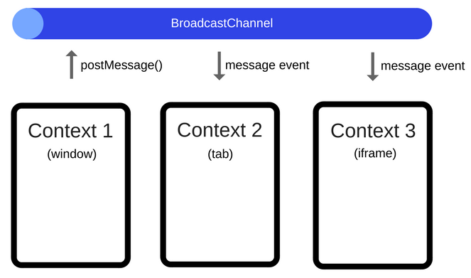

# Broadcast Channel

<p align="center">
    
</p>

서로 다른 origin을 가진 browsing context(bCtx)사이의 통신은 제한적이지만 동일한 origin 사이의 경우, Broadcast Channel API를 사용하면 됩니다.

해당 API를 이용하면 동일한 origin을 가지는 bCtx들이 공용 채널에 구독하는 방식으로 통신이 이루어지는데 임의의 bCtx에서 message를 channel로 전송하면 해당 channel을 구독하는 나머지 bCtx들에게도 그대로 message가 전달됩니다.

:::info
여기서 bCtx 사이의 통신을 cross-context communication이라고 합니다.
:::

동일한 origin을 가진 다른 탭에서 로그인/로그아웃 같은 user action을 감지할 때 유용한 API입니다.

## Browsing Context(bCtx)란?

브라우저에서 Document가 렌더링되는 모든 환경들을 통칭하는데 아래와 같습니다.

- tab : 창 내의 탭
- window : 창
- iframe, frame : 페이지 내 일부

broadcast channel마다 고유의 origin과 history(지금까지 시간 순으로 렌더링된 페이지들로 구성된 stack)를 가집니다.

## Interface

처음으로 channel을 생성하거나 이미 생성된 channel을 구독하기 위해서는 bCtx마다 동일한 id의 BroadcastChannel 인스턴스를 만들면 됩니다.

```js
// Connection to / Creation of a broadcast channel
const bc = new BroadcastChannel("test_channel");
```

특정 채널로 msg를 전송(post)할 때는 대응되는 inst의 postMessage 메서드를 사용하면 됩니다. 여기서 msg는 string을 포함한 primitive 데이터와 reference 데이터까지 모두 가능합니다.

```js
bc.postMessage("This is a test message.");
bc.postMessage({ prop: 1331 });
```

임의의 bCtx가 자신이 구독한 channel에 전송된 msg를 read할 때는 inst의 onmessage라는 event handler를 사용하면 됩니다.

```js
bc.onmessage = (event) => {
  console.log(event.data);
};
```

임의의 bCtx에서 특정 channel의 구독을 취소할 때는 대응되는 inst의 close 메서드를 사용하면 됩니다.

```js
// Disconnect the channel
bc.close();
```
