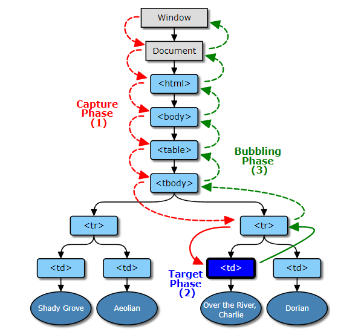

# DOM

## Event 흐름

DOM tree는 웹 페이지를 구성하는 요소(element) 객체 사이의 포함관계를 나타나는 트리 구조의 데이터로 브라우저에 의해서 생성됩니다. 사용자 또는 외부 원인에 의해서 DOM 요소에서 어떤 event가 발생하면 target 요소 뿐만 아니라 상위, 하위 요소에 동일한 event가 전달되는데 event가 흐르는 방향은 다음과 같이 3가지가 있습니다.

    

#### 1. Capturing

DOM tree의 최상위 요소(window)에서 target의 parent 요소까지 event가 전달되는 단계입니다.

여기서 DOM tree를 타고 내려가면서 거치는 요소들의 event listener는 `capture` 옵션을 `true`로 가져야 합니다. event listener는 보통 `EventTarget.addEventListener` 메서드를 이용하여 구현하는데 이 메서드의 `capture` 옵션 default 값은 `false`입니다. 그래서인지 capturing 단계에서 event를 처리하는 코드는 거의 없습니다.

#### 2. Targeting

이벤트가 발생한 실제 target 요소의 event handler를 실행하는 단계입니다.

#### 3. Bubbling

target의 parent 요소에서 최상위 요소(window)로 event가 전달되는 단계입니다.

이 때 DOM tree를 타고 올라가면서 거치는 요소들의 event listener의 `capture` 옵션은 `false`로 설정되어 있어야 합니다.

각 단계마다 발생한 event와 관련된 정보는 다음과 같이 handler 내부에서 얻을 수 있습니다.

- `Event.target` : event가 처음으로 발생한 DOM 객체입니다.
- `Event.currentTarget` : 현재 event handler가 위치한 DOM 객체로 handler 내부 `this`가 참조하는 값입니다.
- `Event.eventPhase` : 현재 event handler를 거치는 event flow의 단계를 표현한 number형 데이터입니다(캡처링=1, 타깃=2, 버블링=3).

### Event 관련 메서드

자주 사용하는 Event 관련 메서드들을 정리하면 다음과 같습니다.

#### 1. Event.stopPropagation

다음 event bubbling / capture 단계를 더 이상 진행하지 않을 때 사용합니다. 즉, `capture` 옵션이 변경되지 않았다면 `currentTarget` 요소의 handler만 실행하고 다음 노드의 event handler를 실행하지 않습니다.

#### 2. Event.preventDefault

user agent(browser)가 DOM에서 발생한 특정 event에 의한 default action을 발생시키지 않을 때 사용하는 메서드입니다.

예를 들어 type이 submit인 input 태그를 클릭했을 때 default action은 form을 submit하는 것이고 anchor 태그를 클릭했을 때 default action은 화면 새로고침입니다. 여기서 특정 event에 preventDefault 메서드를 적용할 수 있는지 여부는 event의 `cancelable` 속성값에 따라 달라집니다.

#### 3. Event.stopImmediatePropagation

동일한 요소에 동일한 event에 대한 event listener들을 여러 개를 추가한다면 등록된 순서대로 실행합니다. 중간에 특정 listener에서 해당 메서드를 실행한다면 그 뒤에 등록된 listener들은 실행되지 않습니다.
