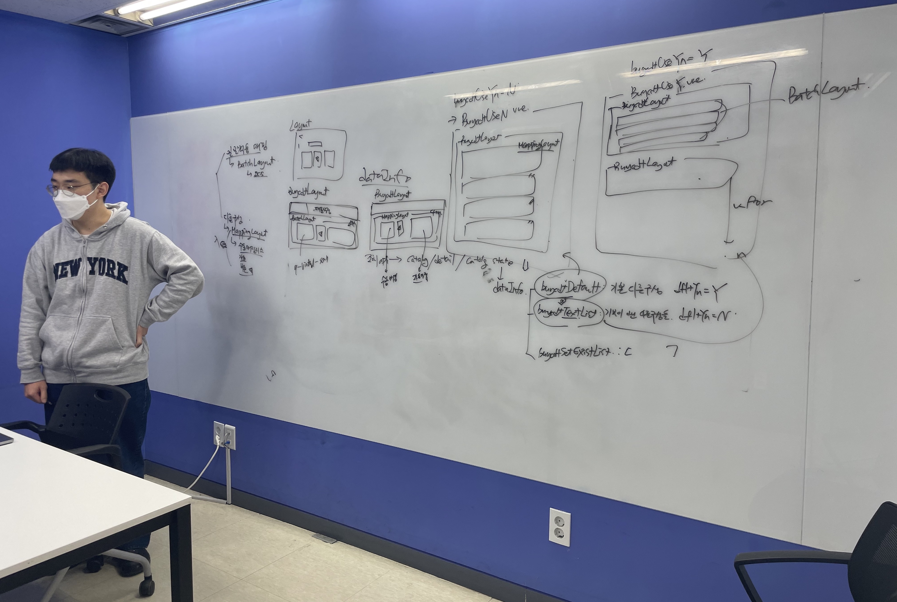
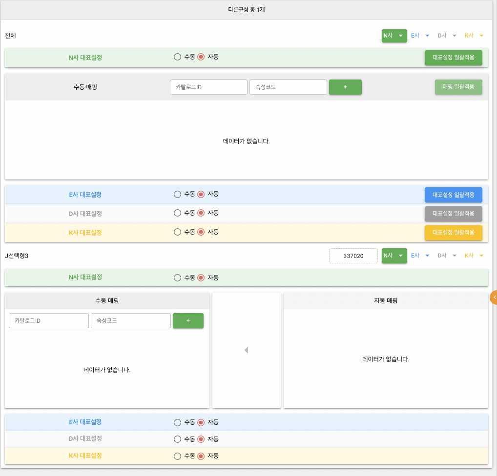
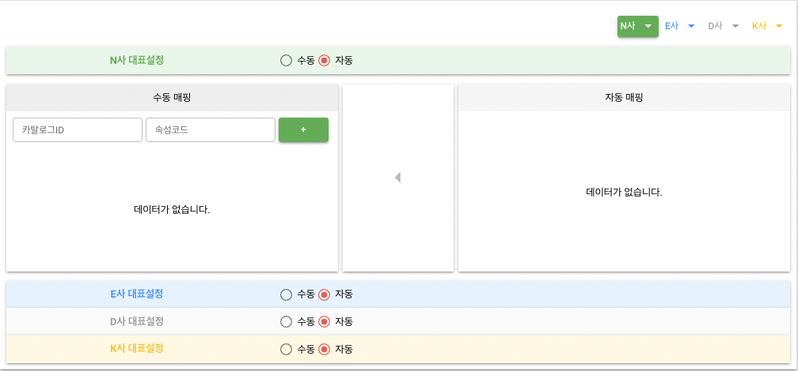
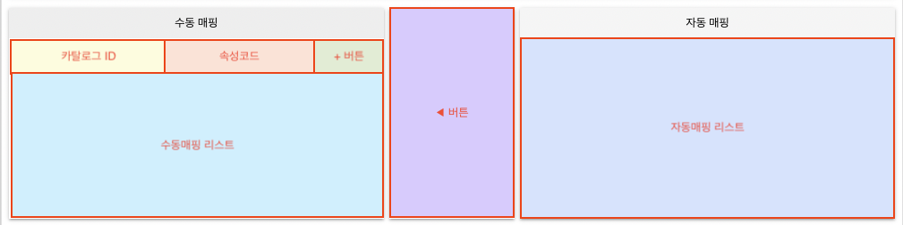
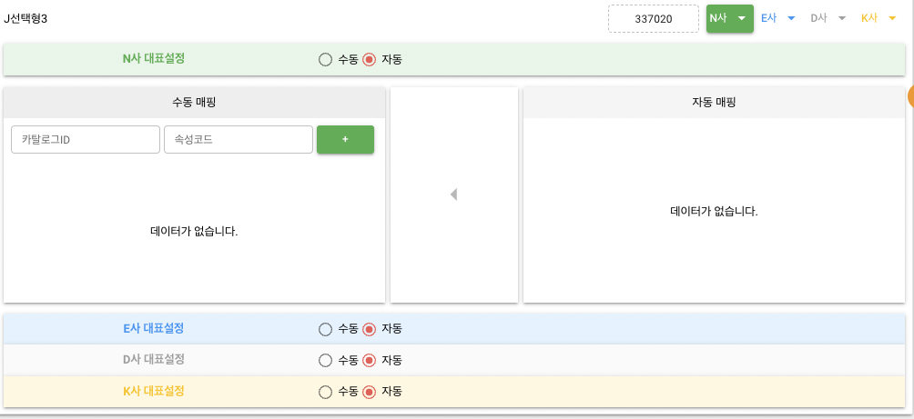

# Compound 패턴으로 컴포넌트 만들어보기

## 개요

이전에 서로 다른 4개의 타사들과의 카탈로그 매핑 정보를 조회하기 위한 신규 탭을 재개발하는 업무를 맡은 적이 있었습니다.

해당 신규 탭 개발 이슈는 원래 개발기간이 약 2달 정도 소요되었던 1순위 작업이었는데 live 환경에서 모니터링 중 side-effect로 인한 다수의 버그가 발생하는 와중에 기존 담당자분이 갑작스럽게 퇴사하셔서 제가 총대를 메게 되었습니다.

어떻게든 해결하려고 자정까지 야근을 했지만 끝내 고치지 못해서 이미 퇴근하셨던 팀장님과 다른 매니저님들의 도움으로 결국 롤백을 진행했었죠🤯

굉장히 막막했지만 [평소에 생각했던 컴포넌트의 재사용성에 대한 아이디어](./컴포넌트로_무엇을_재사용하는가.md)를 구현할 수 있는 기회로 생각하기로 마음먹은 저는 1주일 동안 재개발을 진행했습니다.



Compound 패턴을 적용하여 재개발했는데 하위 컴포넌트에 많은 역할과 기능을 부여하지 않으니 재사용하는데 부담이 덜 들었고, 컴포넌트의 props와 emit되는 event들의 종류만으로 ViewModel 로직을 간결하게 작성할 수 있었습니다.

덕분에 QA 중 기능버그는 1건만 나왔고 기존 test, live 환경에서 발생했던 모든 버그들을 해결해서 배포예정일에 맞춰 이슈를 마무리할 수 있었습니다🥳

이번 포스트를 통해 해당 이슈를 대응하면서 어떤 UI를 어떻게 구현했는지를 코드와 자세하게 설명하겠습니다.

## 구현할 UI

먼저 탭에 표시할 UI는 아래와 같이 2가지로 나뉩니다.

### BuycdtUseY



### BuycdtUseN



저는 위 2가지 케이스에 모두 대응할 수 있는 컴포넌트 구조를 만들기 위해 비지니스 로직을 완전히 제외하고 재사용할 수 있는 요소들의 배치(구조)를 먼저 정의하면 필요에 맞게 요소들을 채워넣는 방향으로 작업을 진행했습니다.

## Layout 구성

반복되는 구조는 "Layout"이라는 postfix를 가진 컴포넌트로 만들고, 구체적인 컨텐츠가 들어갈 영역(색깔로 표시된 영역)은 `<slot></slot>`으로 남겨두었습니다.

:::info
`q-`로 시작하는 태그는 [Quasar](https://v1.quasar.dev/) 컴포넌트입니다!
:::

### BuycdtLayout


```html
<template>
  <div>
    <div class="row q-py-lg">
      <span class="col flex items-center">
        <!-- 다른구성 이름 -->
        <slot name="buycdtName" />
      </span>
      <div class="col-auto flex justify-end align-center">
        <!-- 최저가 여부 -->
        <slot name="lowestPriceText" />
        <!-- 다른구성 ID -->
        <slot name="buycdtSeq" />
        <q-btn
          class="q-mr-sm"
          label="N사"
          color="green"
          icon-right="arrow_drop_down"
          dense
          :flat="nFlat"
          @click.stop="toggleNFlat"
        />
        <q-btn
          class="q-mr-sm"
          label="E사"
          color="blue"
          icon-right="arrow_drop_down"
          dense
          :flat="eFlat"
          @click.stop="toggleEFlat"
        />
        <q-btn
          class="q-mr-sm"
          label="D사"
          color="grey"
          icon-right="arrow_drop_down"
          dense
          :flat="dFlat"
          @click.stop="toggleDFlat"
        />
        <q-btn
          class="q-mr-sm"
          label="K사"
          color="amber"
          icon-right="arrow_drop_down"
          dense
          :flat="kFlat"
          @click.stop="toggleKFlat"
        />
      </div>
    </div>
    <!-- 타사별 매핑영역 -->
    <slot
      name="mapping"
      :showN="!nFlat"
      :showE="!eFlat"
      :showD="!dFlat"
      :showK="!kFlat"
    />
  </div>
</template>
```

### OtherCompanyMappingLayout



```html
<template>
  <div class="selectable-list q-mb-lg">
    <div class="left-side shadow-2">
      <div class="row q-pa-md bg-grey-3 justify-center items-center">
        <div class="text-center">수동 매핑</div>
      </div>
      <div class="row q-py-md q-col-gutter-sm" style="width: 100%">
        <!-- 카탈로그 ID -->
        <slot name="catalogId" />
        <!-- 속성코드 -->
        <slot name="attributeCode" />
        <div class="col-2 flex justify-start">
          <!-- + 버튼 -->
          <slot name="addBtn" />
        </div>
      </div>
      <!-- 수동매핑 리스트 -->
      <slot name="manualMappingList">
        <div class="selectable-list-empty" :style="computedStyle('156px')">
          데이터가 없습니다.
        </div>
      </slot>
    </div>
    <div class="mid-side q-mx-md shadow-2">
      <div>
        <!-- 화살표 버튼 -->
        <slot name="arrworBtn" />
      </div>
    </div>
    <div class="right-side shadow-2">
      <div class="q-pa-md text-center bg-grey-2">자동 매핑</div>
      <!-- 자동매핑 리스트 -->
      <slot name="autoMappingList">
        <div class="selectable-list-empty" :style="computedStyle('207px')">
          데이터가 없습니다.
        </div>
      </slot>
    </div>
  </div>
</template>
```

### BatchMappingLayout


```html
<template>
  <div class="selectable-list q-mb-lg">
    <div class="left-side shadow-2">
      <div class="row bg-grey-3 flex justify-between">
        <div class="col-4 flex justify-center items-center">수동 매핑</div>
        <div class="col-5 row q-pa-md">
          <!-- 카탈로그 ID -->
          <slot name="catalogId" />
          <!-- 속성코드 -->
          <slot name="attributeCode" />
          <!-- + 버튼 -->
          <slot name="addBtn" />
        </div>
        <div class="col-3 flex justify-end items-center">
          <!-- 매핑 일괄적용 버튼 -->
          <slot name="mappingBatchBtn" />
        </div>
      </div>
      <!-- 일괄적용 대상 수동매핑 항목 리스트 -->
      <slot name="manualMappingList">
        <div class="selectable-list-empty" :style="computedStyles('156px')">
          데이터가 없습니다.
        </div>
      </slot>
    </div>
  </div>
</template>
```

## Layout에 내용 채워넣기

위에서 정의한 Layout들의 개별 slot에 다른 컴포넌트를 채워서 재사용할 컴포넌트를 생성합니다.

여기서 slot에 채워넣는 컴포넌트가 실제 비지니스 로직과 연관되어 있기 때문에 상위 컴포넌트에서 사용자의 의도를 파악할 수 있도록 구체적인 이름을 가진 이벤트와 함께 필요한 정보를 페이로드를 전달합니다.

### OtherCompanyMapping


```html
<template>
  <div>
    <!-- 상단 대표설정 + option-group 영역 -->
    <OtherCompanyMappingLayout v-show="showMappingArea">
      <!-- 카탈로그 ID -->
      <template #catalogId>
        <q-input ref="$catalogId" v-model="catalogId" label="카탈로그ID" />
      </template>
      <!-- 속성코드 -->
      <template v-if="companyType === 'N'" #attributeCode>
        <q-input
          ref="$attributeCode"
          v-model="attributeCode"
          label="속성코드"
        />
      </template>
      <!-- + 버튼 -->
      <template #addBtn>
        <q-btn @click.stop="$emit('add:manualItem')">+</q-btn>
      </template>
      <!-- 수동매핑 리스트 -->
      <template v-if="manualList.length" #manualMappingList>
        <q-virtual-scroll :items="manualList">
          <template #default="{ item }">
            <q-item @click.stop="$emit('select:manualItem', item)">
              <q-item-section>
                <!-- "대표" 키워드 + 매핑항목 label + PC, MW chip 영역 -->
                <q-btn
                  icon="cancel"
                  @click.stop="$emit('delete:manualItem', item)"
                />
              </q-item-section>
            </q-item>
          </template>
        </q-virtual-scroll>
      </template>
      <!-- 화살표 버튼 -->
      <template #arrowBtn>
        <q-btn icon="arrow_left" @click.stop="$emit('move:autoItems')" />
      </template>
      <!-- 자동매핑 리스트 -->
      <template v-if="autoList.length" #autoMappingList>
        <q-virtual-scroll :items="autoList">
          <template #default="{ item }">
            <q-item>
              <q-item-section>
                <!-- "대표" 키워드 + 매핑항목 label + PC, MW chip 영역 -->
              </q-item-section>
            </q-item>
          </template>
        </q-virtual-scroll>
      </template>
    </OtherCompanyMappingLayout>
  </div>
</template>
<script lang="ts">
  import { defineComponent, PropType, computed } from "@vue/composition-api";

  export default defineComponent({
    name: "OtherCompanyMapping",
    props: {
      companyType: String as PropType<"N" | "E" | "D" | "K">,
      mappings: Array as PropType<OtherCompanyCtlg[]>,
      mainType: String as PropType<"A" | "M">,
      showMappingArea: Boolean,
    },
    setup(props, context) {
      const manualList = computed(() =>
        props.mappings.filter(({ isAuto }) => isAuto === "N")
      );
      const autoList = computed(() =>
        props.mappings.filter(({ isAuto }) => isAuto === "Y")
      );
      // ...
      return {
        manaulList,
        autoList,
        // ...
      };
    },
  });
</script>
```

### BatchMapping


```html
<template>
  <div>
    <!-- 상단 대표설정 + option-group 영역 -->
    <q-btn label="대표설정 일괄적용" @click.stop="$emit('batch:mainType')" />
    <BatchMappingLayout v-show="showMappingArea">
      <!-- 카탈로그 ID -->
      <template #catalogId>
        <q-input ref="$catalogId" v-model="catalogId" label="카탈로그ID" />
      </template>
      <!-- 속성코드 -->
      <template v-if="showAttrCode" #attributeCode>
        <q-input
          ref="$attributeCode"
          v-model="attributeCode"
          label="속성코드"
        />
      </template>
      <!-- + 버튼 -->
      <template #addBtn>
        <q-btn label="+" />
      </template>
      <!-- 매핑 일괄적용 버튼 -->
      <template #mappingBatchBtn>
        <q-btn
          label="매핑 일괄적용"
          @click.stop="$emit('batch:manualMappings')"
        />
      </template>
      <!-- 일괄적용 대상 수동매핑 항목 리스트 -->
      <template v-if="manualList.length" #manualMappingList>
        <q-virtual-scroll :items="manualList">
          <template #default="{ item }">
            <q-item>
              <q-item-section>
                <!-- 매핑항목 label + PC, MW chip + 삭제버튼 영역 -->
              </q-item-section>
            </q-item>
          </template>
        </q-virtual-scroll>
      </template>
    </BatchMappingLayout>
  </div>
</template>
<script lang="ts">
  import { defineComponent, PropType, ref } from "@vue/composition-api";

  export default defineComponent({
    name: "BatchMapping",
    props: {
      companyType: String as PropType<"N" | "E" | "D" | "K">,
      showMappingArea: Boolean,
    },
    setup(props, context) {
      const manualList = ref<OtherCompanyCtlg[]>([]);
      // ...
      return {
        manualList,
        // ...
      };
    },
  });
</script>
```

## 최종 탭 구성

이제 위에서 만든 `~Mapping` 컴포넌트들을 `BuycdtLayout`의 slot에 채워서 최종 탭을 구성합니다.

여기서 개별 `~Mapping` 컴포넌트에서 발생한 이벤트 핸들러로 비지니스 로직을 구현하면 특정 상태의 변화가 어떤 이벤트에 의해서 일어났는지 추적할 수 있습니다.

### BuycdtUseY - 상단 일괄적용 영역(전체)


```html
<template>
  <BuycdtLayout>
    <!-- 다른구성 이름 -->
    <template #buycdtName> 전체 </template>
    <!-- 타사별 매핑영역 -->
    <template #mapping="props">
      <BatchMapping
        companyType="N"
        :showMappingArea="props.showN"
        @batch:mainType="onBatchMainType"
        @batch:manualMappings="onBatchManualMappings"
      />
      <BatchMapping
        companyType="E"
        :showMappingArea="props.showE"
        @batch:mainType="onBatchMainType"
        @batch:manualMappings="onBatchManualMappings"
      />
      <BatchMapping
        companyType="D"
        :showMappingArea="props.showD"
        @batch:mainType="onBatchMainType"
        @batch:manualMappings="onBatchManualMappings"
      />
      <BatchMapping
        companyType="K"
        :showMappingArea="props.showK"
        @batch:mainType="onBatchMainType"
        @batch:manualMappings="onBatchManualMappings"
      />
    </template>
  </BuycdtLayout>
</template>
```

### BuycdtUseY - 하단 항목들



```html
<template>
  <BuycdtLayout v-for="buycdt in buycdtList" :key="buycdt.id">
    <!-- 다른구성 이름 -->
    <template #buycdtName> {{ buycdt.buycdtSetElmtNm }} </template>
    <!-- 최저가 여부 -->
    <template v-if="buycdt.buycdtSetLowestPriceYn === 'Y'" #lowestPriceText>
      최저가
    </template>
    <!-- 다른구성 ID -->
    <template #buycdtSeq> {{ buycdt.buycdtSetSeq }} </template>
    <!-- 타사별 매핑영역 -->
    <template #mapping="props">
      <OtherCompanyMapping
        companyType="N"
        :mainType="buycdt.otherCompanyCtlgs.nCtlg.mainType"
        :mappings="buycdt.otherCompanyCtlgs.nCtlg.catalogs"
        :showMappingArea="props.showN"
        @update:mainType="onUpdateMainType(buycdt.buycdtSetElmNm)"
        @add:manualItem="onAddManualItem(buycdt.buycdtSetElmNm)"
        @delete:manualItem="onDeleteManualItem(buycdt.buycdtSetElmNm)"
        @move:autoItems="onMoveAutoItems(buycdt.buycdtSetElmNm)"
      />
      <OtherCompanyMapping
        companyType="E"
        :mainType="buycdt.otherCompanyCtlgs.eCtlg.mainType"
        :mappings="buycdt.otherCompanyCtlgs.eCtlg.catalogs"
        :showMappingArea="props.showE"
        @update:mainType="onUpdateMainType(buycdt.buycdtSetElmNm)"
        @add:manualItem="onAddManualItem(buycdt.buycdtSetElmNm)"
        @delete:manualItem="onDeleteManualItem(buycdt.buycdtSetElmNm)"
        @move:autoItems="onMoveAutoItems(buycdt.buycdtSetElmNm)"
      />
      <OtherCompanyMapping
        companyType="D"
        :mainType="buycdt.otherCompanyCtlgs.dCtlg.mainType"
        :mappings="buycdt.otherCompanyCtlgs.dCtlg.catalogs"
        :showMappingArea="props.showD"
        @update:mainType="onUpdateMainType(buycdt.buycdtSetElmNm)"
        @add:manualItem="onAddManualItem(buycdt.buycdtSetElmNm)"
        @delete:manualItem="onDeleteManualItem(buycdt.buycdtSetElmNm)"
        @move:autoItems="onMoveAutoItems(buycdt.buycdtSetElmNm)"
      />
      <OtherCompanyMapping
        companyType="K"
        :mainType="buycdt.otherCompanyCtlgs.kCtlg.mainType"
        :mappings="buycdt.otherCompanyCtlgs.kCtlg.catalogs"
        :showMappingArea="props.showK"
        @update:mainType="onUpdateMainType(buycdt.buycdtSetElmNm)"
        @add:manualItem="onAddManualItem(buycdt.buycdtSetElmNm)"
        @delete:manualItem="onDeleteManualItem(buycdt.buycdtSetElmNm)"
        @move:autoItems="onMoveAutoItems(buycdt.buycdtSetElmNm)"
      />
    </template>
  </BuycdtLayout>
</template>
```

### BuycdtUseN


```html
<template>
  <BuycdtLayout>
    <!-- 타사별 매핑영역 -->
    <template #mapping="props">
      <OtherCompanyMapping
        companyType="N"
        :mainType="buycdt.otherCompanyCtlgs.nCtlg.mainType"
        :mappings="buycdt.otherCompanyCtlgs.nCtlg.catalogs"
        :showMappingArea="props.showN"
        @update:mainType="onUpdateMainType"
        @add:manualItem="onAddManualItem"
        @select:manualItem="onSelectManualItem"
        @delete:manualItem="onDeleteManualItem"
        @move:autoItems="onMoveAutoItems"
      />
      <OtherCompanyMapping
        companyType="E"
        :mainType="buycdt.otherCompanyCtlgs.eCtlg.mainType"
        :mappings="buycdt.otherCompanyCtlgs.eCtlg.catalogs"
        :showMappingArea="props.showE"
        @update:mainType="onUpdateMainType"
        @add:manualItem="onAddManualItem"
        @select:manualItem="onSelectManualItem"
        @delete:manualItem="onDeleteManualItem"
        @move:autoItems="onMoveAutoItems"
      />
      <OtherCompanyMapping
        companyType="D"
        :mainType="buycdt.otherCompanyCtlgs.dCtlg.mainType"
        :mappings="buycdt.otherCompanyCtlgs.dCtlg.catalogs"
        :showMappingArea="props.showD"
        @update:mainType="onUpdateMainType"
        @add:manualItem="onAddManualItem"
        @select:manualItem="onSelectManualItem"
        @delete:manualItem="onDeleteManualItem"
        @move:autoItems="onMoveAutoItems"
      />
      <OtherCompanyMapping
        companyType="K"
        :mainType="buycdt.otherCompanyCtlgs.kCtlg.mainType"
        :mappings="buycdt.otherCompanyCtlgs.kCtlg.catalogs"
        :showMappingArea="props.showK"
        @update:mainType="onUpdateMainType"
        @add:manualItem="onAddManualItem"
        @select:manualItem="onSelectManualItem"
        @delete:manualItem="onDeleteManualItem"
        @move:autoItems="onMoveAutoItems"
      />
    </template>
  </BuycdtLayout>
</template>
```
