# 컴포넌트로 무엇을 재사용하는가?

## 배경

지금까지 기획서를 보면서 컴포넌트를 만들 때마다 거치는 레파토리는 비슷했던 것 같습니다.

1. 필요한 부분을 구현한 컴포넌트가 있는 페이지를 확인한다.
2. 있다면 해당 컴포넌트(`.vue`) 코드를 복사해서 현재 작업하고 있는 파일에 붙여넣는다. 만일 없으면 비슷한 부품들을 모아서 어떻게든 만든다.
3. 모양새가 잡히면 가져온 컴포넌트의 script를 분석하여 어떤 상태값과 로직을 가지는지, 어떤 event를 emit하는지, props의 타입이 무엇인지 등을 확인한다.
4. 만일 필요한 기능을 구현하기에 바로 사용할 수 있는 상태가 아니라면 props 몇 개를 더 추가해서든 디버깅하면서 구현한다.
5. 완성하면 qa, stg를 거쳐서 live 배포하고 모니터링을 진행한다.

하지만 위와 같은 방식은 다음과 같은 문제점이 있습니다.

- 재사용할 때마다 context에 맞춰 컴포넌트의 script 부분을 수정하면 template 부분도 같이 복잡해질 수 있다.
- 새로운 기능이나 스타일을 생성, 추가, 삭제하다가 동일한 컴포넌트를 사용하는 다른 페이지에 영향이 갈 수 있다.

컴포넌트가 "페이지 내에서 재사용할 구성단위"라는 말을 귀에 못이 박히도록 들어왔지만 정작 제가 컴포넌트를 사용할 때 자연스러운 재사용이 가능했던 적은 거의 없었던 것 같습니다🤣

과거에 컴포넌트를 만드셨던 분은 시간이 지나서 이게 자주 활용될지를 예상할 수 없으니 어떻게 보면 당연한 현상으로 볼 수 있지만 제 개발방식도 한번 점검해볼 필요가 있다고 생각했습니다.

이러한 상황에서 재사용이 용이한 컴포넌트의 조건이 있다면 개발이 조금이라도 수월해지지 않을까라는 생각을 가지게 되었고 이에 대해 고민한 내용과 관련 사례를 한번 공유하고자 합니다.

## 무엇을 재사용하는가?

지금까지 작업하고 있는 페이지와 기획서를 보면서 "나는 무엇을 기준으로 화면의 특정 영역을 컴포넌트 단위로 만드는걸까?"에 대해 고민해봤는데 답은 당연하게도 UI였습니다.

UI는 **사용자 화면에 표시되는 마크업**과 **사용자 이벤트에 의한 반응**을 의미하는데, 여기서 페이지의 용도에 기반한 UI 정책(비즈니스 로직)들은 대부분 이벤트 핸들러에서 구현된다는 사실도 알게되었습니다.

## 재사용할 컴포넌트의 조건

기존 방식대로 마크업과 반응성이 비슷한 컴포넌트를 그대로 가져와서 이미 작성된 script안에 새로운 기능을 구현한다면 (1)현재 페이지에서 기존 정책에 맞춰 렌더링된 부분과 (2)동일한 컴포넌트를 사용하는 다른 페이지에 영향이 가지 않도록 신경써야 한다는 번거로움이 있습니다.

그래서 "재사용할 컴포넌트"는 아래와 같은 조건을 만족해야 한다고 생각합니다.

1. 정책과 독립적으로 오직 렌더링 역할만 가진다.
2. 외부 스토어나 [provide/inject](https://vuejs.org/guide/components/provide-inject.html) 등을 사용하는 비즈니스 로직들은 부모 컴포넌트나 페이지에 구현한다.
3. UI가 동작하기 위한 최소한의 상태값과 상태관리 로직만이 script에 위치한다.
4. 사용자 이벤트가 발생할 때마다 관련 event를 emit하거나 [scoped slot](https://vuejs.org/guide/components/slots.html#scoped-slots)으로 상태값을 전달한다.
5. template에 렌더링할 데이터는 props로만 전달받고, props로 전달받은 데이터를 수정하는 로직은 외부 컴포넌트의 이벤트 핸들러로 구현한다.
6. 공통으로 사용할 수 있는 Layout은 [named slot](https://vuejs.org/guide/components/slots.html#named-slots)으로 구현한다.

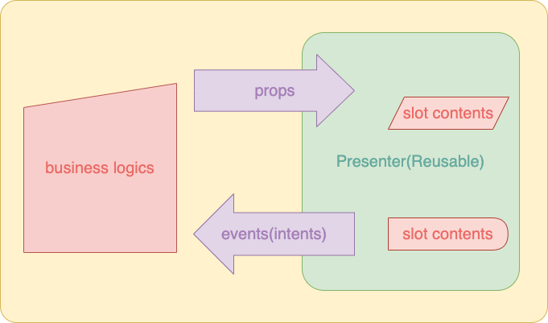

## 구현사례

이전에 담당했던 프로젝트에서 서로 다른 4개의 타사들과의 카탈로그 매핑을 위한 신규 탭을 만드는 이슈를 맡은 적이 있었는데, 위 내용들을 활용하여 컴포넌트를 설계한 이야기를 한번 정리해보겠습니다.

먼저 탭에 표시할 컨텐츠는 다른 탭에서 선택한 옵션값에 따라서 아래와 같이 2가지로 나뉩니다.

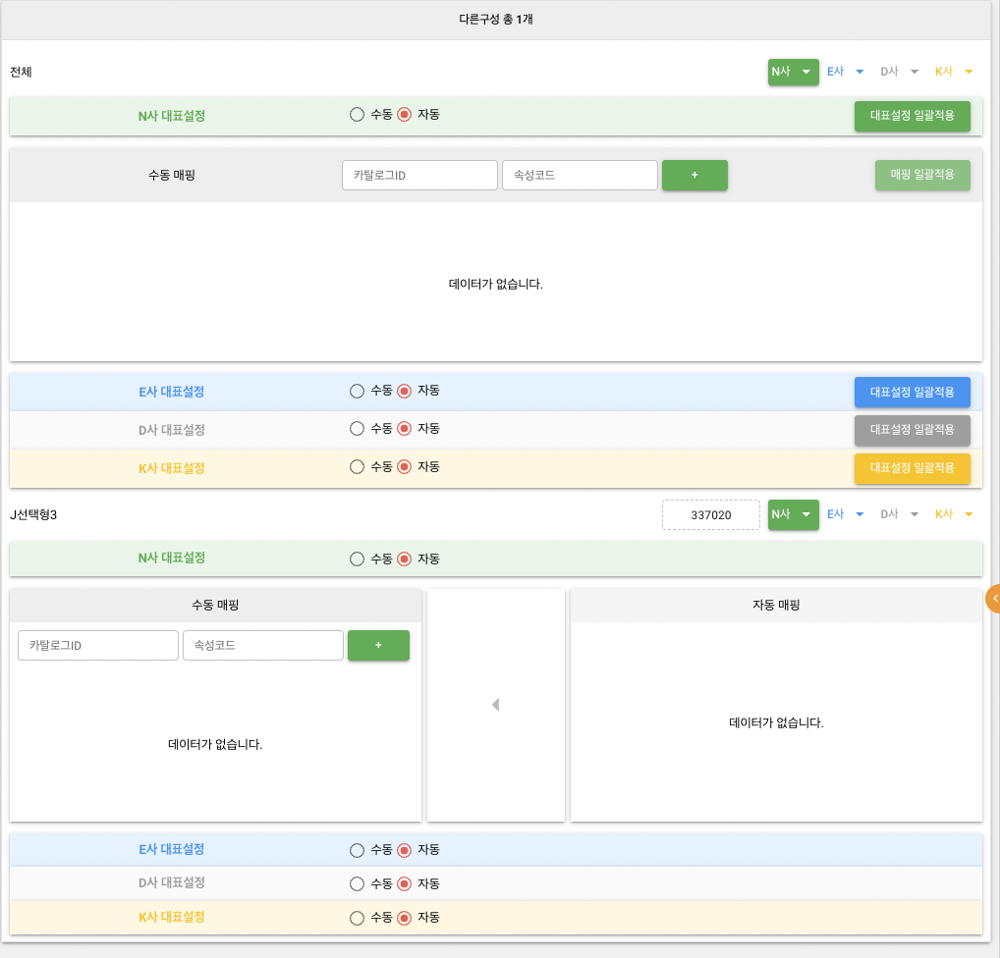

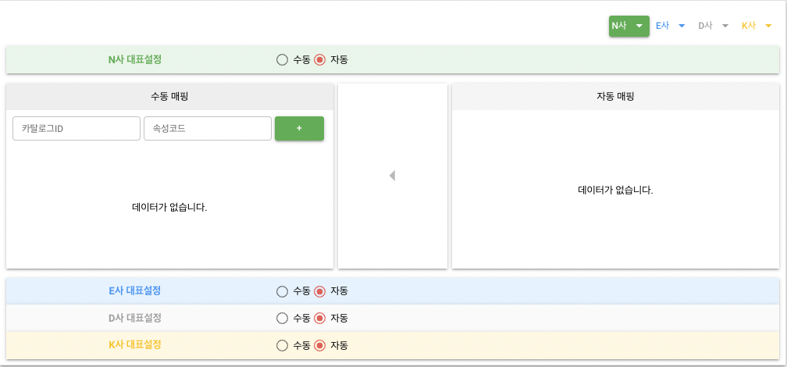

### Layout 구성

반복되는 구조는 "Layout"이라는 postfix를 가진 컴포넌트로 만들고, 구체적인 컨텐츠가 들어갈 영역(색깔로 표시된 영역)은 `<slot></slot>`으로 남겨둡니다.

:::info
`q-`로 시작하는 태그는 [Quasar](https://v1.quasar.dev/) 컴포넌트입니다!
:::

#### BuycdtLayout

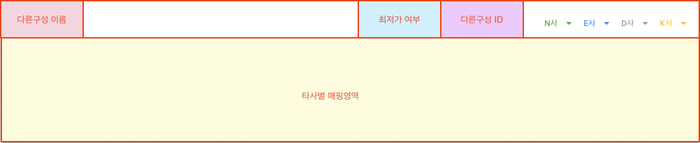

```html
<template>
  <div>
    <div class="row q-py-lg">
      <span class="col flex items-center">
        <slot name="buycdtName" />
      </span>
      <div class="col-auto flex justify-end align-center">
        <slot name="lowestPriceText" />
        <slot name="buycdtSeq" />
        <q-btn
          class="q-mr-sm"
          label="N사"
          color="green"
          icon-right="arrow_drop_down"
          dense
          :flat="nFlat"
          @click.stop="toggleNFlat"
        />
        <q-btn
          class="q-mr-sm"
          label="E사"
          color="blue"
          icon-right="arrow_drop_down"
          dense
          :flat="eFlat"
          @click.stop="toggleEFlat"
        />
        <q-btn
          class="q-mr-sm"
          label="D사"
          color="grey"
          icon-right="arrow_drop_down"
          dense
          :flat="dFlat"
          @click.stop="toggleDFlat"
        />
        <q-btn
          class="q-mr-sm"
          label="K사"
          color="amber"
          icon-right="arrow_drop_down"
          dense
          :flat="kFlat"
          @click.stop="toggleKFlat"
        />
      </div>
    </div>
    <slot
      name="mapping"
      :showN="!nFlat"
      :showE="!eFlat"
      :showD="!dFlat"
      :showK="!kFlat"
    />
  </div>
</template>
```

#### OtherCompanyMappingLayout

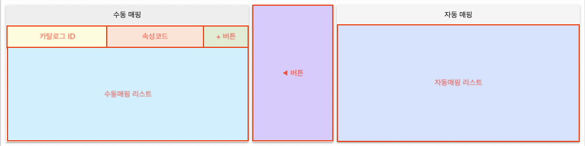

```html
<template>
  <div class="selectable-list q-mb-lg">
    <div class="left-side shadow-2">
      <div class="row q-pa-md bg-grey-3 justify-center items-center">
        <div class="text-center">수동 매핑</div>
      </div>
      <div class="row q-py-md q-col-gutter-sm" style="width: 100%">
        <slot name="catalogId" />
        <slot name="attributeCode" />
        <div class="col-2 flex justify-start">
          <slot name="addBtn" />
        </div>
      </div>
      <slot name="manualMappingList">
        <div class="selectable-list-empty" :style="computedStyle('156px')">
          데이터가 없습니다.
        </div>
      </slot>
    </div>
    <div class="mid-side q-mx-md shadow-2">
      <div>
        <slot name="arrworBtn" />
      </div>
    </div>
    <div class="right-side shadow-2">
      <div class="q-pa-md text-center bg-grey-2">자동 매핑</div>
      <slot name="autoMappingList">
        <div class="selectable-list-empty" :style="computedStyle('207px')">
          데이터가 없습니다.
        </div>
      </slot>
    </div>
  </div>
</template>
```

#### BatchMappingLayout

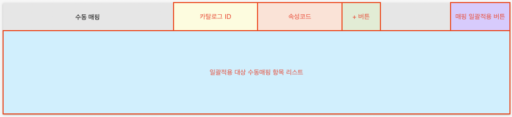

```html
<template>
  <div class="selectable-list q-mb-lg">
    <div class="left-side shadow-2">
      <div class="row bg-grey-3 flex justify-between">
        <div class="col-4 flex justify-center items-center">수동 매핑</div>
        <div class="col-5 row q-pa-md">
          <slot name="catalogId" />
          <slot name="attributeCode" />
          <slot name="addBtn" />
        </div>
        <div class="col-3 flex justify-end items-center">
          <slot name="mappingBatchBtn" />
        </div>
      </div>
      <slot name="manualMappingList">
        <div class="selectable-list-empty" :style="computedStyles('156px')">
          데이터가 없습니다.
        </div>
      </slot>
    </div>
  </div>
</template>
```

### 컴포넌트 구성

위에서 정의한 layout의 slot에 다른 컴포넌트를 채워서 재사용할 컴포넌트를 생성합니다.

#### OtherCompanyMapping

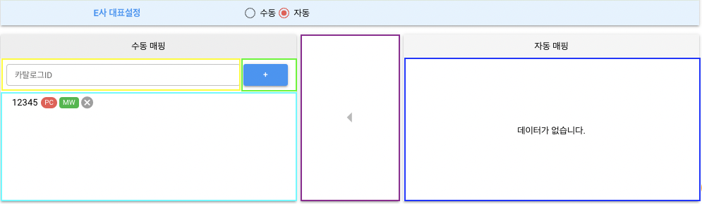

```html
<template>
  <div>
    <!-- 상단 대표설정 + option-group 영역 -->
    <OtherCompanyMappingLayout v-show="showMappingArea">
      <template #catalogId>
        <q-input ref="$catalogId" v-model="catalogId" label="카탈로그ID" />
      </template>
      <template v-if="companyType === 'N'" #attributeCode>
        <q-input
          ref="$attributeCode"
          v-model="attributeCode"
          label="속성코드"
        />
      </template>
      <template #addBtn>
        <q-btn @click.stop="$emit('add:manualItem')">+</q-btn>
      </template>
      <template v-if="manualList.length" #manualMappingList>
        <q-virtual-scroll :items="manualList">
          <template #default="{ item }">
            <q-item @click.stop="$emit('select:manualItem', item)">
              <q-item-section>
                <!-- "대표" 키워드 + 매핑항목 label + PC, MW chip 영역 -->
                <q-btn
                  icon="cancel"
                  @click.stop="$emit('delete:manualItem', item)"
                />
              </q-item-section>
            </q-item>
          </template>
        </q-virtual-scroll>
      </template>
      <template #arrowBtn>
        <q-btn icon="arrow_left" @click.stop="$emit('move:autoItems')" />
      </template>
      <template v-if="autoList.length" #autoMappingList>
        <q-virtual-scroll :items="autoList">
          <template #default="{ item }">
            <q-item>
              <q-item-section>
                <!-- "대표" 키워드 + 매핑항목 label + PC, MW chip 영역 -->
              </q-item-section>
            </q-item>
          </template>
        </q-virtual-scroll>
      </template>
    </OtherCompanyMappingLayout>
  </div>
</template>
<script lang="ts">
  import { defineComponent, PropType, computed } from "@vue/composition-api";

  export default defineComponent({
    name: "OtherCompanyMapping",
    props: {
      companyType: String as PropType<"N" | "E" | "D" | "K">,
      mappings: Array as PropType<OtherCompanyCtlg[]>,
      mainType: String as PropType<"A" | "M">,
      showMappingArea: Boolean,
    },
    setup(props, context) {
      const manualList = computed(() =>
        props.mappings.filter(({ isAuto }) => isAuto === "N")
      );
      const autoList = computed(() =>
        props.mappings.filter(({ isAuto }) => isAuto === "Y")
      );
      // ...
      return {
        manaulList,
        autoList,
        // ...
      };
    },
  });
</script>
```

#### BatchMapping

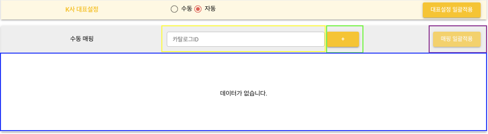

```html
<template>
  <div>
    <!-- 상단 대표설정 + option-group 영역 -->
    <q-btn label="대표설정 일괄적용" @click.stop="$emit('batch:mainType')" />
    <BatchMappingLayout v-show="showMappingArea">
      <template #catalogId>
        <q-input ref="$catalogId" v-model="catalogId" label="카탈로그ID" />
      </template>
      <template v-if="showAttrCode" #attributeCode>
        <q-input
          ref="$attributeCode"
          v-model="attributeCode"
          label="속성코드"
        />
      </template>
      <template #addBtn>
        <q-btn label="+" />
      </template>
      <template #mappingBatchBtn>
        <q-btn
          label="매핑 일괄적용"
          @click.stop="$emit('batch:manualMappings')"
        />
      </template>
      <template v-if="manualList.length" #manualMappingList>
        <q-virtual-scroll :items="manualList">
          <template #default="{ item }">
            <q-item>
              <q-item-section>
                <!-- 매핑항목 label + PC, MW chip + 삭제버튼 영역 -->
              </q-item-section>
            </q-item>
          </template>
        </q-virtual-scroll>
      </template>
    </BatchMappingLayout>
  </div>
</template>
<script lang="ts">
  import { defineComponent, PropType, ref } from "@vue/composition-api";

  export default defineComponent({
    name: "BatchMapping",
    props: {
      companyType: String as PropType<"N" | "E" | "D" | "K">,
      showMappingArea: Boolean,
    },
    setup(props, context) {
      const manualList = ref<OtherCompanyCtlg[]>([]);
      // ...
      return {
        manualList,
        // ...
      };
    },
  });
</script>
```

### 탭 구성

이제 위에서 만든 컴포넌트들을 `BuycdtLayout`의 slot에 넣어서 컨텐츠를 구성합니다.

#### BuycdtUseY - 상단 일괄적용 영역(전체)

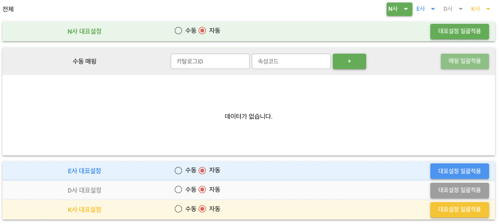

```html
<template>
  <BuycdtLayout>
    <template #buycdtName> 전체 </template>
    <template #mapping="props">
      <BatchMapping
        companyType="N"
        :showMappingArea="props.showN"
        @batch:mainType="onBatchMainType"
        @batch:manualMappings="onBatchManualMappings"
      />
      <BatchMapping
        companyType="E"
        :showMappingArea="props.showE"
        @batch:mainType="onBatchMainType"
        @batch:manualMappings="onBatchManualMappings"
      />
      <BatchMapping
        companyType="D"
        :showMappingArea="props.showD"
        @batch:mainType="onBatchMainType"
        @batch:manualMappings="onBatchManualMappings"
      />
      <BatchMapping
        companyType="K"
        :showMappingArea="props.showK"
        @batch:mainType="onBatchMainType"
        @batch:manualMappings="onBatchManualMappings"
      />
    </template>
  </BuycdtLayout>
</template>
```

#### BuycdtUseY - 하단 항목들

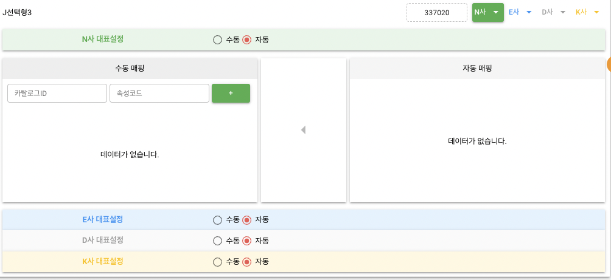

```html
<template>
  <BuycdtLayout v-for="buycdt in buycdtList" :key="buycdt.id">
    <template #buycdtName> {{ buycdt.buycdtSetElmtNm }} </template>
    <template v-if="buycdt.buycdtSetLowestPriceYn === 'Y'" #lowestPriceText>
      최저가
    </template>
    <template #buycdtSeq> {{ buycdt.buycdtSetSeq }} </template>
    <template #mapping="props">
      <OtherCompanyMapping
        companyType="N"
        :mainType="buycdt.otherCompanyCtlgs.nCtlg.mainType"
        :mappings="buycdt.otherCompanyCtlgs.nCtlg.catalogs"
        :showMappingArea="props.showN"
        @update:mainType="onUpdateMainType(buycdt.buycdtSetElmNm)"
        @add:manualItem="onAddManualItem(buycdt.buycdtSetElmNm)"
        @delete:manualItem="onDeleteManualItem(buycdt.buycdtSetElmNm)"
        @move:autoItems="onMoveAutoItems(buycdt.buycdtSetElmNm)"
      />
      <OtherCompanyMapping
        companyType="E"
        :mainType="buycdt.otherCompanyCtlgs.eCtlg.mainType"
        :mappings="buycdt.otherCompanyCtlgs.eCtlg.catalogs"
        :showMappingArea="props.showE"
        @update:mainType="onUpdateMainType(buycdt.buycdtSetElmNm)"
        @add:manualItem="onAddManualItem(buycdt.buycdtSetElmNm)"
        @delete:manualItem="onDeleteManualItem(buycdt.buycdtSetElmNm)"
        @move:autoItems="onMoveAutoItems(buycdt.buycdtSetElmNm)"
      />
      <OtherCompanyMapping
        companyType="D"
        :mainType="buycdt.otherCompanyCtlgs.dCtlg.mainType"
        :mappings="buycdt.otherCompanyCtlgs.dCtlg.catalogs"
        :showMappingArea="props.showD"
        @update:mainType="onUpdateMainType(buycdt.buycdtSetElmNm)"
        @add:manualItem="onAddManualItem(buycdt.buycdtSetElmNm)"
        @delete:manualItem="onDeleteManualItem(buycdt.buycdtSetElmNm)"
        @move:autoItems="onMoveAutoItems(buycdt.buycdtSetElmNm)"
      />
      <OtherCompanyMapping
        companyType="K"
        :mainType="buycdt.otherCompanyCtlgs.kCtlg.mainType"
        :mappings="buycdt.otherCompanyCtlgs.kCtlg.catalogs"
        :showMappingArea="props.showK"
        @update:mainType="onUpdateMainType(buycdt.buycdtSetElmNm)"
        @add:manualItem="onAddManualItem(buycdt.buycdtSetElmNm)"
        @delete:manualItem="onDeleteManualItem(buycdt.buycdtSetElmNm)"
        @move:autoItems="onMoveAutoItems(buycdt.buycdtSetElmNm)"
      />
    </template>
  </BuycdtLayout>
</template>
```

#### BuycdtUseN


```html
<template>
  <BuycdtLayout>
    <template #mapping="props">
      <OtherCompanyMapping
        companyType="N"
        :mainType="buycdt.otherCompanyCtlgs.nCtlg.mainType"
        :mappings="buycdt.otherCompanyCtlgs.nCtlg.catalogs"
        :showMappingArea="props.showN"
        @update:mainType="onUpdateMainType"
        @add:manualItem="onAddManualItem"
        @select:manualItem="onSelectManualItem"
        @delete:manualItem="onDeleteManualItem"
        @move:autoItems="onMoveAutoItems"
      />
      <OtherCompanyMapping
        companyType="E"
        :mainType="buycdt.otherCompanyCtlgs.eCtlg.mainType"
        :mappings="buycdt.otherCompanyCtlgs.eCtlg.catalogs"
        :showMappingArea="props.showE"
        @update:mainType="onUpdateMainType"
        @add:manualItem="onAddManualItem"
        @select:manualItem="onSelectManualItem"
        @delete:manualItem="onDeleteManualItem"
        @move:autoItems="onMoveAutoItems"
      />
      <OtherCompanyMapping
        companyType="D"
        :mainType="buycdt.otherCompanyCtlgs.dCtlg.mainType"
        :mappings="buycdt.otherCompanyCtlgs.dCtlg.catalogs"
        :showMappingArea="props.showD"
        @update:mainType="onUpdateMainType"
        @add:manualItem="onAddManualItem"
        @select:manualItem="onSelectManualItem"
        @delete:manualItem="onDeleteManualItem"
        @move:autoItems="onMoveAutoItems"
      />
      <OtherCompanyMapping
        companyType="K"
        :mainType="buycdt.otherCompanyCtlgs.kCtlg.mainType"
        :mappings="buycdt.otherCompanyCtlgs.kCtlg.catalogs"
        :showMappingArea="props.showK"
        @update:mainType="onUpdateMainType"
        @add:manualItem="onAddManualItem"
        @select:manualItem="onSelectManualItem"
        @delete:manualItem="onDeleteManualItem"
        @move:autoItems="onMoveAutoItems"
      />
    </template>
  </BuycdtLayout>
</template>
```

## 마무리

지금까지 설명한 사례는 사실 개발기간이 약 2달 정도 소요되었던 1순위 작업이었습니다.

그런데 live 환경에서 모니터링 중 side-effect로 인한 다수의 버그가 발생하는 와중에 담당자 분이 갑작스럽게 퇴사하셔서 해당 이슈는 저한테 넘어오게 되었습니다.

어떻게든 해결하려고 자정까지 야근을 했지만 끝내 고치지 못해서 이미 퇴근하셨던 팀장님과 다른 매니저님들의 도움으로 결국 롤백을 진행했었죠🤯

굉장히 막막했지만 평소에 생각했던 컴포넌트의 재사용성에 대한 아이디어를 구현할 수 있는 기회로 생각하기로 마음먹은 저는 약 1주일동안 재개발을 진행했습니다.

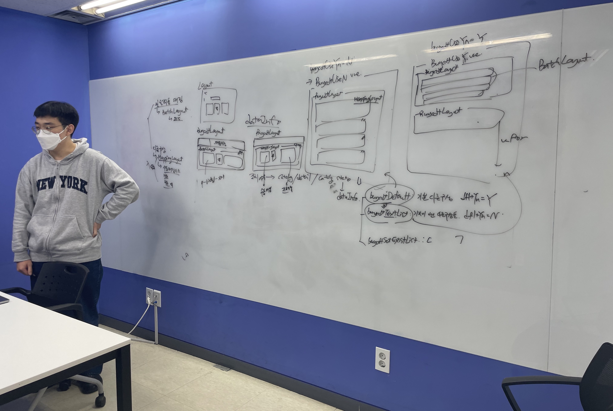

확실히 컴포넌트에 많은 역할과 기능을 부여하지 않으니 재사용하는데 부담이 덜 들었고, 컴포넌트의 props와 emit되는 event들의 종류만으로 ViewModel 로직을 간결하게 작성할 수 있었습니다.

덕분에 QA 중 기능버그는 1건만 나왔고 기존 test, live 환경에서 발생했던 모든 버그들을 해결해서 배포예정일에 맞춰 이슈를 마무리할 수 있었습니다🥳
