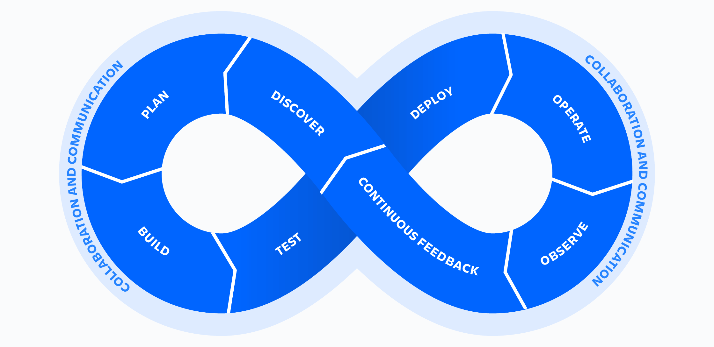

# DevOps란?

dev(elopment)와 op(erations)의 합성어로, 개발과 운영 사이에서 수행되는 일련의 작업들을 통합하고 자동화하기 위한 toolchain이나 관습들을 모두 포괄하는 용어입니다.

서비스 주기를 따라 다양한 팀간의 협업을 통해 소프트웨어 배포의 속도와 질을 높이는 것을 목표로 합니다.

## Life Cycle

    

DevOps 모델은 보통 지속성을 상징하는 뫼비우스 띠 모양으로 표현되는데, 왼쪽 고리가 “개발”, 오른쪽 고리가 “운영”에 해당합니다.

## CI(Continuos Integration)

개발자들이 각자 할당된 이슈로 개발한 사항들을 하나의 repository에 지속적으로 merge하는 과정을 가리킵니다.

변경사항들이 merge될 때마다 lint와 같은 correctness test를 실행하여 프로젝트에 정제된 소스만이 있도록 관리할 수 있습니다.

## CD(Continuous Deployment)

자동화된 방식으로 새로운 feature들을 자주 배포하는 과정을 가리킵니다.

사용자에게 업데이트된 코드를 지속적으로 전달하여 개발팀의 개발속도, 생산성과 유지보수의 용이성을 제공합니다.

## CD(Continuous Delivery)

CI에서 좀 더 확장한 개념으로, repo에 merge가 일어날 때마다 test/prod 환경으로 build + test + deploy가 연속적으로 일어나는 pipeline을 가리킵니다.
