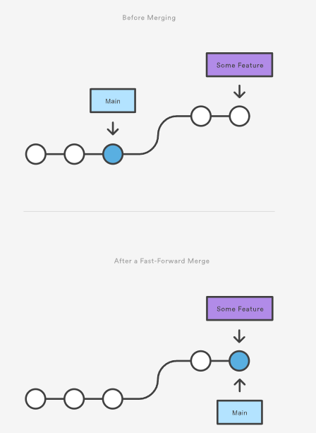
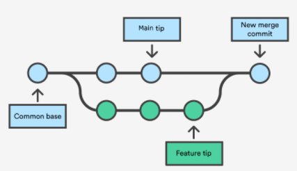
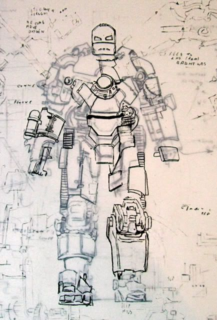
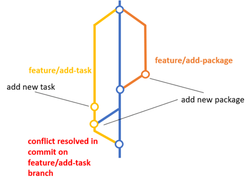

# git merge

forked history를 다시 하나로 합치기 위한 명령어로, 보통 하나의 common base(공통 commit)에서 갈라진 branch들을 하나의 branch로 만들 때 사용합니다.

::: info
`git merge` + checkout + `git branch -d` 조합으로 많이 사용됩니다.

:::

`git merge`를 하기 전에 준비과정이 필요합니다.

1. `git HEAD`(현재 commit)가 merge-receiving branch에 있는지 확인한다.
2. `git pull`로 remote repo 상의 merge-receiving branch의 최근 상태와 동기화한다.
3. `git merge`를 수행한다.

## merge하는 방법

### Fast Foward

**FROM** branch에서 **TO** branch로 하나의 경로로 이어질 수 있을 때 사용할 수 있는 방법입니다.

<p align="center">
    
</p>

Git은 branch들을 합치는 대신에 **FROM** branch tip이 **TO** branch tip으로 이동시켜서 하나의 history를 만들기에 새로운 merge commit을 생성하지 않습니다.

보통 `git rebase`와 함께 사용되어 사소한 feature나 bugfix를 할 때 사용합니다.

fast-foward 방식이여도 기록을 유지하기 위한 수단으로 merge commit을 생성하려면 `—-no-ff` 옵션을 사용하면 됩니다.

### 3-way merge

Fast Forward merge와 다르게 **FROM** branch에서 feature를 개발하는 동안에 **TO** branch에서 계속 commit이 생성될 때도 사용할 수 있는 방식으로, 보통 규모가 큰 feature를 개발하거나 팀 단위로 project를 진행할 때 활용합니다.

<p align="center">
    
</p>

3개의 commit 즉, **FROM** branch의 tip + **TO** branch의 tip + common base commit을 사용하는데, Git은 merge 전에 common base를 기준으로 두 tip에서 각각 어떤 부분이 달라졌는지를 확인합니다.

변한 부분이 겹치지 않는다면 두 변경사항들을 모두 반영한 새로운 merge commit을 생성하지만, 동일한 파일에서 겹치는 부분이 하나라도 있다면 두 변경사항 중 어떤 것을 반영할지 모르므로 Git은 merge conflict를 발생시켜 개발자의 개입을 요구합니다.

## Conflict

3-way merge를 할 때 발생하는 merge conflict는 보통 아래와 같은 상황에서 발생합니다.

- 두 사람이 동일한 파일에서 동일한 줄에 있는 코드를 수정한 경우
- 한 branch에서 잘 사용하던 파일을 다른 branch에서 삭제한 경우

:::info
현재 프로젝트의 working directory(unstage) 또는 stage 단계에서 대기하는 변경사항(pending changes)들로 commit을 만들지 않으면 Git은 merge를 시작하지 않습니다.

이에 대비하려면 `git stash`, `git checkout`, `git commit`, `git reset` 명령어로 local repo를 최근 상태로 만들면 됩니다.
:::

:::tip merge 관련 유용한 command들

- `git status` : confilct가 발생한 파일을 확인할 때 사용한다.
- `git log -—merge` : merge되려는 두 branch에서 conflict가 발생한 commit들의 목록을 보여준다.
- `git diff` : repository와 파일들 사이의 차이점을 보여준다.

:::

### Resolving Conflict

merge 과정은 마치 만드려는 제품의 구성품 도안들을 겹치는 행위와 동일합니다. 2개 이상의 도안들이 같은 파트를 동시에 설계하여 중복된다면 conflict가 발생합니다.

<p align="center">
    
</p>

### feature -> master(main)

평소에 `feature`에서 작업하는 중에 `master`에 새로운 commit이 올라올 때마다 master → feat 방향 merge를 수행하면 된다.

<p align="center">
    
</p>

### feature -> develop, test

`develop`, `test`는 각각 개발용, 검증용 환경에서 테스트하기 위한 브랜치로, 저 말고도 다른 분들에 의해서 live 환경에 추가할 기능들을 테스트하기 위한 목적으로 이미 많은 merge들이 이루어진 상태입니다.

:::danger
`develop`, `test` → `feature` 방향으로 merge를 수행하여 해결해서는 **절대로 안됩니다.**

- 제 `feature`에 아직 배포준비가 되지 않은 다른 사람의 코드들이 반영되어 live에 배포될 수 있습니다.
- merge를 수행한 뒤에 `feature`에서 작업하다가 다른 분이 생성한 코드를 수정하거나 삭제해서 다시 `develop`, `test`에 반영될 수 있습니다.

:::

conflict는 아래와 같이 해결하면 됩니다.

1. target(`develop`, `test`)으로 checkout한 뒤에, 아래와 같은 브랜치를 생성한다.

```js
`${feat 이름}-${target 이름}`

// feature/FE2-123-dev
// feature/FE2-123-tst
```

2. `feature` → feat-target 방향으로 merge를 진행하면 당연히 충돌이 생길 것이다.

3. feat-target에 checkout된 상태에서 [VSC](https://code.visualstudio.com/docs/editor/versioncontrol#_merge-conflicts), [Intellij](https://javakong.tistory.com/217)에서 제공하는 자동화 툴로 충돌을 해결하고 3-way merge를 진행한다.
