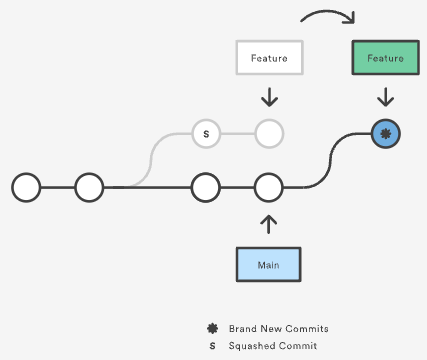

# git rebase

`feature` 브랜치의 base를 특정 브랜치 또는 commit으로 옮겨서 현재까지 변경사항을 local에 반영하고 linear history를 유지할 때 사용하는 명령어로, rebase한 이후 `feature` 브랜치에는 새로운 commit들이 만들어집니다.

{ align="center" }

:::danger
새로운 commit이 만들어지기 때문에 다른 팀원들과 공유하고 있는 브랜치를 로컬에서 rebase하고 push하면 **절대로 안됩니다.**
:::

## interactive rebase

`feature` 브랜치를 rebase했을 때, 기존 commit들을 어떻게 재구성할지 commit 단위로 작업할 수 있습니다.

보통 commit 순서 수정, commit 메시지 수정, 이전 commit으로 squash, 제거 등 작업에 주로 활용됩니다.

`—-onto` 옵션을 붙이면 rebase되기 전후 브랜치를 명시하여 안전하게 변경사항들을 반영할 수 있습니다.

```zsh
git rebase --onto <newbase> <oldbase> <rebase-target-branch>
```
