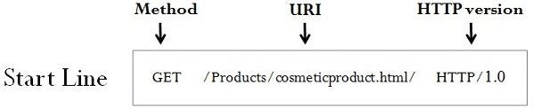
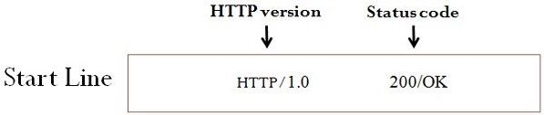

# start-line

## 요청

요청 메시지의 경우, 아래와 같은 구성을 가집니다.

<p align="center">
    
</p>

### Method

[Methods](../http1/methods.md)

### URI

#### 1. absolute path(origin form)

`GET`, `POST`, `HEAD`, `OPTIONS` 메서드에서 주로 사용합니다.

형태 : path( + ‘?’ + query)

```bash
POST / HTTP/1.1
```

```bash
GET /background.png HTTP/1.0
```

```bash
HEAD /test.html?query=alibaba HTTP/1.1
```

```bash
OPTIONS /anypage.html HTTP/1.0
```

#### 2. complete URL(absolute form)

HTTP proxy로의 `GET` 요청에서 주로 사용합니다.

형태 : origin + path( + ? + query)

```bash
GET https://developer.mozilla.org/en-US/docs/Web/HTTP/Messages HTTP/1.1
```

#### 3. authority component(authority form)

주로 `CONNECT` 메서드에서 사용합니다.

형태 : domain name + port

```bash
CONNECT developer.mozilla.org:80 HTTP/1.1
```

#### 4. asterisk form(\*)

주로 `OPTIONS` 메서드에서 주로 사용합니다.

형태 : \* ⇒ 가능한 모든 서버들을 가리킨다.

```bash
OPTIONS * HTTP/1.1
```

### HTTP Version

`start-line` 아래로 작성되는 메시지와 추후 응답 메시지의 구조를 나타냅니다.

## 응답

응답 메시지의 경우, 아래와 같이 HTTP version + Status Code로만 간단하게 구성됩니다.

<p align="center">
    
</p>
