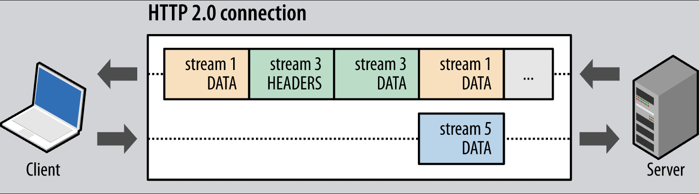

# Multiplexing

`HTTP/2` 에서는 stream간의 frame 결합과 재조립으로 multiplexing을 구현합니다.

{ align="center" }

전송할 HTTP 메시지들을 [단일 persistent TCP connection](../http1/connection_management#persistent) 내에서 결합된 stream으로 주고받는 로직은 다음과 같은 장점을 가집니다.

- 여러 개의 요청/응답을 병렬적으로 전송해도 어느 하나도 blocking되지 않아서 [HOL Blocking](../../http/http1/connection_management.html##http-pipelining)을 해결한다.
- 불필요한 네트워크 지연이 없고 가용 대역폭를 최대한 활용할 수 있다.
- 중간 proxy들의 연산량이 줄어서 여러 개의 TCP connection 상에서 요청들을 처리할 필요가 없어진다.
- 기존 HTTP 메시들을 압축하여 네트워크 대역폭을 절약할 수 있다.
