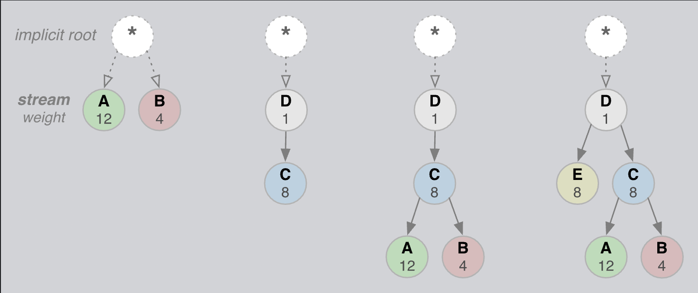

# Stream Prioritization

`HTTP/2` 에서는 리소스의 우선순위를 반영하여 stream들 사이의 우선순위를 결정합니다.

    

결정요인은 2가지가 있습니다.

#### 1. dependency(1~256)

요청 stream 처리순서 또는 대응된 응답 stream의 전송순서

#### 2. weight

stream을 처리하기 위해 투입할 리소스 양의 비율

클라이언트는 stream별 dependency와 weight를 조합하여 만든 prioritization tree를 서버와 공유하고 서버는 **“최대한”** 리소스 우선순위에 맞춰서 처리하고 응답을 전송합니다.

:::info
우선순위가 높은 stream을 처리하느라 낮은 우선순위 stream을 처리하는데 지연이 발생할 수 있기 때문에 “최대한”을 붙였습니다.
:::

또한 prioritization tree는 언제든지 클라이언트 상에서의 사용자 상호작용이나 다른 signal에 의한 업데이트가 가능합니다.
