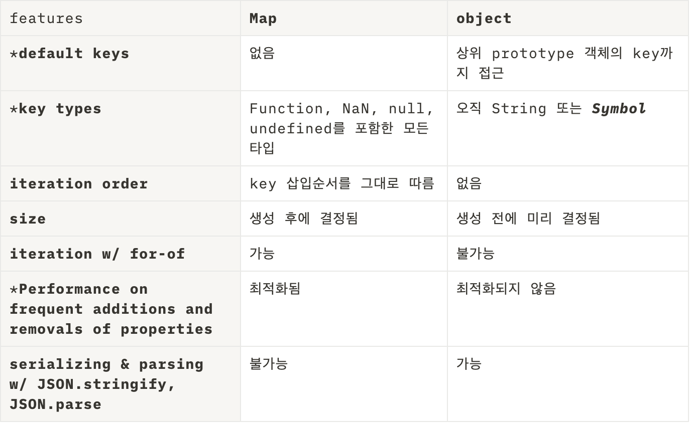

# Map

reference 타입 중 하나인 Map은 key-value pair로 속성을 저장한다는 점에서 일반적인 객체와 거의 비슷하지만 다음과 같은 차이점이 있습니다.



## Iterating Map with forEach method

```js
myMap.forEach((value, key) => {
  console.log(key + " = " + value);
});
// 0 = zero
// 1 = one
```

## 2D Array

```js
const kvArray = [
  ["key1", "value1"],
  ["key2", "value2"],
];

// Use the regular Map constructor to transform a 2D key-value Array into a map
const myMap = new Map(kvArray);

myMap.get("key1"); // returns "value1"

// Use Array.from() to transform a map into a 2D key-value Array
console.log(Array.from(myMap));

// A succinct way to do the same, using the spread syntax
console.log([...myMap]);

// Or use the keys() or values() iterators, and convert them to an array
console.log(Array.from(myMap.keys())); // ["key1", "key2"]
```

## Cloning Maps

```js
const original = new Map([[1, "one"]]);

const clone = new Map(original);

console.log(clone.get(1)); // one
console.log(original === clone); // false (useful for shallow comparison)
```

## Merging Maps

```js
const first = new Map([
  [1, "one"],
  [2, "two"],
  [3, "three"],
]);

const second = new Map([
  [1, "uno"],
  [2, "dos"],
]);

// Merge two maps. The last repeated key wins.
// Spread operator essentially converts a Map to an Array
const merged = new Map([...first, ...second]);

console.log(merged.get(1)); // uno
console.log(merged.get(2)); // dos
console.log(merged.get(3)); // three
```
