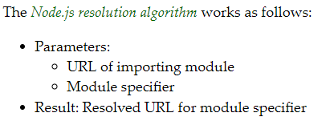

# Module Resolution

Node 환경에서는 "Node.js Resolution Algorithm"으로 module specifier를 해석하여 module들을 구분합니다.



## Relative Specifier

import하는 module의 URL로부터 해석된 absoulte URL에서 다음 3가지를 확인합니다.

- (module).js
- (module)/package.json의 `main` 필드에 지정된 `.js` 파일
- (module)/index.js

## Bare Specifier

bare specifier인 경우, 3가지 경우가 있습니다.

- ‘#’으로 시작하는 경우
- (package)/sub/path
- @(scope)/(scoped-package)/sub/path

resolution algorithm은 현재 위치에서 bare specifier의 시작 부분 패턴과 일치하는 subdirectory 구조를 가진 `node_modules` 폴더를 찾을 때까지 프로젝트 root까지 거슬러 올라갑니다.

package id 다음으로 오는 subpath는 package directory에 대한 relative path로 해석됩니다.

```js
var x = require("moduleB"); // /root/src/moduleA.js
```

```js
/root/src/node_modules/moduleB.js
/root/src/node_modules/moduleB/package.json // (if it specifies a "main" property)
/root/src/node_modules/moduleB/index.js

/root/node_modules/moduleB.js
/root/node_modules/moduleB/package.json // (if it specifies a "main" property)
/root/node_modules/moduleB/index.js

/node_modules/moduleB.js
/node_modules/moduleB/package.json // (if it specifies a "main" property)
/node_modules/moduleB/index.js
```

resolution algorithm의 결과는 하나의 파일을 가리켜야 합니다.

:::tip
`.js` 확장자를 가진 파일을 모듈로 처리하려면 다음과 같은 설정이 필요합니다.

- `.mjs` 확장자는 언제나 ES Module을 의미합니다.
- 현재 위치에서 가장 가까운 `package.json`의 `type` 필드의 값을 “module”로 지정합니다.
  :::
