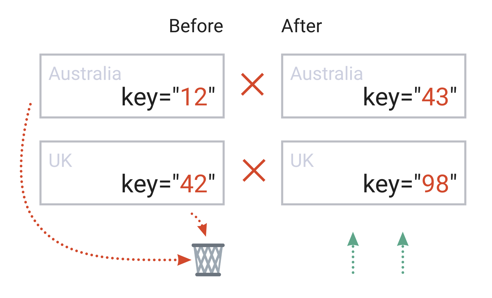
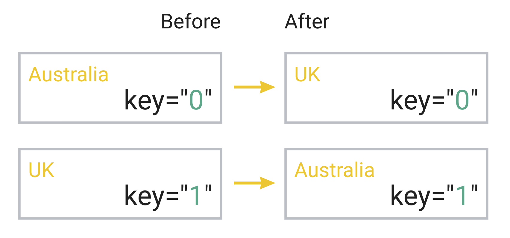
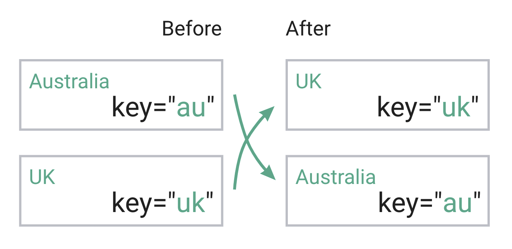

# React key attribute: best practices for performant lists

`key` attribute은 list rendering에서 리렌더링 중 sibling 컴포넌트들을 구분하기 위한 id 역할을 합니다.

React에서 `key` attribute은 다음과 같은 과정을 거쳐서 확인합니다.

1. 리렌더링으로 특정 ReactElement의 전과 후의 snapshot들을 생성합니다.
2. list item에 `key` attribute이 없다면 index를 대신 사용합니다.
3. snapshot을 비교하면서…
   - 이전 snapshot에서도 동일한 `key` attribute의 list item이 있다면, 이 item의 **상태는 그대로 유지하면서 달라진 props를 반영한 리렌더링을 수행**합니다.
   - 이전 snapshot에는 있지만 이후 snapshot에 없는 `key` attribute의 컴포넌트는 unmount 됩니다.
   - 이전 snapshot에는 없지만 이후 snapshot에 있는 `key` attribute의 컴포넌트는 새로 mount됩니다.

:::warning
컴포넌트의 props와 state는 별개로 생각해야 합니다.

달라진 props를 기반으로 리렌더링한다고 해서 state가 초기화되는게 절대 아닙니다!
:::

## Why random “key” attributes are a bad idea?

위와 같은 원리에 의하면 `key` attribute을 무작위로 지정하면 리렌더링마다 list item의 `key` attribute이 달라지므로 모든 list item이 unmount되고 새로 mount되기 때문에 앱 성능을 저하시킬 수 있습니다.



## Why “index” as a “key” attribute is not a good idea?

공식문서에서는 item의 index를 `key` attribute을 사용하면 여러 버그와 성능저하의 원인이라고 하는데, **이 부분은 list item의 순서나 개수가 달라지는 동적인 list에 한해서 발생하는 문제**입니다.

아래와 같은 Item과 List 컴포넌트가 있다고 합시다.

```jsx
const Item = ({ country }) => {
  return (
    <button className="country-item">
      
      {country.name}
    </button>
  );
};
```

```jsx
const MemoizedItem = React.memo(Item);

const CountriesList = ({ countries }) => {
  return (
    <div>
      {countries.map((country) => (
        <MemoizedItem country={country} />
      ))}
    </div>
  );
};
```

위에서 ContriesList가 리렌더링될 때마다 동일한 props에 대해서는 기존 컴포넌트를 재활용하도록 `React.memo` 로 memoise 처리합니다.

dnd로 item의 순서가 달라져도 첫번째 item의 index는 0이고 두번째 index는 1로 유지됩니다.

그래서 동일한 index를 가졌던 컴포넌트의 상태를 그대로 유지하면서 달라진 props를 기반으로 리렌더링이 일어납니다.



id를 `key` attribute으로 사용하는 경우, 순서가 바뀐 컴포넌트들은 리렌더링될 필요없이 그대로 재활용됩니다.



또한 list에 새로운 item을 임의의 위치에 추가하는 경우도 마찬가집니다.

index를 `key`로 가지는 경우, item을 가장 앞에 추가한다면 첫번째 컴포넌트는 index 0을 가지므로 이전 snapshot의 첫번째 컴포넌트를 그대로 사용하여 리렌더링이 일어나지만 원래 있던 가장 마지막 item의 새로운 index를 가지므로 매번 re-mounting되는 현상이 일어납니다.

id를 `key`로 가지는 경우, 추가되는 item만 mount되고 기존 item들은 그대로 재활용됩니다.

## Why “index” as a “key” attribute is a good idea?

item의 index를 key로 가지는 것은 list의 길이가 고정적인 정적 리스트인 경우에 유용합니다.

대표적으로 pagination에 적용할 수 있습니다.

id를 key로 가지는 경우, 페이지가 달라질 때마다 전체 리스트가 다시 mount되지만 index로 가지는 경우, React에서는 이전 페이지에서 사용한 item들을 리렌더링하기에 연산량이 덜 필요합니다.

또한 검색 자동완성과 같이 기존 list item을 다른 걸로 대체하는 연산이 필요한 작업들에도 유용합니다.
