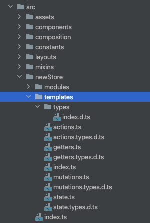

# Vuex를 위한 composable 만들어보기

## 배경

이전에 담당했던 Vue 프로젝트에서 `useGenericStore`라는 composable을 사용했는데, 특정 [Vuex](https://v3.vuex.vuejs.org/) 스토어 모듈의 option들(state, getter, mutation, dispatch)을 사용하기 위한 함수들을 제공합니다.

[다른 Vuex helper](https://github.com/ambit-tsai/vue2-helpers)들과는 달리 option들의 인자 타입과 반환값 타입을 generic으로 직접 지정할 수 있었는데, 이는 타입추론에 의한 자동완성과 디버깅 용이성을 제공하여 스토어 모듈들을 안전하게 사용할 수 있도록 도와주었습니다.

가령 아래와 같은 스토어 모듈이 있다면...

```ts
// @/store/modules/depth1/depth2.ts
export default {
  namespaced: true,
  state: {
    // ...
    seqs: [],
  },
  getters: {
    // ...
    getEvenSeqs: (state) => state.seqs.filter((_, i) => i % 2),
  },
  mutations: {
    // ...
    setSeqs: (state, data) => {
        state.seqs = data;
    },
  }
  dispatch: {
    // ...
    getSeqsApi: async ({ commit }, paramsOrData = {}) => {
        const resp = await fetchSeqs('url', paramsOrData);
        commit('setSeqs', resp);
    }
  },
};
```

컴포넌트나 다른 composable 파일에서 다음과 같이 사용할 수 있습니다.

```ts
// 아래 두 인자 depth1, depth2는 내부 로직에 의해서 자동완성이 가능합니다.
const { state, dispatch, mutation, getters } = useGenericStore(
  "depth1",
  "depth2"
);

const seqs = computed(() => state<SeqsType>("seqs"));

const oddSeqs = computed(() => getters<SeqsType>("getEvenSeqs"));

const updateFn = () => {
  // ...
  mutation<SeqsType>("setSeqs", data);
};

const fetchAlpha = async () => {
  await dispatch<ResponseType, ParamsOrDataType>("getSeqsApi");
  // ...
};
```

이러한 순기능에도 불구하고 저는 3가지의 문제점들이 있다고 생각했습니다.

1. 여러 스토어 모듈들에 접근하려면 개별적으로 `useGenericStore`를 호출해야 한다.
2. 사용할 option의 이름이 모듈 단위로 겹치지 않도록 이름을 붙여야 한다.
3. 특정 option의 인자와 반환값 타입을 일일이 지정해야 하는 번거로움이 있다.

```ts
const {
  toComputedState: ctlgCommState,
  dispatch: ctlCommDispatch,
  mutation: ctlgCommMutation,
} = useGenericStore("catalog", "common");

const { toComputedGetter: ctlgWorkGetter } = useGenericStore("catalog", "work");

const { toComputedState: applCommState, toComputedGetter: applCommGetter } =
  useGenericStore("application", "common");

// ...

const CURR_WORK_TAB = ctlgWorkGetter<WorkTab>("workTab");
const SELECTED_CATEGORY = applCommState<ICommonCategory>("selectedCategory");
const SELECTED_FULL_CATEGORY_LIST = applCommGetter<Function>(
  "selectedFullCategoryList"
);
const SELECTED_PRODUCT_MATCHING_TYPE = ctlgCommState<string | null>(
  "selectedProductMatchingType"
);
const SELECTED_PRODUCT_LIST = ctlgCommState<IProduct[]>("selectedProductList");
const SELECTED_GROUP_SEQ = ctlgCommState<string | null>("selectedGroupSeq");
```

위 문제점들을 해결하기 위해서 다음과 같은 방향으로 새로운 composable인 `useVuex`를 만들었습니다.

1. 스토어 모듈 단위가 아닌 option별로 접근할 수 있는 4개의 함수들을 정의한다.
2. 모든 모듈에 대해서 적용할 수 있도록 전달할 인자를 구성한다.
3. option에 접근하기 위한 accessor + 인자 + 반환값의 타입을 추론할 수 있도록 한다.

## 스토어 모듈의 정형화

임의의 스토어 모듈에 대해 적용할 수 있도록 모듈의 구조(타입)를 통일시켰습니다.

모듈마다 구성하는 option 객체들은 각자 다른 속성과 메서드를 가지지만 모듈 자체가 일관된 구조를 가져야 타입추론이 가능해지면서 함수의 이름, 인자 타입, 반환값 타입 충돌에 의한 버그를 개발하는 중에 해결할 수 있습니다.

기존의 스토어 모듈들을 살펴보면 Vuex의 `Module` 또는 `IStoreModule`이라는 전역타입으로 뒤섞여 있는 상태였습니다.

```ts
export default <Module<IState, any>>{
  state: {
    /*...*/
  },
  getters: {
    /*...*/
  },
  actions: {
    /*...*/
  },
  mutations: {
    /*...*/
  },
};
```

```ts
export default <IStoreModule<IState>>{
  state: {
    /*...*/
  },
  getters: {
    /*...*/
  },
  actions: {
    /*...*/
  },
  mutations: {
    /*...*/
  },
};
```

이를 개선하기 위해서 모든 스토어 모듈에 적용할 generic 타입인 `StoreModule`을 정의했습니다.

여기서 state를 제외한 나머지 option들의 타입은 Vuex에서 제공하는 `GetterTree`, `MutationTree`, `ActionTree`을 확장하여 적용했고, 특정 action 내에서 사용할 mutation들을 제한하기 위한 `AugmentedActionContext` 타입을 정의했습니다.

```ts
// @/newStore/modules/types.d.ts
import {
  GetterTree,
  MutationTree,
  ActionTree,
  Module,
  ActionContext,
} from "vuex";

export type AugmentedGetterTree<S, G> = GetterTree<S, S> & G;
export type AugmentedMutationTree<S, M> = MutationTree<S> & M;
export type AugmentedActionTree<S, A> = ActionTree<S, S> & A;

export type StoreModule<S, G, M, A> = Omit<
  Module,
  "getters" | "mutations" | "actions"
> & {
  getters?: AugmentedGetterTree<S, G>;
  mutations?: AugmentedMutationTree<S, M>;
  actions?: AugmentedActionTree<S, A>;
};

export type AugmentedActionContext<S, M> = Omit<
  ActionContext<S, S>,
  "commit"
> & {
  commit<K extends keyof M>(
    key: K,
    payload?: Parameters<M[K]>[1]
  ): ReturnType<M[K]>;
};
```

## option별 구현

### state

```ts
// @/newStore/modules/depth1/depth2/state.types.d.ts
export type State = {
  categories: CommonCategory[] | null;
};
```

```ts
// @/newStore/modules/depth1/depth2/state.ts
import { State } from "@/newStore/modules/depth1/depth2/state.types";

export const state: State = {
  categories: null,
};
```

### getters

```ts
// @/newStore/modules/depth1/depth2/getters.types.d.ts
import { State } from "@/newStore/modules/depth1/depth2/state.types";

export enum GetterTypes {
  CATEGORIES_IDS = "CATEGORIES_IDS",
}

export type Getters = {
  [GetterTypes.CATEGORIES_IDS](state: State): CommonCategory["cateSeq"][];
};
```

```ts
// @/newStore/modules/depth1/depth2/getters.ts
import { State } from "@/newStore/modules/depth1/depth2/state.types";
import {
  GetterTypes,
  Getters,
} from "@/newStore/modules/depth1/depth2/getters.types";
import { AugmentedGetterTree } from "@/newStore/modules/types";

export const getters: AugmentedGetterTree<State, Getters> = {
  [GetterTypes.CATEGORIES_IDS](state) {
    return state.categories.map(({ cateSeq }) => cateSeq);
  },
};
```

### mutations

```ts
// @/newStore/modules/depth1/depth2/mutations.types.d.ts
import { State } from "@/newStore/modules/depth1/depth2/state.types";

export enum MutationTypes {
  SET_CATEGORIES = "setCategories",
}

export type Mutations = {
  [MutationTypes.SET_CATEGORIES](
    state: State,
    payload: State["categories"]
  ): void;
};
```

```ts
// @/newStore/modules/depth1/depth2/mutations.ts
import { State } from "@/newStore/modules/depth1/depth2/state.types";
import {
  MutationTypes,
  Mutations,
} from "@/newStore/modules/depth1/depth2/mutations.types";
import { AugmentedMutationTree } from "@/newStore/modules/types";

export const mutations: AugmentedMutationTree<State, Mutations> = {
  [MutationTypes.SET_CATEGORIES](state, payload) {
    state.categories = payload;
  },
};
```

### actions

```ts
// @/newStore/modules/depth1/depth2/actions.types.d.ts
import { State } from "@/newStore/modules/depth1/depth2/state.types";
import { Mutations } from "@/newStore/modules/depth1/depth2/mutations.types";
import { AugmentedActionContext } from "@/newStore/modules/types";

type Context = AugmentedActionContext<State, Mutations>;

export enum ActionTypes {
  GET_CATEGORIES = "GET_CATEGORIES",
}

export type Actions = {
  [GET_CATEGORIES](context: Context): Promise<void>;
};
```

```ts
// @/newStore/modules/depth1/depth2/actions
import { State } from "@/newStore/modules/depth1/depth2/state.types";
import {
  MutationTypes,
  Mutations,
} from "@/newStore/modules/depth1/depth2/mutations.types";
import {
  ActionTypes,
  Actions,
} from "@/newStore/modules/depth1/depth2/actions.types";
import { AugmentedActionTree } from "@/newStore/modules/types";

export const actions: AugmentedActionTree<State, Actions> = {
  async [ActionTypes.GET_CATEGORIES]({ commit }) {
    const resp = await fetchFn("path/to/endpoint");
    commit(MutationTypes.SET_CATEGORIES, resp);
  },
};
```

:::info template화
코드를 보면 import할게 많아서 아래 이미지와 같은 template을 생성하는 방안도 고려했었습니다.


:::

## 스토어 모듈 구현

이제 구현한 option들을 모아서 하나의 스토어 모듈을 완성합니다.

```ts
// @/newStore/modules/depth1/depth2/index.ts
import { State } from "@/newStore/modules/depth1/depth2/state.types";
import { Getters } from "@/newStore/modules/depth1/depth2/getters.types";
import { Mutations } from "@/newStore/modules/depth1/depth2/mutations.types";
import { Actions } from "@/newStore/modules/depth1/depth2/actions.types";

import { state } from "@/newStore/modules/depth1/depth2/state.ts";
import { getters } from "@/newStore/modules/depth1/depth2/getters.ts";
import { mutations } from "@/newStore/modules/depth1/depth2/mutations.ts";
import { actions } from "@/newStore/modules/depth1/depth2/actions.ts";

import { StoreModule } from "@/newStore/modules/types";

const depth2: StoreModule<State, Getters, Mutations, Actions> = {
  namespaced: true,
  state,
  getters,
  mutations,
  actions,
};

export default depth2;
```

위에서 정의한 스토어 모듈 `depth2`를 이제 모듈 `depth1`에서 import하여 적용합니다.

```ts
// @/newStore/modules/depth1/index.ts
import depth2 from "@/newStore/modules/depth1/depth2";

export default {
  depth1: {
    namespaced: true,
    modules: {
      depth2,
    },
  },
};
```

이제 마지막으로 root 스토어에 모듈 `depth1`을 import하여 적용합니다.

```ts
// @/newStore/index.ts
import depth1 from "@/newStore/modules/depth1";

export default {
  modules: {
    depth1,
  },
};
```

## composable 구현

접근하려는 특정 스토어 모듈의 depth별 이름과 option의 종류, 인자와 반환값 타입을 자동완성하기 위해서 아래와 같이 일련의 타입들을 정의했습니다.

```ts
// @/composables/useVuex/types.d.ts
import store from "@/newStore/modules";

type Store = typeof store;
type Options = "state" | "getters" | "mutations" | "actions";

type Depth1 = keyof Store["modules"];
type Depth2<D1 extends Depth1> = keyof Store["modules"][D1]["modules"];

type Module<
  D1 extends Depth1,
  D2 extends Depth2<D1>
> = Store["modules"][D1]["modules"][D2];

type Accessor<
  D1 extends Depth1,
  D2 extends Depth2<D1>,
  O extends Options
> = keyof Module<D1, D2>[O];

export type OptionCurry<O extends Options> = <D1 extends Depth1>(
  depth1: D1
) => <D2 extends Depth2<D1>>(
  depth2: D2
) => <A extends Accessor<D1, D2, O>>(
  accessor: A
) => O extends "state"
  ? Module<D1, D2>[O][A]
  : O extends "getters"
  ? ReturnType<Module<D1, D2>[O][A]>
  : (
      payload: Parameters<Module<D1, D2>[O][A]>[1]
    ) => ReturnType<Module<D1, D2>[O][A]>;
```

이제 정의한 타입들을 기반으로 composable인 `useVuex`을 구현하면 됩니다.

```ts
// @/composables/useVuex/index.ts
import { getCurrentInstance } from "@vue/composition-api";
import { OptionCurry } from "@/composables/useVuex/types";

const useVuex = () => {
  const inst = getCurrentInstance();

  if (!inst) {
    throw new Error("setup 내부에서만 사용할 수 있습니다");
  }

  const {
    proxy: { $store },
  } = inst;

  const getAccessor = (d1: string, d2: string, acc: string) =>
    [d1, d2, acc].join("/");

  const state: OptionCurry<"state"> = (depth1) => (depth2) => (accessor) => {
    return $store.state[depth1][depth2][accessor];
  };

  const getter: OptionCurry<"getters"> = (depth1) => (depth2) => (accessor) => {
    return $store.getters[getAccessor(depth1, depth2, accessor)];
  };

  const commit: OptionCurry<"mutations"> =
    (depth1) => (depth2) => (accessor) => (payload) => {
      $store.commit(getAccessor(depth1, depth2, accessor), payload);
    };

  const dispatch: OptionCurry<"actions"> =
    (depth1) => (depth2) => (accessor) => (payload) => {
      $store.dispatch(getAccessor(depth1, depth2, accessor), payload);
    };

  return {
    state,
    getter,
    commit,
    dispatch,
  };
};

export default useVuex;
```

## 테스트 결과

state의 depth별 이름과 accessor 이름은 IDE(IntelliJ)에서는 추론이 되는데 나머지 getters, mutations, actions는 안되네요😅

올바른 accessor의 이름을 넣는다면 반환되는 값이나 함수의 타입이 제대로 나오지만 많이 아쉽군요;


## 참고자료

[Vuex + TypeScript](https://dev.to/3vilarthas/vuex-typescript-m4j)
