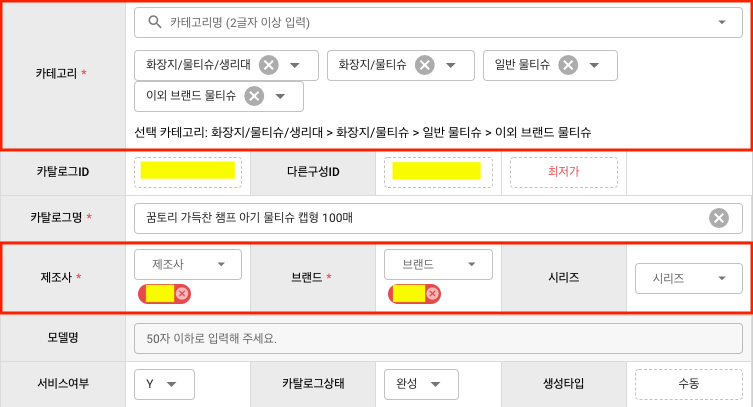
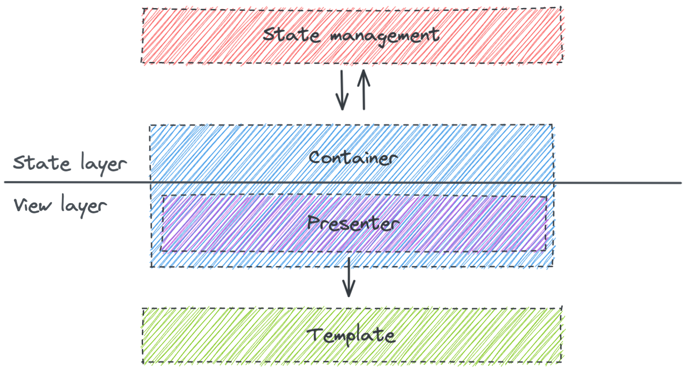
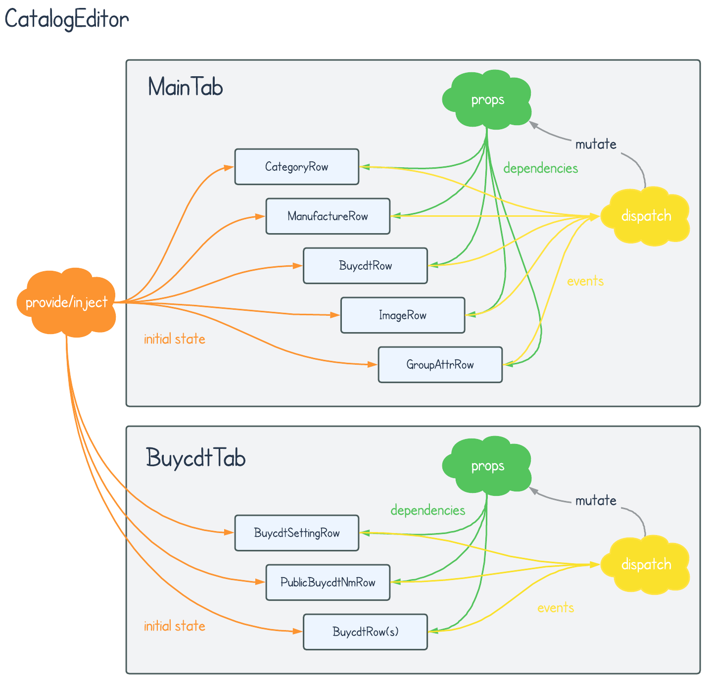
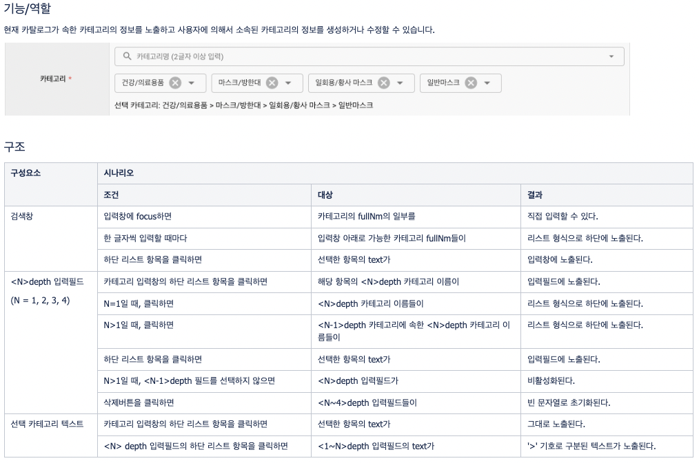
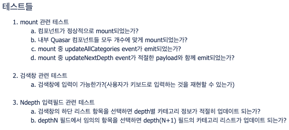
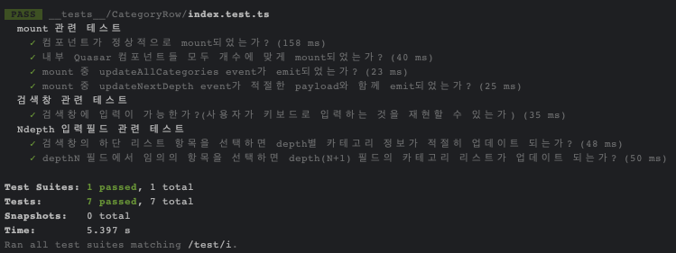

# 컴포넌트 단위로 테스트 작성해보기

## 배경

이전 담당했던 프로젝트에는 특정 카탈로그의 세부정보를 확인하기 위한 카탈로그 상세페이지가 있었는데, 심지어 전 팀장님도 "숨이 죽어가는 페이지"라고 하실 정도로 구현이 복잡하기로 악명높았습니다😨

어느 날, 아침 스크럼 때 전 팀장님이 상세페이지에 리팩토링을 진행할 필요가 있다고 언급하시면서 마지막에 "단위 테스트" 코드가 있으면 좋겠다고 하셨습니다.

프로젝트에 합류했던 초창기에 상세페이지 소스를 이리저리 분석하면서 힘겨운 신고식(?)을 거쳤던 어느 주니어 개발자는 이 말을 듣고 싹 갈아엎겠다는 엄청난 패기로 역할분담 회의를 하기도 전에 바로 지라 티켓을 만들어 버립니다.

네, 그게 바로 저였습니다.


3번의 리뷰회의를 거치면서 개발방향을 가다듬고 작업을 진행했지만 워낙 긴 히스토리를 가진 복잡한 정책과 초반에 세운 무리한 작업계획, 그리고 당시 팀장님이 다른 곳으로 이직하시면서 사실상 중단되고 말았습니다.

비록 마무리를 짓지는 못했지만 재사용이 용이한 컴포넌트의 구조와 테스트 코드를 작성하는 방법에 대해서 고민할 수 있었던 경험으로 기억에 남아서 한번 테스트 코드를 작성하기까지의 과정과 느낀점들을 정리하고자 합니다.

## 컴포넌트 설계

상세페이지 일부와 컴포넌트 단위로 나눌 영역을 표시하면 다음과 같습니다.



나뉘어진 컴포넌트들을 테스트 단위로 정했는데 이유는 아래와 같습니다.

1. 상세페이지 전체 테스트를 내부 컴포넌트들의 개별 테스트들로 구성할 수 있다.
2. 단위 테스트가 가능한 컴포넌트를 설계하여 전보다 일관된 구조를 가진 컴포넌트 트리를 만들 수 있다.

### Container-Presenter 패턴



Container-Presenter 패턴을 참고하여 단위 테스트 대상 컴포넌트들은 Presenter가 되도록 구현했습니다.

Presenter에 대해서 테스트를 구성하면 테스트 범위를 컴포넌트의 특정 상태에서 렌더링이 제대로 일어났는지 여부와 다른 상태로 변했을 때 올바른 event가 emit되었는지 여부로 좁힐 수 있습니다.

### 컴포넌트 트리 모델

리팩토링을 적용했을 때 예상했던 컴포넌트 트리는 아래와 같이 다이어그램으로 그렸습니다.



`CatalogEditor`는 상세페이지에서 리팩토링 대상이 되는 페이지 섹션에 해당하는 컴포넌트이고 2개의 탭인 `MainTab`과 `BuycdtTab`으로 구성됩니다.

:::info
위에서 붉은색으로 컴포넌트 영역들을 표시한 이미지는 `MainTab`에서 캡쳐한 겁니다.
:::

단위 테스트 대상이 되는 컴포넌트는 "Row"라는 postfix를 가진 Presenter, `CatalogEditor`와 두 탭은 모두 Container 역할을 가집니다.

`CatalogEditor`는 API 호출로 Presenter들의 초기 상태값을 조회하거나 수정한 상세정보를 저장하는 등의 일괄작업들을 담당하고 [provide/inject](https://vuejs.org/guide/components/provide-inject.html)를 통해 Presenter와 데이터를 주고받습니다.

탭은 Presenter마다 필요한 상태관리 로직들을 담은 함수들이 위치한 영역으로 Presenter에서 emit한 event를 감지하여 필요한 dispatch들을 수행하고 업데이트된 상태값(dependency)들을 props를 통해 Presenter로 전달합니다.

## 시나리오 작성

`MainTab`의 `CategoryRow`를 개발하기에 앞서서 해당 컴포넌트의 기능과 관련된 정책들을 파악하기 위해 사용자 시나리오를 작성했습니다.



그리고 위 시나리오와 기존 소스의 로직을 바탕으로 `CategoryRow`에서 확인할 사항들을 정리했습니다.



## 컴포넌트 구현

이제 차례대로 Container와 Presenter들을 구현했습니다.

### CatalogEditor

```html
<template>
  <div class="q-ma-md relative-position">
    <!-- 탭 및 카탈로그 저장/삭제 버튼들 영역 -->
    <MainTab />
    <!-- BuycdtTab -->
  </div>
</template>
<script lang="ts">
  import { defineComponent, provide } from "@vue/compostion-api";
  import MainTab from "@/components/catalog/detail/MainTab.vue";
  import { CTLG_CATE_IK } from "@/constants/catalog/detail/keys";
  // ...

  export default defineComponent({
    name: "CatalogEditor",
    components: {
      MainTab,
    },
    setup(props, context) {
      // ...

      // row별 초기 상태값(ctlgCate)을 하위 컴폰넌트들로 provide합니다.
      // CTLG_CATE_IK => symbol 타입을 가지는 provide key
      provide(CTLG_CATE_IK, ctlgCate);
    },
  });
</script>
```

### MainTab

```html
<template>
  <q-markup-table>
    <tbody>
      <CategoryRow
        v-bind="{ allCategories, catePerDepth }"
        @update:allCategories="onUpdateAllCategories"
        @update:nextDepth="onUpdateNextDepth"
      />
      <!-- 그외의 Row들 -->
    </tbody>
  </q-markup-table>
</template>
<script lang="ts">
  import { defineComponent } from "@vue/composition-api";
  import CategoryRow from "@/components/catalog/detail/CategoryRow";
  // CategoryRow에서 필요한 상태값과 로직들이 정의된 함수
  import useCategoryRow from "@/components/catalog/detail/CategoryRow/hooks";
  // ...

  export default defineComponent({
    name: "MainTab",
    components: {
      CategoryRow,
    },
    setup(props, context) {
      const {
        allCategories,
        catePerDepth,
        onUpdateAllCategories,
        onUpdateNextDepth,
      } = useCategoryRow();
      // ...
      return {
        allCategories,
        catePerDepth,
        onUpdateAllCategories,
        onUpdateNextDepth,
        // ...
      };
    },
  });
</script>
```

### CategoryRow

```html
<template>
  <tr>
    <th>카테고리<span class="required-mark" /></th>
    <td colspan="5">
      <!-- 카테고리 검색영역 -->
      <div class="q-mb-lg full-width">
        <q-select
          ref="$qSelect"
          v-model="selectedItem"
          :options="searchOptions"
          @input="onSelected"
          @filter="filterSearchResult"
          @keyup.stop="onKeyup"
        />
      </div>
      <!-- depth1 ~ depth4까지 카테고리 선택영역-->
      <div class="q-mb-lg">
        <q-select
          v-for="(depth, index) in ['depth1', 'depth2', 'depth3', 'depth4']"
          :key="depth"
          v-model="cateState[depth]"
          :options="optionsPerDepth[depth]"
          :disable="isDisable(i + 1)"
          :label="depth"
          @input="onChangeDepth($event, i + 1)"
        />
      </div>
      <div>선택 카테고리: {{ fullCateText }}</div>
    </td>
  </tr>
</template>
<script lang="ts">
  import { defineComponent, PropType, inject } from "@vue/composition-api";
  // 카테고리 검색영역에서 사용할 상태값들과 로직들을 정의한 함수
  import useSearchInput from "@/components/catalog/detail/CategoryRow/hooks/useSearchInput";
  // depth별 카테고리 선택영역에서 사용할 상태값들과 로직들을 정의한 함수
  import useCateDepth from "@/components/catalog/detail/CategoryRow/hooks/useCateDepth";
  // ...

  export default defineComponent({
    name: "CategoryRow",
    props: {
      allCategories: Array as PropType<CommonCategory[]>,
      cateDepth: [Number, Array] as unknown as PropType<[number, CateInfo[]]>,
    },
    setup(props, context) {
      // CatalogEditor로부터 provide된 데이터를 inject
      const ctlgCate = inject(CTLG_CATE_IK);

      const {
        searchOptions,
        $qSelect,
        selectedItem,
        onKeyup,
        filterSearchResult,
      } = useSearchInput();

      const {
        cateState,
        optionsPerDepth,
        fullCateText,
        isDisable,
        onChangeDepth,
      } = useCateDepth();

      // ...

      return {
        searchOptions,
        $qSelect,
        selectedItem,
        onKeyup,
        filterSearchResult,
        cateState,
        optionsPerDepth,
        fullCateText,
        isDisable,
        onChangeDepth,
        // ...
      };
    },
  });
</script>
```

## 테스트

### setup

테스트 코드는 Jest 기반의 Vue 컴포넌트 테스트 라이브러리인 [vue-test-utils](https://v1.test-utils.vuejs.org/)로 작성했고, 프로젝트 root level에 있는 `__test__` 폴더 내에 Row별로 정리했습니다.

```text
__test__
├- CategoryRow
|  ├- index.test.ts
|  ├- mocks.ts
|
├- ManufactureRow
|  ├- index.test.ts
|  ├- mocks.ts
|
├- ...
├- setup.ts
```

먼저 테스트 상에서 Quasar를 사용할 수 있도록 아래와 같이 setup 코드를 작성합니다.

```ts
// /__test__/setup.ts
import Vue from "vue";
import VueCompositionApi from "@vue/composition-api";
import Quasar from "quasar";

Object.defineProperty(document, "doctype", { value: "<!DOCTYPE html>" });

Vue.use(VueCompositionApi);
Vue.use(Quasar);
```

그리고 mock 데이터도 미리 준비해둡니다.

```ts
// /__test__/CategoryRow/mocks
export const ALL_CATEGORIES = [
  {
    cateCd: 1100000,
    cateNm: "가공식품",
    fullNm: "가공식품",
    childCategories: [2100000],
  },
  {
    cateCd: 2100000,
    cateNm: "과자/베이커리/떡",
    fullNm: "가공식품 > 과자/베이커리/떡",
    childCategories: [3100001],
  },
  {
    cateCd: 3100001,
    cateNm: "떡/한과",
    fullNm: "가공식품 > 과자/베이커리/떡 > 떡/한과",
    childCategories: [4100010, 4100011],
  },
  {
    cateCd: 4100010,
    cateNm: "만쥬/화과자",
    fullNm: "가공식품 > 과자/베이커리/떡 > 떡/한과 > 만쥬/화과자",
    childCategories: [],
  },
  {
    cateCd: 4100011,
    cateNm: "이외 떡/한과류",
    fullNm: "가공식품 > 과자/베이커리/떡 > 떡/한과 > 이외 떡/한과류",
    childCategories: [],
  },
  // ...
];
export const CATE_PER_DEPTH = {
  depth1: [
    1,
    [
      { cateCd: 1100093, cateNm: "프론트엔드대분류" },
      // ...
    ],
  ],
  depth2: [
    2,
    [
      { cateCd: 2000857, cateNm: "프론트엔드중분류1" },
      { cateCd: 2000858, cateNm: "프론트엔드중분2" },
      // ...
    ],
  ],
  depth3: [
    3,
    [
      { cateCd: 3007283, cateNm: "프론트엔드소분류1-1" },
      { cateCd: 3007284, cateNm: "프론트엔드소분류1-2" },
      // ...
    ],
  ],
  depth4: [
    4,
    [
      { cateCd: 4013259, cateNm: "프론트엔드1-1-세분류1" },
      // ...
    ],
  ],
};
```

### TC 작성

```ts
// /__test__/CategoryRow/index.test.ts
import { mount } from "@vue/test-utils";
import CategoryRow from "@/components/catalog/detail/CategoryRow";
import { QSelect } from "quasar";
import { ALL_CATEGORIES, CATE_PER_DEPTH } from "./mocks";

let wrapper, searchInput, depth1Input, depth2Input, depth3Input;

// test 함수를 실행할 때마다 CategoryRow 컴포넌트를 mount하여 상태를 초기화시킵니다.
beforeEach(() => {
  wrapper = mount(CategoryRow);
  searchInput = wrapper.findAllComponents(QSelect).at(0);
  depth1Input = wrapper.findAllComponents(QSelect).at(1);
  depth2Input = wrapper.findAllComponents(QSelect).at(2);
  depth3Input = wrapper.findAllComponents(QSelect).at(3);
});

desccribe("mount 관련 테스트", () => {
  test("컴포넌트가 정상적으로 mount되었는가?", () => {
    expect(wrapper.exists()).toBeTruthy();
  });
  test("내부 Quasar 컴포넌트들 모두 개수에 맞게 mount되었는가?", () => {
    expect(wrapper.findAllComponents(QSelect)).toHaveLength(5);
  });
  test("mount 중 update:allCategories 이벤트가 emit되었는가?", () => {
    expect(wrapper.emitted("update:allCategories")).toBeTruthy();
  });
  test("mount 중 update:nextDepth 이벤트가 payload와 함께 emit되었는가?", () => {
    expect(wrapper.emitted("update:nextDepth")[0]).toEqual([
      { cateDepth: 1, prtCateCd: 0 },
    ]);
  });
});

describe("검색창 관련 테스트", () => {
  test("검색창에 입력이 가능한가?", async () => {
    const searchInputEl = searchInput.find('input[type="search"]');
    await searchInputEl.setValue("가공");
    expect(searchInputEl.element.value).toEqual("가공");
  });
});

describe("Ndepth 입력필드 관련 테스트", () => {
  test("검색창의 하단 리스트 항목을 선택하면 depth별 카테고리 정보가 적절히 업데이트되는가?", async () => {
    await wrapper.setProps({ allCategories: ALL_CATEGORIES });
    const selectedItem = wrapper
      .props("allCategories")
      .find(({ cateCd }) => cateCd === 4100010);
    // 검색결과 리스트에서 depth4 항목(cateCd=4100010)을 선택하면
    searchInput.vm.$emit("input", selectedItem);
    await wrapper.vm.$nextTick();
    // cateCd=1100000인 depth1 항목이 노출되는가?
    expect(wrapper.emitted("update:nextDepth")[1]).toEqual([
      { cateDepth: 2, prtCateCd: 1100000 },
    ]);
    // cateCd=2100000인 depth2 항목이 노출되는가?
    expect(wrapper.emitted("update:nextDepth")[2]).toEqual([
      { cateDepth: 3, prtCateCd: 2100000 },
    ]);
    // cateCd=3100001인 depth3 항목이 노출되는가?
    expect(wrapper.emitted("update:nextDepth")[3]).toEqual([
      { cateDepth: 4, prtCateCd: 3100001 },
    ]);
  });
  test("depthN 필드에서 임의의 항목을 선택하면 depth(N+1) 필드의 카테고리 리스트가 업데이트되는가?", async () => {
    let depthOptions;
    // depth1 필드에서 "프론트엔드대분류"(cateCd=1100093)를 선택하는 경우
    await wrapper.setProps({ catePerDepth: CATE_PER_DEPTH["depth1"] });
    depthOptions = wrapper.vm.$data.optionsPerDepth["depth1"];
    expect(depthOptions.length).toEqual(1);
    depth1Input.vm.$emit("input", depthOptions[0]);
    await wrapper.vm.$nextTick();
    expect(wrapper.emitted("update:nextDepth")[1]).toEqual([
      { cateDepth: 2, prtCateCd: 1100093 },
    ]);
    // depth2 필드에서 "프론트엔드중분류1"(cateCd=2000857)를 선택하는 경우
    await wrapper.setProps({ catePerDepth: CATE_PER_DEPTH["depth2"] });
    depthOptions = wrapper.vm.$data.optionsPerDepth["depth2"];
    expect(depthOptions.length).toEqual(4);
    depth2Input.vm.$emit("input", depthOptions[0]);
    await wrapper.vm.$nextTick();
    expect(wrapper.emitted("update:nextDepth")[2]).toEqual([
      { cateDepth: 3, prtCateCd: 2000857 },
    ]);
    // depth3 필드에서 "프론트엔드소분류1-1"(cateCd=3007283)을 선택하는 경우
    await wrapper.setProps({ catePerDepth: CATE_PER_DEPTH["depth3"] });
    depthOptions = wrapper.vm.$data.optionsPerDepth["depth3"];
    expect(depthOptions.length).toEqual(3);
    depth3Input.vm.$emit("input", depthOptions[0]);
    await wrapper.vm.$nextTick();
    expect(wrapper.emitted("update:nextDepth")[3]).toEqual([
      { cateDepth: 4, prtCateCd: 3007283 },
    ]);
  });
});
```

이제 실행해보면 아래와 같이 제대로 실행하는 것을 확인할 수 있습니다.



## 마무리

당시 리팩토링을 진행하면서 시나리오와 테스트 코드를 작성하는 것은 프로젝트 히스토리 관리와 side-effect없이 feature를 구현하는데에 도움이 된다고 느꼈습니다.

하지만 다시 돌아보면 Presenter 컴포넌트를 테스트 단위로 하는 것이 과연 이 의의에 부합한 방식인지 의문이 듭니다.

특정 기능이 제대로 동작하면서 내부 상태값이 올바르게 동기화되는지 여부를 판단하는데 props의 값과 emit된 event들의 종류만으로는 근거가 부족하지 않나 싶습니다.

그리고 테스트가 가능한 방향으로만 컴포넌트를 설계하는 방식이 임의의 요구사항들을 구현하는데 걸림돌이 될 수도 있다는 생각도 듭니다.

특히 백오피스 같이 사용자가 선택한 옵션에 따라서 일부 필드들의 값뿐만 아니라 화면에 렌더링되지도 않은 탭의 컨텐츠가 달라지거나 비활성화되는 등의 별의별 상호작용을 요구하는 서비스의 경우, Presenter 단위로만 컴포넌트를 구성하는 것은 덜 유연한 방식일겁니다.

올바른 테스트 단위 찾을 때까지 계속 공부를 해야겠군요🤔

## 참고자료

[2 Ways to Write Easily Testable React Components](https://brettfisher.dev/better-testing/)

[바닥부터 시작하는 Vue 컴포넌트 테스트](https://tech.kakao.com/2019/11/27/kakao-business-vue-component-test/)

[Writing testable React components with hooks](https://charles-stover.medium.com/writing-testable-react-components-with-hooks-23441ee582d5)
