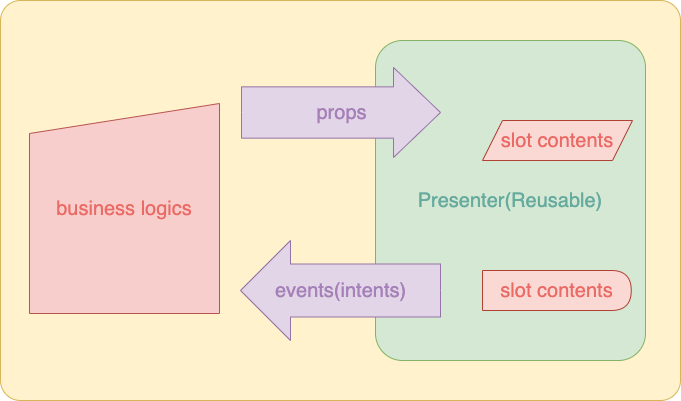

# 컴포넌트로 무엇을 재사용하는가?

## 배경

지금까지 기획서를 보면서 컴포넌트를 만들 때마다 거치는 레파토리는 비슷했던 것 같습니다.

1. 이 부분을 구현한 컴포넌트가 있는 페이지를 확인한다.
2. 있다면 해당 컴포넌트(`.vue`) 코드를 복사해서 현재 작업하고 있는 파일에 붙여넣는다. 만일 없으면 페이지를 뒤져서 비슷한 부품들을 모아서 어떻게든 만든다.
3. 모양새가 잡히면 재사용한 컴포넌트의 script를 분석하여 어떤 상태값과 로직을 가지는지, 어떤 event를 emit하는지, props의 타입이 무엇인지 등을 확인한다.
4. 만일 필요한 기능을 구현하기에 바로 사용할 수 있는 상태가 아니라면 props 몇 개를 더 추가해서든 디버깅하면서 구현한다.
5. 완성하면 qa, stg를 거쳐서 live 배포하고 모니터링을 진행한다.

하지만 위와 같은 방식은 문제점이 있습니다.

- 재사용할 때마다 context에 맞춰 컴포넌트의 script 부분을 걔속 수정하면 template 부분도 같이 복잡해질 수 있다.
- 새로운 기능이나 스타일을 생성, 추가, 삭제하다가 동일한 컴포넌트를 사용하는 다른 페이지에 영향이 갈 수 있다.

컴포넌트가 "재사용이 가능한 화면 구성단위"라는 말을 귀에 못이 박히도록 들어왔지만 정작 제가 컴포넌트를 사용할 때 자연스러운 재사용이 가능했던 적은 거의 없었던 것 같습니다🤣

과거에 컴포넌트를 만드셨던 분은 시간이 지나서 이게 자주 활용될지를 예상할 수 없으니 어떻게 보면 당연한 현상으로 볼 수 있지만 제 개발방식도 한번 점검해볼 필요가 있습니다.

이러한 상황에서 재사용이 가능한 컴포넌트의 조건이 있다면 이를 기반으로 조금 더 활용하기 쉬운 컴포넌트를 만들 수 있지 않을까라는 생각을 가지게 되었고 이에 대해서 고민한 내용을 한번 공유하고자 합니다.

## 무엇을 재사용하는가?

지금까지 기획서와 작업하고 있는 페이지를 보면서 "나는 무엇을 기준으로 화면의 특정 영역을 컴포넌트 단위로 만드는걸까?"에 대해 고민해본 결과, 당연하게도 "UI"였습니다.

여기서 UI는 (1)사용자 화면에 표시되는 마크업과 (2)사용자 이벤트에 의한 반응성(button을 클릭할 때마다 보여지는 내용이 달라지는 등)을 의미하는데, 여기서 페이지의 용도에 기반한 UI 정책들은 대부분 이벤트 핸들러에서 구현된다는 사실도 알게되었습니다.

그래서 기존 방식대로 마크업과 반응성이 비슷한 컴포넌트를 그대로 가져와서 이미 작성된 script안에 새로운 기능을 구현한다면 (1)기존 정책에 맞춰 렌더링된 부분에 영향이 가지 않도록, (2)현재 작업영역 뿐만 아니라 동일한 컴포넌트를 사용하는 페이지에 영향이 가지 않도록 신경써야 한다는 번거로움이 있습니다.

## 재사용할 컴포넌트의 조건

그래서 "재사용이 가능한 컴포넌트"는 아래와 같은 조건을 만족해야 한다고 생각합니다.

1. 페이지별 정책과는 독립적으로 오직 렌더링 역할만 가진다.
2. 외부 스토어나 [provide/inject](https://vuejs.org/guide/components/provide-inject.html) 등을 사용하는 비즈니스 로직들은 부모 컴포넌트나 페이지에 구현한다.
3. UI가 동작하기 위한 최소한의 상태값과 상태관리 로직만을 script에 가진다.
4. 사용자 이벤트가 발생할 때마다 관련 event를 emit하거나 [scoped slot](https://vuejs.org/guide/components/slots.html#scoped-slots)으로 상태값을 전달한다.
5. template에 렌더링할 데이터는 props로만 전달받고, props로 전달받은 데이터를 수정하는 로직은 외부 컴포넌트의 이벤트 핸들러로 구현한다.
6. 공통으로 사용할 수 있는 Layout은 [named slot](https://vuejs.org/guide/components/slots.html#named-slots)으로 구현한다.

다이어그램으로 표현하면 다음과 같습니다.

