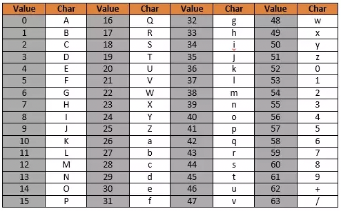

# FormData

`<form enctype="multipart/form-data"></form>`의 input field와 value를 key-value pair형식으로 생성/수정/삭제할 수 있는 interface를 제공합니다.

`FormData`로 만든 인스턴스는 `POST` 요청의 body로 바로 사용할 수 있어서 `File`과 같은 `Blob` 데이터를 API로 전달할 때 자주 사용됩니다.

## data: URL

HTML 문서에 작은 용량의 파일을 inline 방식으로 삽입하도록 도와주는 URL로 `data:` prefix를 가집니다.

### 구조

보통 아래의 구조를 가집니다.

```js
data:[<mediatype>][;base64],<data>

// mediatype
// 데이터의 종류를 MIME type으로 표시한 부분
// default - text/plain;charset=US-ASCII

// ;base64
// 뒤의 data가 base64 기반으로 인코딩되었는지 여부를 표시

// data
// (인코딩된) binary data
```

### 사용

개발자가 아닌 일반 사용자들 입장에서는 평범한(?) 링크처럼 보인다는 점을 이용하여 phishing 수법에 자주 이용됩니다.

그래서 2020년 이전부터 Chrome이나 Firefox 등의 브라우저에서는 JS를 사용하여 `data:` URL로 navigate하는 행위를 차단합니다.

:::info 관련링크
[Chrome](https://ourcodeworld.com/articles/read/682/what-does-the-not-allowed-to-navigate-top-frame-to-data-url-javascript-exception-means-in-google-chrome)

[FireFox](https://blog.mozilla.org/security/2017/11/27/blocking-top-level-navigations-data-urls-firefox-59/)
:::

대신 창이나 탭이 아닌 `iframe` 내에서는 URL의 내용을 확인할 수 있습니다.

## Base64 Encoding

직역하면 “64진법 인코딩”인데, 임의의 binary data(특히, 이미지나 오디오 같은 media 타입)를 손실없이 주고받을 수 있도록 printable ASCII 문자로 구성된 text로 변환하는 기법입니다.

인코딩은 원본 binary data를 6bit씩 자르고 아래 base64 표를 참고하여 각 block에 대응되는 문자로 바꾸면 됩니다.



예를 들어, “Man” base64로 인코딩하면 다음과 같습니다.

1. Man ⇒ M, a, n
2. ASCII table을 참조하여 문자별 8-bit value를 구한다.
   1. M ⇒ 01001101
   2. a ⇒ 01100001
   3. n ⇒ 01101110
3. 8-bit value들을 모두 합친 후, 다시 6-bit 단위로 분리한다.
   1. 010011
   2. 010110
   3. 000101
   4. 101110
4. 6-bit value별로 앞에 zero-padding을 추가하여 8-bit로 만들고 10진수로 변환한다.
   1. **00**010011 ⇒ 19
   2. **00**010110 ⇒ 22
   3. **00**000101 ⇒ 5
   4. **00**101110 ⇒ 46
5. 위 표를 참조하여 수에 대응되는 문자들을 조합하여 문자열을 만든다. ⇒ TWFu

Base64 encoding 방식은 기존 데이터에 bit들을 추가하기 때문에 약 33%의 오버헤드가 발생한다는 특징이 있습니다.
