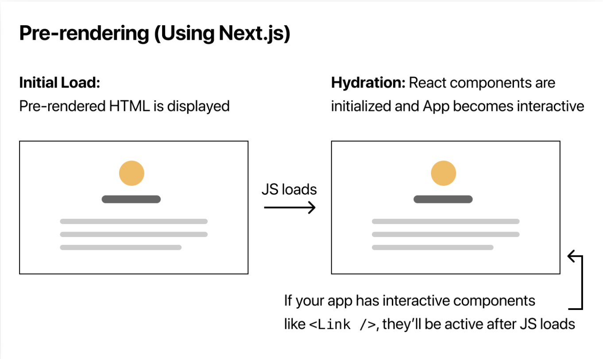
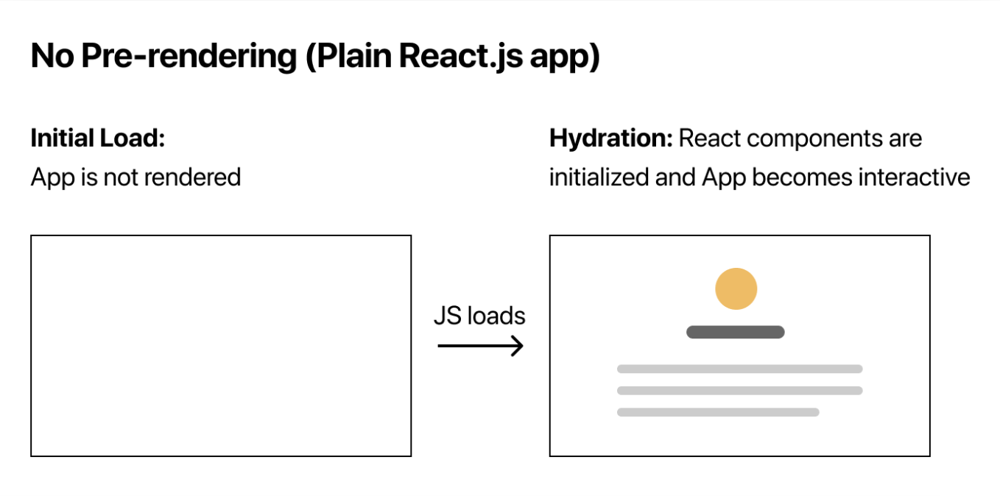
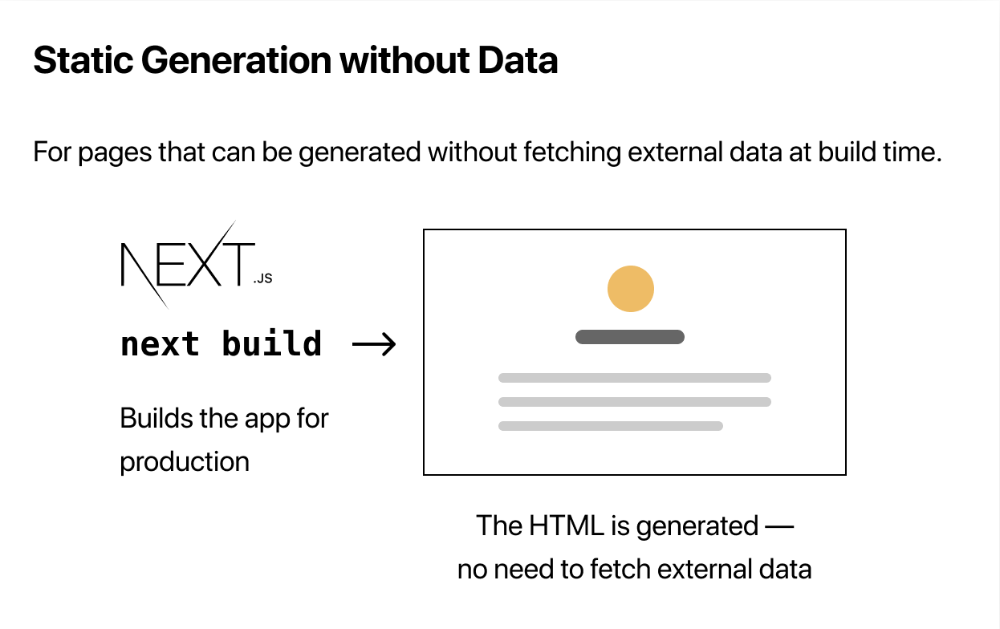
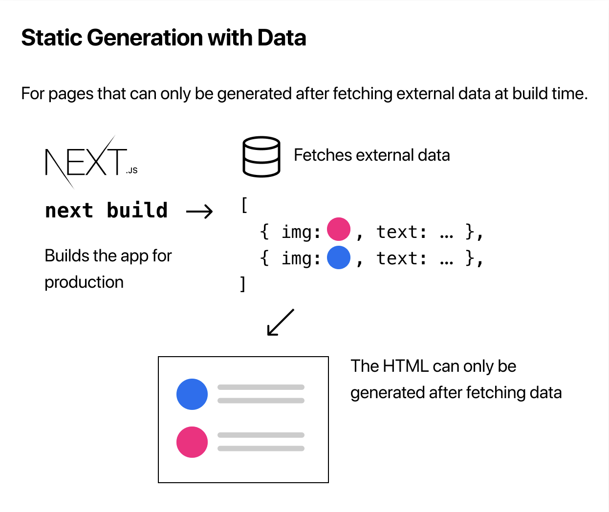
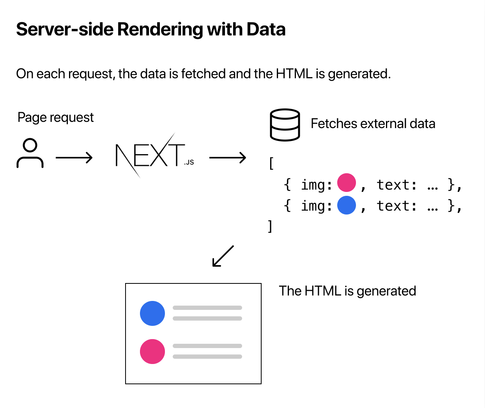

# Pre-rendering and Data Fetching

## Pre-rendering

nextjs에서 모든 페이지는 pre-rendering으로 생성됩니다.

클라이언트로부터 요청이 들어오면 초기 UI 상태를 반영한 `html` 파일을 생성하여 전달하는데 이는 페이지 렌더링을 완전히 클라이언트에서 담당하는 [CSR](../../browser/rendering_strategy/csr.md)과는 차이가 있습니다.

컨텐츠가 있는 페이지가 클라이언트로 전달되므로 향상된 초기 로딩속도와 [SEO](../../frontend/seo.md)에 유리하다는 장점을 가집니다.

여기서 브라우저가 페이지를 로딩하면서 컨텐츠에 반응성을 부여하기 위한 작은 용량의 JS chunk도 다운로드하여 실행하는데, 이러한 프로세스를 hydration이라고 합니다.





## Three Forms of Pre-rendering

pre-rendering 기법은 SSR, SSG, ISR 방식이 있습니다.

### SSR(Server-side Rendering)

pre-rendering을 **빌드타임** 중에 진행하여 매 요청마다 동일한 페이지가 재사용됩니다.

### SSG(Static Site Generation)

pre-rendering을 **런타임** 중에 진행하여 매 요청마다 새로운 페이지를 생성합니다.

### ISR(Incremental Static Regeneration)

## Static Generation with and without Data

데이터 없이 SSG 방식으로 페이지를 생성한다면 아래와 이미지와 같이 빌드 이후에 정적인 페이지가 클라이언트로 전달됩니다.



하지만 서버에서 빌드하는 중에 API 호출, fs 접근, db 쿼링 등의 비동기 작업으로 초기 렌더링 데이터를 확보할 필요도 있습니다.



## Implement getStaticProps

빌드 중에 페이지를 생성하기 전에 초기 데이터를 확보할 때는 페이지와 함께 `getStaticProps` 함수를 정의하고 `export`하면 됩니다.

그럼 서버에서 빌드하면서 `getStaticProps` 함수를 호출하면 반환된 객체 내부의 `props` 객체가 `StaticComponent`의 props로 전달됩니다.

클라이언트로 전달되는 chunk에 포함되지 않고 오직 서버에서만 실행되므로 안심하고 비동기 로직을 작성할 수 있습니다.

```js
function StaticComponent({ data }) {
  // ...
}

export async function getStaticProps() {
  const res = await fetch("from/some/where");
  return {
    props: {
      data: res,
    },
  };
}

export default StaticComponent;
```

## Fetching Data at Request Time

매 요청마다 비동기 처리를 수행하여 초기 렌더링 데이터를 확보할 때는 SSR 방식을 사용하면 됩니다.



SSR을 구현할 때는 페이지와 함께 `getServerSideProps` 함수를 정의하고 `export`하면 됩니다.

```js
function ServersideComponent({ data }) {
  // ...
}

// context 인자는 페이지 요청과 관련된 정보를 전달합니다.
export async function getServersideProps(context) {
  const res = await fetch("from/some/where");
  return {
    props: {
      data: res,
    },
  };
}
```
