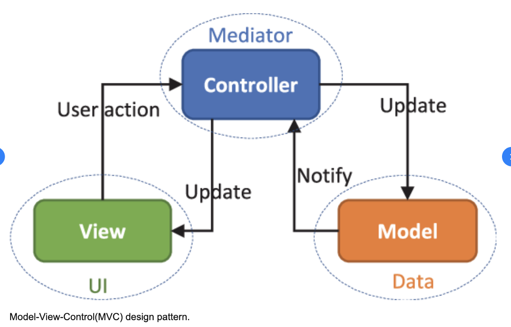

# MVC

가장 초창기에 나온 모델로, 사용자들에게 노출되는 페이지 영역과 화면에 표시할 데이터를 관리하는 영역을 분리하고자 했습니다.

- **Model** : 화면에 표시할 데이터

- **View** : HTML, CSS, JS로 만들어진 페이지

- **Controller** : 사용자 상호작용에 대응되는 데이터 업데이트 로직

서비스 초창기 시절(PHP, JSP, Ruby On Rails 등)에는 MVC 패턴을 다음과 같이 구현했습니다.

| Model |     View      | Controller |
| :---: | :-----------: | :--------: |
|  DB   | HTML, CSS, JS |  SSR 영역  |

시간이 지나 [AJAX](https://developer.mozilla.org/en-US/docs/Web/Guide/AJAX)가 등장하면서 페이지 렌더링 이후에도 브라우저에서 서버로 필요할 때마다 데이터를 요청할 수 있게되자 구현방식에 변화가 생겼습니다.

|      Model       |   View    | Controller |
| :--------------: | :-------: | :--------: |
| REST API w/ AJAX | HTML, CSS |     JS     |
