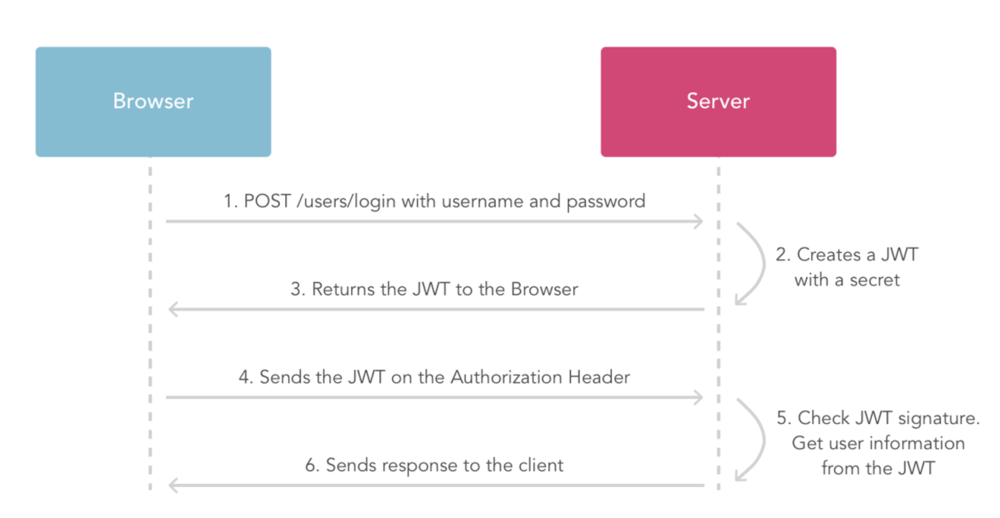
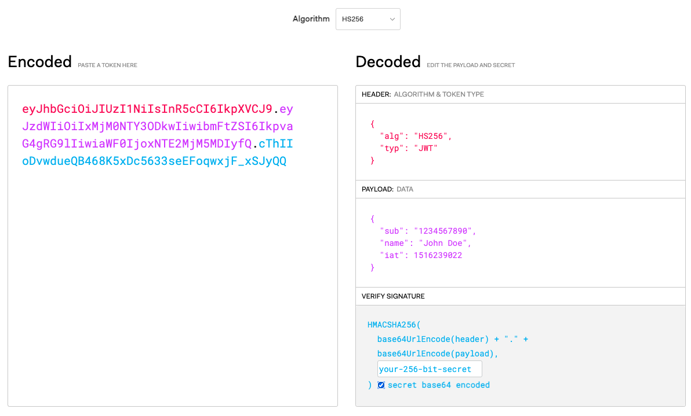
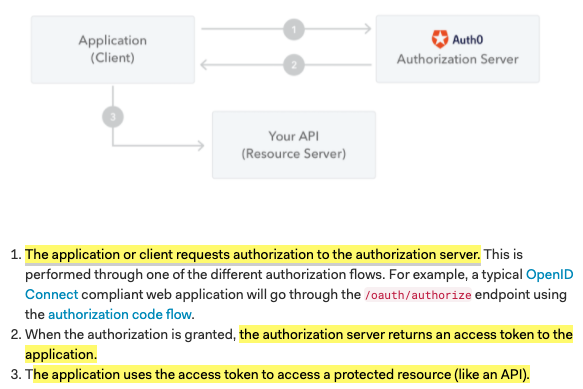

# JWT

JSON Web Token의 줄임말로, 두 주체 사이에서 정보를 JSON 객체로 주고받기 위한 조밀하고(compact) 독립적인(self-contained) 방법을 제시합니다.



이 방식은 비밀키를 이용한 내부 데이터의 암호화 방식을 통해 정보의 고결성(integrity)을 유지하는 특징이 있습니다.

HTTP 요청과 함께 서버로 전송되어 이미 인증된 사용자가 서버의 특정 리소스에 접근하기 위한 권한이 있는지를 확인하는 인가 과정에서 흔히 사용되는 메커니즘입니다.

JWT 방식을 사용하면 정보의 고결성뿐만 아니라 서버 단에서 요청한 주체가 누구인지도 알 수 있습니다.

## 구조

곤충처럼 머리(header), 가슴(payload), 배(signature)로 구성되고 '.'(period)로 구분되고, 각 part는 JSON format을 가집니다.



### Header

token의 종류와 signature를 생성할 때 사용할 암호화 알고리즘 정보를 담습니다.

처음에는 JSON string이지만 전송될 때는 Base64Url 방식으로 인코딩됩니다.

```js
{
  "alg": "HS256",
  "typ": "JWT"
}
```

### Payload

토큰을 전송한 주체(사용자)가 누구인지와 추가적인 데이터가 위치하는 부분으로 registered, public, private으로 타입이 나뉩니다.

payload 부분도 Base64Url 방식으로 인코딩됩니다.

:::warning
JWT 토큰은 누구나 읽을 수 있으므로, 보안에 민감한 정보는 암호화를 적용한 뒤에 payload 또는 header에 포함시켜야 합니다!
:::

```js
{
  "sub": "1234567890", // registered
  "name": "John Doe", // public
  "admin": true // private
}
```

#### 1. Registered Claim

iss(issuer), exp(expiration time), sub(subject), aud(audience) 등이 [이미 등록된 claim들](https://datatracker.ietf.org/doc/html/rfc7519#section-4.1)이 위치합니다.

이 claim의 이름들은 토큰의 크기를 최대한 줄이기 위해 최대 3글자 길이를 가집니다.

#### 2. Public Claim

[IANA JSON Web Token Registry](https://www.iana.org/assignments/jwt/jwt.xhtml)에 등록된 claim 또는 충돌방지용 namespace가 포함된 URI가 위치합니다.

#### 3. Private Claim

두 전송주체간의 공유할 정보가 위치하는데 registered claim과 public claim의 이름과 겹쳐서는 안됩니다.

### Signature

인코딩된 header와 payload를 앞에서 명시한 암호화 알고리즘으로 생성한 암호화된 문자열이 위치하는 부분으로, 보통 암호화를 진행할 때는 서버에 저장된 비밀키(secret key)를 사용합니다.

signature를 사용하면 서버 쪽에서 payload에 저장된 정보가 조작되었는지 여부와 토큰을 전송한 주체가 누구인지를 알 수 있습니다.

```js
HMACSHA256(base64UrlEncode(header) + "." + base64UrlEncode(payload), secret);
```

## 작동방식



1. 클라이언트는 인증 이후, 인가 서버로부터 jwt 토큰을 받습니다.

2. 리소스 서버는 JWT의 인코딩된 header와 payload, 그리고 서버에 저장된 비밀키를 사용하여 signature를 생성하고 이 signature와 토큰으로 전달된 signature를 비교합니다.

3. 두 값이 같다면 통과, 다르다면 유효하지 않은 토큰이 되어 요청이 거절됩니다.

## 장단점

JWT는 다음과 같은 장점을 가집니다.

- JSON parser를 사용하는 모든 프로그래밍 언어에서 사용할 수 있습니다.
- 모바일을 포함한 다양한 플랫폼에서의 간단한 client-side 처리가 가능합니다.
- 서버의 수평적 확장에도 유연하게 대처할 수 있습니다.
- 서버에 사용자 정보를 저장하지 않습니다.

하지만 다음과 같은 단점을 가집니다.

- 서버에서 비밀키가 유출되어 전체 시스템에서 사용할 비밀키를 새로 만들게 되면 재인증과정을 거쳐서 새 토큰을 발급받아야 합니다.
- 적용된 암호화 알고리즘이 변경될 때마다 재인증절차를 거쳐야 합니다.
- 토큰의 크기가 세션 토큰보다는 비교적 크기 때문에 데이터 오버헤드(용량초과)가 발생할 수 있습니다.
- 암호화 알고리즘이 복잡합니다.

:::danger 유의사항
JWT 토큰과 같은 인가 수단 데이터는 가급적이면 로컬 스토리지에 저장해서는 안됩니다.

로컬 스토리지에 저장된 정보는 브라우저를 닫아도 로컬 디스크에 계속 저장되기 때문에 기기를 사용하는 누구나, 브라우저를 실행하는 언제든지 접근할 수 있다는 보안상 취약점을 가집니다.
:::
