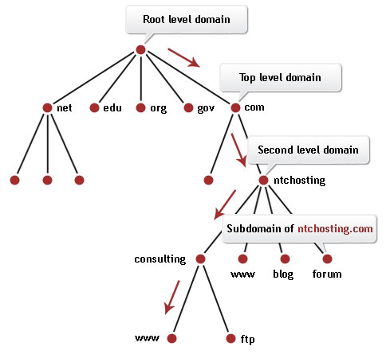
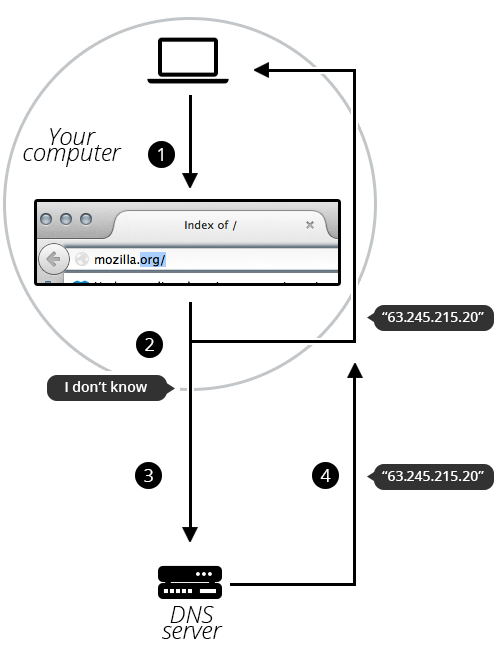

# Domain

## 구조

도메인은 서버 주소의 가독성을 높이기 위해서 사용하는 주소지정 방식으로, 보통 오른쪽에서 왼쪽 방향으로 읽습니다.

### TLD(Top Level Domain)

도메인의 가장 오른쪽에 위치하여 해당 도메인의 전반적인 운영목적을 보여줍니다.

`.com`, `.org`, `.net`과 같은 TLD는 아무 도메인에 붙여도 되지만 일부는 정해진 특수목적을 위해서 허가된 조직에서만 사용할 수 있습니다.

:::info

- 특정 언어로 서비스를 제공하거나 특정 나라에서 호스팅하는 경우 : `.us`, `.fr`, `.kr` 등
- 정부 부처에서 운영하는 서버인 경우 : `.gov`
- 교육기관에서 운영하는 서버인 경우 : `.edu`
  :::

### Label

TLD 왼쪽으로 붙은 문자열로 `.`으로 구분합니다.

대소문자를 구분하지 않고 최대 63자의 알파벳 + 0부터 9까지의 한자리 숫자 + `-` 또는 `_`를 포함할 수 있습니다.

도메인이 가질 수 있는 label의 개수는 제한되지 않습니다.

### SLD(Secondary Level Domain)

TLD 바로 왼쪽에 위치한 label을 가리킵니다.

## 관리

서버의 도메인은 한번 구매해서 계속 사용하는 것이 아닌 1년 단위로 사용기간을 정하여 대여비용을 지불하고 사용하는 방식으로, 사용기간이 지날 때마다 갱신해야 합니다.

registrar(레지스트라)라고 불리는 기관/회사에서 도메인 이름 등록과 관리를 담당합니다.

## DNS Refreshing

전세계적으로 퍼져 있는 DNS 서버들은 계층구조의 형태를 가지고 각자 담당하는 도메인에 속하는 서브 도메인들의 IP 주소들을 관리합니다.

만일 registrar에서 특정 도메인에 관한 정보를 생성하거나 수정하면 이 정보는 해당 도메인의 정보를 가지고 있는 다른 도메인들에게 반영이 되도록 업데이트가 이루어집니다.

물론 최신 상태로 업데이트하기까지 시간은 좀 걸립니다.

## DNS Process

브라우저에서 도메인 주소를 입력하고 엔터키를 누르면 브라우저는 먼저 local DNS cache을 먼저 확인해봅니다.

만일 대응되는 IP 주소가 없다면 root level DNS에서부터 시작하여 트리를 타고 내려오면서 이 도메인을 담당하는 DNS 서버의 주소를 알아냅니다.

해당 DNS 서버에서 도메인에 해당하는 IP주소를 알아내어 브라우저로 전달하면 세션연결을 시작합니다.
