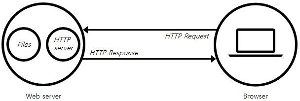

# Web Server

1개 이상의 웹 사이트들을 호스팅하는 물리적인 하드웨어와 소프트웨어를 동시에 가리킵니다.

:::info 호스팅(hosting)
임의의 웹 사이트로 사용자의 요청이 들어올 때마다 요청한 웹 페이지와 관련 리소스를 브라우저로 제공한다는 뜻입니다.

웹 서버는 웹 사이트를 호스팅하고, 웹 사이트의 호스트는 웹 서버입니다.
:::

## HW

물리적인 하드웨어로서 서버 소프트웨어를 실행하고 웹 사이트의 구성 파일들(`.html`, `.css`, `.js`, image 등)을 저장하는 컴퓨터입니다.

인터넷과 연결되어 웹 상에 연결된 다른 기기들과 데이터를 주고받을 수 있습니다.

## SW

호스팅하고 있는 파일들을 어떻게 사용자들에게 제공할지를 제어하는 소프트웨어입니다.

클라이언트가 웹 서버에서 호스팅되는 파일들을 얻고자할 때는 웹 서버로 HTTP 요청을 전송합니다.

그 요청이 물리적인 웹 서버에 도착하면 내부에 위치한 HTTP 서버 소프트웨어가 요청을 분석하고 적절하게 응답합니다.
