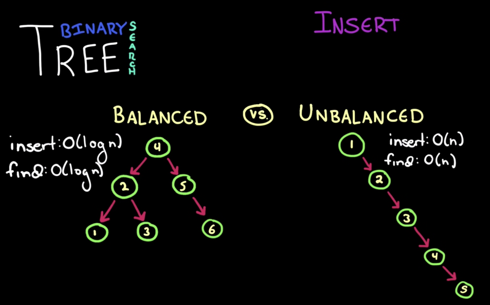
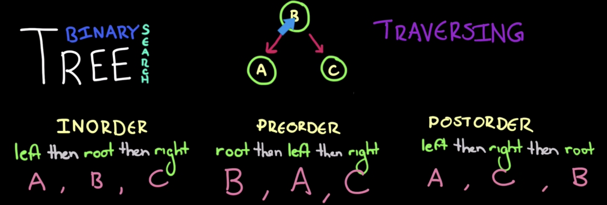

# Tree

root node를 중심으로 하위에 1개 이상의 node들이 연결된 구조를 가집니다.

## 종류

### Binary Tree

자식 node들을 2개 이하로만 가질 수 있는 트리입니다.

### Binary Search Tree

Binary Tree이면서 특정 node의 값이 왼쪽 자식 node보다 크고 오른쪽 자식 node보다 작은 트리입니다.

## 연산들

### 검색

node별로 정해진 순서가 있어서 임의의 node를 검색하는데 `O(logN)` ~ `O(N)`의 시간 복잡도를 가집니다.

### 삽입

임의의 node를 특정 node의 자식 node로 추가하는 연산으로, `O(logN)` ~ `O(N)`의 시간 복잡도를 가집니다.

node를 추가하면서 tree가 한 방향으로만 늘어나는 unbalanced 형태 또는 균일하게 늘어나는 balanced 형태가 존재합니다.



## 순회

트리의 root로부터 모든 node들을 한번씩 접근하는 연산입니다.



### 전위(preorder)

"root -> left -> right" 순으로 접근합니다.

### 중위(inorder)

"left -> root -> right" 순으로 접근합니다.

:::tip
binary search tree에서 중위순회 연산을 적용하면 오름차순으로 값들을 출력할 수 있습니다!
:::

### 후위(postorder)

"left -> right -> root" 순으로 접근합니다.

## 구현

```js
const [DATA, LEFT, RIGHT] = [0, 1, 2];

const hasData = (node) => node.length;

const tree = () => {
  const root = [];

  const insert = (data) => {
    for (let p = root; hasData(p); ) {
      p = data < p[DATA] ? p[LEFT] : p[RIGHT];
    }
    p.push(data, [], []);
  };

  const contains = (data) => {
    for (let p = root; hasData(p); ) {
      if (p[DATA] === data) {
        return true;
      }
      p = data < p[DATA] ? p[LEFT] : p[RIGHT];
    }
    return false;
  };

  const preorder = (node = root) => {
    if (!hasData(node)) return;
    console.log(node[DATA]);
    preorder(node[LEFT]);
    preorder(node[RIGHT]);
  };

  const inorder = (node = root) => {
    if (!hasData(node)) return;
    inorder(node[LEFT]);
    console.log(node[DATA]);
    inorder(node[RIGHT]);
  };

  const postorder = (node = root) => {
    if (!hasData(node)) return;
    postorder(node[LEFT]);
    postorder(node[RIGHT]);
    console.log(node[DATA]);
  };

  const isValidBst = (
    node = root,
    min = Number.MIN_SAFE_INTEGER,
    max = Number.MAX_SAFE_INTEGER
  ) => {
    // 완전한 BST의 조건
    // 1. node의 왼쪽 서브트리의 모든 node들의 값이 현재 node의 값보다 작은가?
    // 2. node의 오른쪽 서브트리의 모든 node들의 값이 현재 node의 값보다 큰가?

    if (!hasData(node)) {
      return true;
    }
    if (node[DATA] < min || max < node[DATA]) {
      return false;
    }

    return (
      isValidBst(node[LEFT], min, node[DATA] - 1) &&
      isValidBst(node[RIGHT], node[DATA] + 1, max)
    );
  };

  return {
    insert,
    contains,
    preorder,
    inorder,
    postorder,
    isValidBst,
  };
};
```
