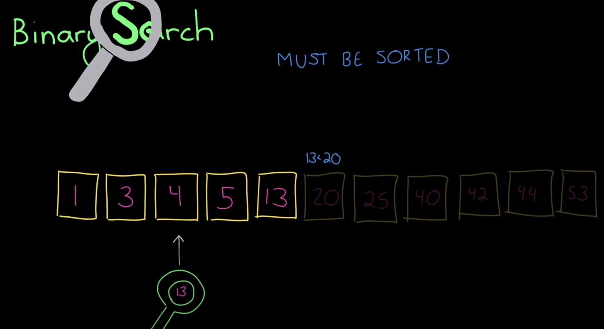

# Binary Search

정렬된 수열에서 특정 값을 검색하는 기법입니다.



중앙에 위치한 값과 내가 검색하려는 값을 비교했을 때 작다면 왼쪽 부분수열을, 크다면 오른쪽 부분수열을 대상으로 재귀적으로 검색합니다.

한번 검색할 때마다 탐색범위가 절반씩 줄어들기 때문에 총 검색하는데 최대 `O(logN)`의 시간복잡도를 가집니다.

## 구현코드

```js
// recusive
const binarySearch = (data, x) => {
  const search = (left = 0, right = data.length - 1) => {
    if (right < left) {
      return false;
    }

    const middle = Math.floor((left + right) / 2);

    if (data[middle] === x) {
      return true;
    } else if (x < data[middle]) {
      return search(left, middle);
    } else {
      return search(middle + 1, right);
    }
  };

  return search();
};
```

```js
// iterative
const binarySearch = (data, x) => {
  let [left, right] = [0, data.length - 1];

  while (left <= right) {
    const middle = Math.floor((left + right) / 2);
    if (data[middle] === x) {
      return true;
    } else if (data[middle] < x) {
      left = middle + 1;
    } else {
      right = middle;
    }
  }

  return false;
};
```
