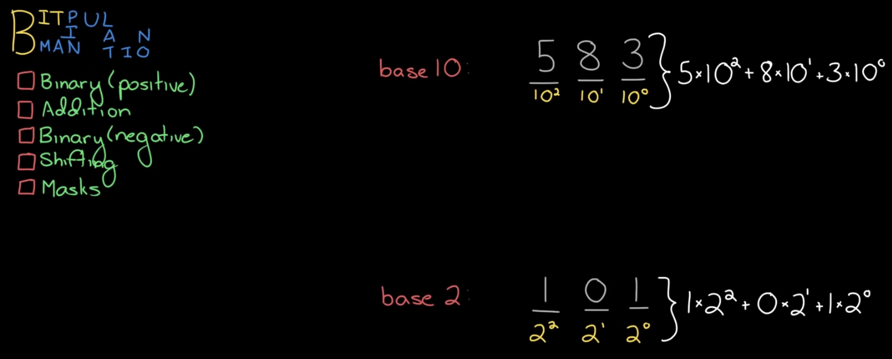
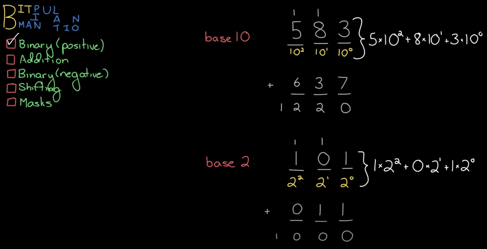
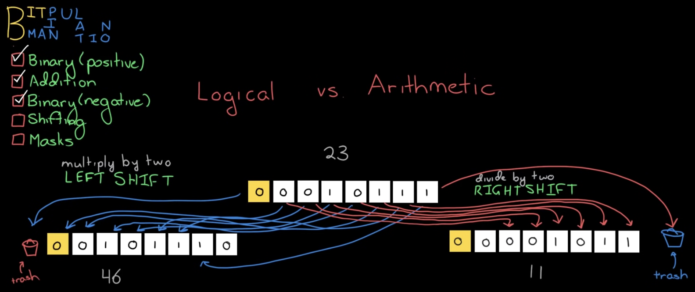
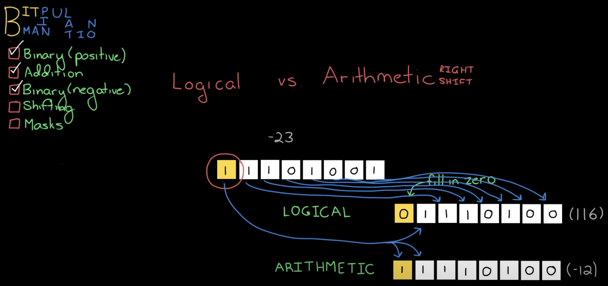
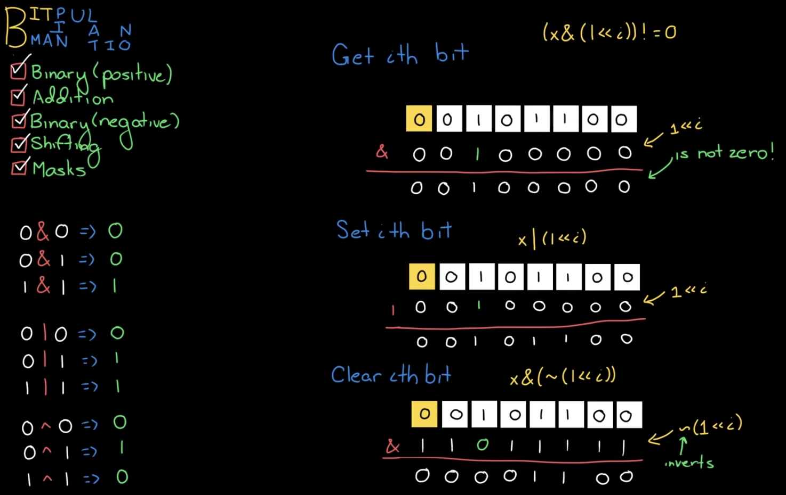

# Bit Manipulation

## Binary(Positive)



## Addition



## Binary(Negative)

음수의 이진수는 기존의 양수의 비트들을 모두 반대로 만든 다음에 1을 더한 "2의 보수"입니다.


## Shifting

### Logical



### Arithmetic



:::info
두 shifting 방식의 차이점은 바로 sign bit 값을 shift 이후에도 유지하는지 여부에 있습니다.
:::

## Masks



```js
const getNthBit = (x, n) => (x & (1 << n) ? 1 : 0);

const setNthBit = (x, n) => x | (1 << n);

const clearNthBit = (x, n) => x & ~(1 << n);
```
