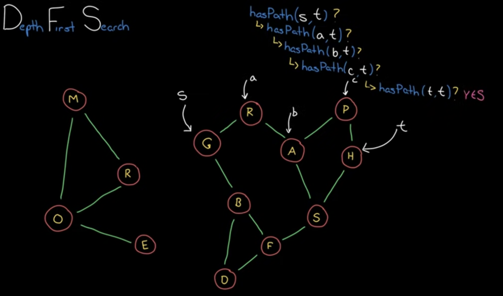
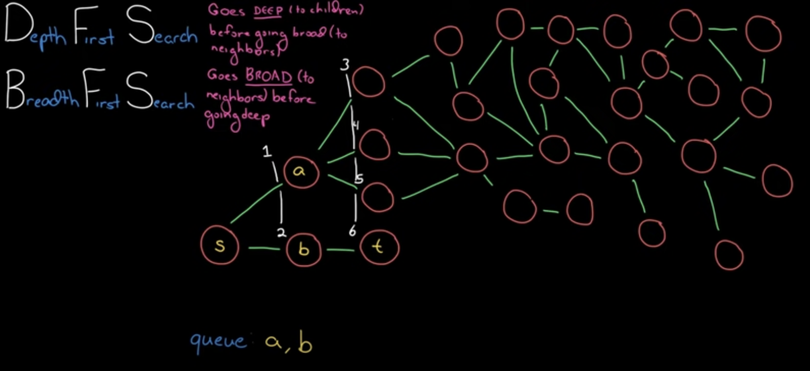

# Graph Search

선으로 연결된 node들의 집합으로, 두 노드 사이의 방향은 단방향 또는 양방향으로 나뉩니다.

## DFS

시작 node부터 시작해서 자식 node마다 재귀적으로 경로를 검색하는 방식으로, 목적지 node에 도착할 때까지 반복합니다.



단거리로 갈 수 있음에도 불구하고 다른 경로를 택해서 우회하여 도착할 가능성이 다분하다는 단점이 있습니다.

보통 node X에서 node Y로의 경로 존재여부나 개수 등을 구할 때 자주 활용됩니다.

### 구현코드

```js
//  정사각형 binary grid 형태로 제공된 그래프인 경우
const dfs = (adj) => {
  const visited = new Set();

  const hasPath = (src, dst) => {
    if (visited.has(src)) {
      return false;
    }
    if (src === dst) {
      return true;
    }

    visited.add(src);

    for (let next = src + 1; next < adj.length; next++) {
      // 다음 재귀를 시작하기 위한 조건은?
      if (adj[src][next] && hasPath(next, dst)) {
        return true;
      }
    }

    // 해당 케이스에 대한 탐색이 끝났으면 visited를 원래대로 돌려놓습니다.
    visited.delete(src);
  };

  return {
    hasPath,
  };
};
```

## BFS

시작 node부터 시작해서 자식 node가 목적지 node인지 여부를 level을 넓혀가면서 탐색하는 방식입니다.



보통 [queue](../%EC%9E%90%EB%A3%8C%EA%B5%AC%EC%A1%B0/queue.md)로 구현하고, 특정 node로의 최단거리를 구할 때 자주 활용됩니다.

### 구현코드

```js
const bfs = (adj) => {
  const q = [];
  const visited = new Set();

  const hasPath = (src, dst) => {
    q.push(src);

    while (q.length) {
      const x = q.shift();
      // 이미 방문한 node라면 다음 node를 뽑습니다.
      if (visited.has(x)) {
        continue;
      }
      if (x === dst) {
        return true;
      }

      visited.add(x);

      for (let c = x + 1; c < adj.length; c++) {
        // queue에 push하여 예약할 수 있는 조건은?
        adj[x][c] && q.push(c);
      }
    }

    return false;
  };

  return {
    hasPath,
  };
};
```
