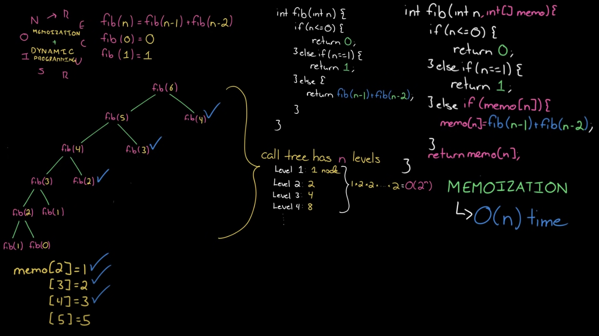
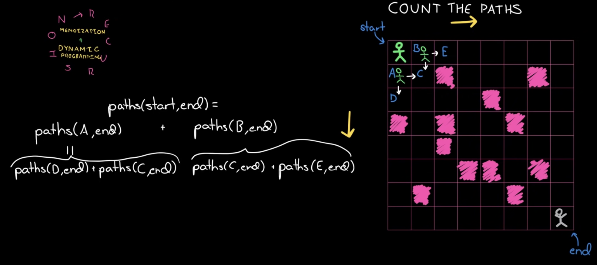

# Memoization, Dynamic Programming

재귀적으로 연산한 결과들을 캐시에 저장하고 필요할 때마다 조회하여 중복된 연산을 줄이는 작업을 **memoization**이라고 합니다.

큰 문제를 작은 문제로 분할해서 풀되 memoization을 이용하여 작은 문제의 답을 단순히 반환하는 방식으로 단 한번만 풀도록 하는 알고리즘이 바로 **Dynamic Programming**입니다.

:::info Dynamic Programming의 조건

- 큰 문제를 1개 이상의 작은 문제들로 나눌 수 있습니다.
- 작은 문제에서 구한 정답은 그것을 포함하는 큰 문제에서도 동일합니다.
  :::

## 피보나치 수열

피보나치의 수열을 기존 재귀적인 방법에 memoization을 적용하면 다음과 같이 구현할 수 있습니다.



```js
const fibo = (n) => {
  const memo = Array(n).fill(0);

  const calc = (x = n) => {
    if (x === 0) {
      return 0;
    } else if (x === 1) {
      return 1;
    }

    if (!memo[x]) {
      memo[x] = calc(x - 1) + calc(x - 2);
    }

    return memo[x];
  };

  return calc();
};
```

:::tip
위 코드로 구현하면 공간복잡도는 시간복잡도와 동일하게 `O(N)` 입니다.

이는 cache를 구현하기 위한 배열과 memoize되지 않은 값을 구하기 위해 재귀호출을 진행하면서 누적된 콜스택의 크기가 모두 N이기 때문입니다!
:::

## 길찾기

`N x N` 크기의 grid에서 두 지점 사이의 경로의 개수를 구하는 문제는 아래와 같이 재귀적으로 구할 수 있습니다.



```js
const countPaths = (grid) => {
  const [endX, endY] = [grid.length - 1, grid[0].length - 1];

  const calc = (x = 0, y = 0) => {
    // 갈 수 없는 지점이 1로 표시한 grid인 경우
    if (endX < x || endY < y || grid[x][y]) {
      return 0;
    }
    if (x === endX && y === endY) {
      return 1;
    }

    return calc(x + 1, y) + calc(x, y + 1);
  };

  return calc();
};
```

또는 특정 지점에서 도착지점까지 갈 수 있는 경로의 수를 memoize하는 방식으로도 구할 수 있습니다.


```js
const countPaths = (grid) => {
  const [rows, cols] = [grid.length, grid[0].length];
  const memo = Array.from(Array(rows), () => Array(cols).fill(0));

  for (let i = rows - 1; 0 <= i; i--) {
    for (let j = cols - 1; 0 <= j; j--) {
      if (i === rows - 1 && j === cols - 1) {
        memo[i][j] = 1;
        continue;
      }
      // 갈 수 없는 지점이 1로 표시한 grid인 경우
      if (grid[i][j]) {
        memo[i][j] = 0;
        continue;
      }
      if (i === rows - 1) {
        memo[i][j] = memo[i][j + 1];
        continue;
      }
      if (j === cols - 1) {
        memo[i][j] = memo[i + 1][j];
        continue;
      }
      memo[i][j] = memo[i + 1][j] + memo[i][j + 1];
    }
  }

  return memo[0][0];
};
```

:::tip
반대로 출발지점에서 특정지점까지 갈 수 있는 경로의 수를 memoize해도 결과는 동일하게 나옵니다!

```js
// ...
for (let i = 0; i < rows; i++) {
  for (let j = 0; j < cols; j++) {
    if (i === 0 && j === 0) {
      memo[i][j] = 1;
      continue;
    }
    if (grid[i][j]) {
      memo[i][j] = 0;
      continue;
    }
    if (i === 0) {
      memo[i][j] = memo[i][j - 1];
      continue;
    }
    if (j === 0) {
      memo[i][j] = memo[i - 1][j];
      continue;
    }
    memo[i][j] = memo[i][j - 1] + memo[i - 1][j];
  }
}

return memo[rows - 1][cols - 1];
```

:::
