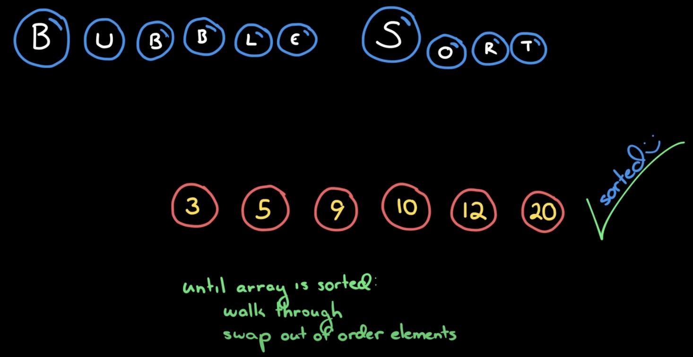
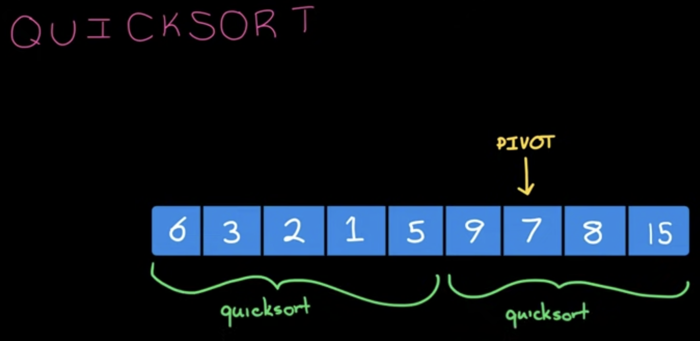
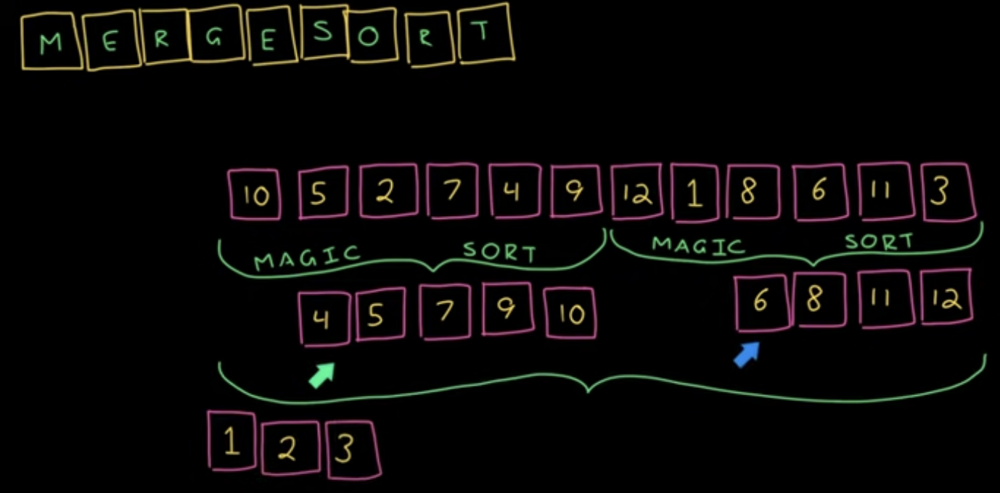

# Sort

## Insertion Sort

index 0에서부터 순회하면서 특정 요소를 **앞에서 정렬된 배열**에 적절한 위치에 삽입하는 방식으로, 최대 `O(N^2)`의 시간 복잡도를 가집니다.


```js
const insertionSort = (compFn) => (arr) => {
  const arr_c = [...arr];

  for (let i = 0; i < arr_c.length; i++) {
    const x = arr_c[i];
    let j = i;

    while (1 <= j) {
      if (compFn(arr_c[j - 1], x)) {
        break;
      }
      arr_c[j] = arr_c[j - 1];
      j--;
    }

    arr_c[j] = x;
  }

  return arr_c.join(" ");
};

const 오름차순 = insertionSort((a, b) => a < b);
const 내림차순 = insertionSort((a, b) => b < a);
```

## Bubble Sort

정렬이 될 때까지 수열을 순회할 때마다 바로 뒤의 있는 요소의 값이 더 작은 경우(오름차순 기준) swap하는 연산을 반복하는 방식입니다.



### 구현코드

```js
const bubbleSort = (data) => {
  const arr = [...data];

  const swap = (x, y) => {
    [arr[x], arr[y]] = [arr[y], arr[x]];
  };

  let lastIndex = arr.length - 1;
  let isSorted = false;

  while (!isSorted) {
    isSorted = true;
    for (let i = 0; i < lastIndex; i++) {
      if (arr[i] < arr[i + 1]) continue;
      swap(i, i + 1);
      isSorted = false;
    }
    // 순회가 끝날 때마다 최댓값이 가장 마지막 index부터 차례대로 위치하므로
    // 순회하는 범위를 하나씩 줄일 수 있습니다.
    lastIndex--;
  }

  return arr;
};
```

## Quick Sort

분할정복 방식을 이용한 정렬입니다.

대상 수열에서 임의의 pivot(중심요소)를 선택하고 pivot 앞으로 pivot보다 작은 수, 뒤로 pivot보다 큰 수가 오도록 swap연산으로 수열을 두 영역으로 나누는데, 이러한 과정을 재귀적으로 수행합니다.



### 구현코드

```js
const quickSort = (data) => {
  const arr = [...data];

  const swap = (x, y) => {
    [arr[x], arr[y]] = [arr[y], arr[x]];
  };

  const partition = (x, y, pivot) => {
    while (x <= y) {
      while (arr[x] < pivot) {
        x++;
      }
      while (pivot < arr[y]) {
        y--;
      }
      if (x <= y) {
        swap(x, y);
        x++;
        y--;
      }
    }
    return x;
  };

  const sort = (left = 0, right = arr.length - 1) => {
    // left와 right가 같다면 배열의 길이가 1이므로 정렬할 필요없습니다.
    if (right <= left) return;

    const pivot = arr[Math.floor((left + right) / 2)];
    const index = partition(left, right, pivot);

    sort(left, index - 1);
    sort(index, right);
  };

  sort();
  return arr;
};
```

대상 수열의 크기를 거의 반으로 분할할 때마다 총 N개의 요소들이 비교연산을 거치므로 시간복잡도는 `O(NlogN)`이지만 pivot을 첫번째 요소 또는 마지막 요소로 계속 유지하는 경우 `O(N^2)`의 복잡도가 나올 수도 있습니다.

## Merge Sort

quick sort처럼 분할정복을 이용합니다.

크기를 반으로 나눈 부분수열들을 각각 정렬한 뒤, 두 수열의 개별요소들을 오름차순(또는 내림차순)으로 결합하여 완성합니다.



### 구현코드

```js
const mergeSort = (data) => {
  // 모든 재귀함수에서 공통으로 사용할 연습장 배열
  const temp = [...data];
  // 실제 정렬된 배열
  const arr = [...data];

  const sort = (start = 0, end = data.length - 1) => {
    if (end <= start) return;

    const middle = Math.floor((start + end) / 2);

    // 반으로 나눠서 각자 정렬 진행 + arr에 반영합니다.
    sort(start, middle);
    sort(middle + 1, end);

    let [x, y, t] = [start, middle + 1, start];

    while (x <= middle && y <= end) {
      if (arr[x] <= arr[y]) {
        temp[t++] = arr[x++];
      } else {
        temp[t++] = arr[y++];
      }
    }

    // 아직 temp에 추가하지 못한 부분수열을 순회하여 마저 추가합니다.
    for (let i = x; i <= middle; i++) {
      temp[t++] = arr[i];
    }
    for (let i = y; i <= end; i++) {
      temp[t++] = arr[i];
    }

    // temp에 정렬된 상태를 그대로 arr에 반영합니다.
    for (let i = start; i <= end; i++) {
      arr[i] = temp[i];
    }
  };

  sort();

  return arr;
};
```

:::tip `Array.prototype.sort`
V8 엔진 상에서 Merge Sort와 Insertion Sort를 결합한 [Tim Sort 알고리즘](https://d2.naver.com/helloworld/0315536)을 사용하는데 최대 `O(N*logN)`의 시간 복잡도를 가집니다.
:::

## Counting Sort

배열의 요소들끼리 비교하는 것이 아닌 요소들의 빈도수를 사용하여 정렬된 배열을 생성하는 방식입니다.

여기서 요소는 `number`형이고 빈도수 배열의 index는 모든 요소들의 값을 포함해야 합니다.

```js
const countingSort = (arr) => {
  const freq = Array(Math.max(...arr) + 1).fill(0);
  const ans = [];

  for (const n of arr) {
    freq[n]++;
  }

  for (let i = 0; i < freq.length; i++) {
    ans.push(...Array(freq[i]).fill(i));
  }

  return ans;
};
```
