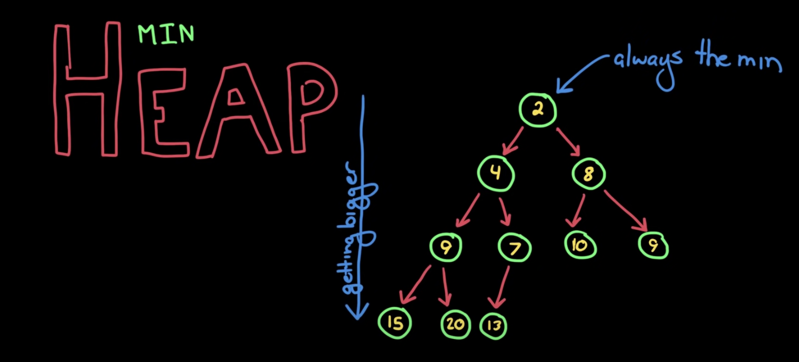
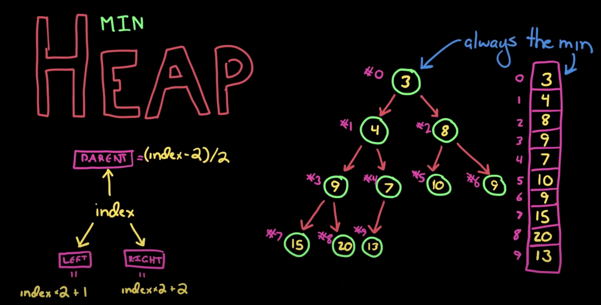

# Heap

우선순위 큐를 구현하기 위한 완전 이진 트리의 일종으로 2가지 종류가 있습니다.

:::info 완전이진트리
이진트리의 높이가 h일 때, (h-1)까지는 모든 node들이 자식 node들을 2개씩 가지고 h에서부터 왼쪽부터 차례대로 채워진 형태를 가집니다.
:::

매 순회마다 최댓값 또는 최솟값을 얻고 싶을 때 유용한 구조입니다.

## Min Heap

root node의 값이 하위 node들의 값보다 작습니다.



### 삽입

특정 node를 삽입할 때는 우선 가장 마지막에 append 합니다. 그 뒤에 자신보다 더 작은 값을 가진 부모 node를 찾을 때까지 depth를 올라갑니다.

### root 제거

제일 마지막에 있는 node를 root로 지정하고 왼쪽, 오른쪽 자식 node들의 값보다 작을 때까지 depth를 내려갑니다.

:::tip Max Heap
Min Heap과 반대로 구현하면 됩니다!
:::

## 구현코드

heap은 트리형태를 가지지만 root를 index 0을 가지는 1차원 배열로 간결하게 나타낼 수 있습니다.



```js
const heap = (comFn) => {
  let arr = [];

  const leftIndex = (index) => index * 2 + 1;
  const rightIndex = (index) => index * 2 + 2;
  const parentIndex = (index) => Math.floor((index - 1) / 2);

  const hasLeft = (index) => leftIndex(index) < arr.length;
  const hasRight = (index) => rightIndex(index) < arr.length;
  const hasParent = (index) => 0 <= parentIndex(index);

  const swap = (x, y) => {
    [arr[x], arr[y]] = [arr[y], arr[x]];
  };

  const add = (data) => {
    arr.push(data);
    let p = arr.length - 1;

    while (hasParent(p)) {
      const pr = parentIndex(p);
      if (compFn(arr[pr], arr[p])) break;
      swap(p, pr);
      p = pr;
    }
  };

  // root 제거 + 반환
  const poll = () => {
    if (arr.length === 0) {
      return null;
    }

    const top = arr.shift();
    const last = arr.pop();

    if (arr.length) {
      arr.unshift(last);

      let p = 0;
      while (hasLeft(p)) {
        // leftChild가 없다면 rightChild도 없게 됩니다.
        let to = leftIndex(p);
        if (hasRight(p) && compFn(arr[rightIndex(p)], arr[to])) {
          to = rightIndex(p);
        }
        if (compFn(arr[p], arr[to])) {
          break;
        }
        swap(p, to);
        p = to;
      }
    }

    return top;
  };

  return {
    poll,
    add,
  };
};
```

```js
const { ... } = heap((a, b) => a < b); // min-heap
const { ... } = heap((a, b) => a > b); // max-heap
```
